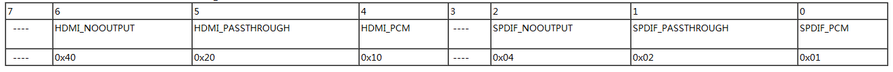
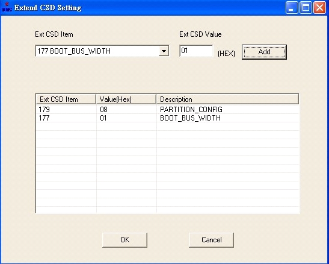
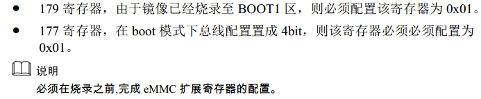

PTCL（8841C/3716C/1G内存/2G EMMC Flash）：

hdcp制式， 60-ntsc  50-pal  cvbs是否不需要切制式  
杜比改回来- 其他局点盒子实验，再次确认电视问题；确认合入版本  
卸载U盘 待机起来不挂载

78. TODO: 本地播放cvbs一直有声音，海思提供接口可以关掉cvbs的声音，已初步验证代码未合入：  
    `
    HI_UNF_SND_INTERFACE_S interface;  
    LOGD("[%s,%d] close cvbs audio output\n",__FUNCTION__,__LINE__);   
    HI_UNF_SND_GetInterface(HI_UNF_SND_0, &interface);   
    interface.bEnable = HI_FALSE;   
    HI_UNF_SND_SetInterface(HI_UNF_SND_0, &interface);   
    `

77. 目前工厂在TNI测试50 PCS PTCL  Android 8841C时发现如下两个问题：  
    *  MAC：000763C16919 待机后无法唤醒  
    *  MAC：000763C16913  恢复出厂后无输出，电视一直显示无信号（更换其它盒子有输出）  
     ----还是之前fastboot签名工具的问题，用最新的fastboot即可。  

76. 6个参考帧的码流1080P_8M.ts播放异常  
    ----bootargs中添加 extra_ref=12 extra_disp=0参数，修改vdec大小。  

75. 【待机】本地播放，待机唤醒后，卡死starting界面；影响用户继续使用  
11-26：CCB：优先级降低，由海思给出官方解释。  

74. 选择一个未订购的VOD，订购失败后，切换到其他类型的VOD，低概率导致页面卡死。--高国栋、孙华胜  

73. 本地播放连续选择不同的视频进行播放，有概率导致机顶盒自动重启。  

72. 手动按后面板OFF键关机时，会出现爆破音  

71.  memo：  
--2013-10-30修改vimeo网站视频无法播放的问题，杨茂林提供了一个libavformat.so库。  
--2013-11-16特定片源(linjiategong.mp4)持续不断的进行seek定位播放，概率出现做SEEK操作不响应，会自己 跳从头播放，或者直接退出播放，多操作几下，盒子自动重起. HiSTBAndroidV400R001C00SPC051_TestPatch_20131116_001_for_zhaoge 提供的库中libavformat.so libffmpegformat.so 其中libavformat.so的MD5与杨提供的库相同。  
--上传11-16库的时候发现10-30库许文胜在小系统中上传了，大系统中没有传过，现在看来结果没有问题。  

70. 标清输出：在laucher页面状态下按首页键，laucher三大图片模块会模糊抖动一下（现象明显），高清输出下：不会有此现象，高清输出，在laucher页面按首页键不会有任何响应状态
    ----看日志是每次home键启动launcher的原因  
----启动了一次launcher  
am start -n net.sunniwell.launcher.swlauncher.huawei/.Launcher  

70. 设置页面：接上U盘，查看Card and STB Memory 结果设置应用崩溃，不响应焦点移动。提示：USBupgrade is not respongding,would you like to close it ? 高概率。有日志提供。--李龙武、孙华胜   

69. PTCL_本地播放SEEK操作待机唤醒后卡死在starting  
    ----片源问题，海思提供补丁解决  

68. 【杜比新规格】在创维电视/型号：24E60HR  ，HDMI 和 SPDIF 同时设置为透传模式，播放杜比dd片源，在机顶盒里查看该参数[sys.prop.Audio_AC3]: [unsupport]，杜比片源无声音输出，切换其它直播频道，所有频道皆无声音输出。  
    ----华为复现流程：全部配置透传；盒子重启；杜比频道（预期/结果无声音）， 其他频道（预期有声音，实际无声音）；盒子重启没有用；电视待机后ok；  
    ----电视问题，采用规避方法，在透传时候检测设备是否支持，如果不支持则不透传。  

67. 【杜比新需求】HDMI输出方式设置为透传或NO-OUTPUT方式后，不支持杜比的电视也能播放出杜比片源的声音。   
    ----三星、彩迅电视有此问题（创维、康佳没有）  
    ----电视问题，采用规避方法，在透传时候检测设备是否支持，如果不支持则不透传。  

66. 【待机】机顶盒概率性出现待机恢复直接死机不响应任何按键  
    ----11-26：CCB：优先级降低，由海思给出官方解释。  
    ----海思给出答复如下：  
* 这个问题 是Linux-3.0.8内核ext文件系统固有问题，热插拔的场景下概率出现，反复热插拔会出现 kernel coredump，  
使用ext3格式的U盘和SD卡均有同样的问题，更换NTFS和FAT文件系统没有问题；  
* Linux-3.4内核没有这个问题，用相同的测试方法验证通过；  
* Linux- 3.0.8  到 Linux-3.4 版本，ext4  改动非常多，如果要 fix bug  只能升级到Linux-3.4内核；Linux Kernel升级的工作量非常大，不建议升级；
对这个问题的建议：避免在Linux-3.0.8版本中使用ext4文件系统，可以使用NTFS/FAT代替；

65. 本地播放视频文件做SEEK操作,不响应，多操作几次后，且会使STB自动重启  
    ----海思解决  

64. 【本地播放】播放无法播放的音乐，会直接跳过下一首可以播放的音乐，播放下一首，例如音乐A(不支持)、B、C,播放A时，会直接跳过B直接播放C。  
    ----转关小龙支持  

63. 【升级】全量和差分升级的时，升级进度条没有到100%就重启机顶盒。  
    ----修改ota_from_targets ，TODO:原来可以修改install system的时候的进度条来解决卡顿90多秒的问题，需要继续研究  

62. 【浏览器】链接标签图片和链接地址不对应，例如baidu search链接展示的是google图标  
    ----孙科沟通  

61. 选择播放一首音乐时，时间轴抓取为0，出现不播放的问题，多按几次OK 出现MyMedia is not responding Would you like to close it?  
    播放音乐时，指针选择，出现播放卡顿的现象，移动指针，播放过程中也会卡顿  
    同时在复现过程中，还发现视频无法正常播放的问题（实际上视频是能够正常播放的）：只播放音频，视频为黑屏  
    ----用最新的0923补丁暂未复现问题，应该是ok的。  

60. 上电到launcher时间49s，马电只需33s，需要优化  
    ----找了个打印时间戳的工具:泰康串口大师，对比马电日志，发现挂载分区时候有个地方持续了7s，查看init.rc有去wait sdcard分区的操作，而ptcl上没有sdcard分区，不去处理sdcard即可节省7s时间。
cmdline中添加loglevel=0可节省2s不到的时间。  

59. 无线接入待机唤醒后，无线被关闭  
    ----见问题58  
    
58. 重启后第一次待机下去指示灯还是为白色  
    ----由于待机时候wifi异常导致没有待机完成，导致设置power灯的操作要等很久后才执行，同时待机完成。现在是kernel中在待机起来后配置gpio给usb供电，保证usb能正常使用。
注意：现在不去手动在待机前给usb断电、待机起来后给usb上电，这样待机起来后就没有u盘插入事件，之前提到的两问题将再次出现：  
1）待机起来后没有上抛事件，没有检测u盘中升级包     我拿浙江电信的盒子来看了，待机起来后也没有去检测u盘升级。马电盒子升级了几个服务器上下的版本后插u盘都不提示升级，比较奇怪，深圳那边可以看下马电的现象。如果一定要做只能上层去主动检测了。  
2）设置页面中卸载u盘后待机起来不再挂载   这个问题CCB过的。在处理问题1的时候采用usb断电上电的方式会使得待机起来后u盘去挂载，现在不去手动断电上电该问题仍有存在。  

57. 【本地播放】本地播放无声音  
    ----检测非杜比音频的话不进行杜比的那些检测和设置。  
另外发现问题，在恢复出厂设置后/data/data/net.sunniwell.app.ott.huawei/.iptv/para 不会再出现，这样肯定会出问题，请上层同学看看！  

56. 本地播放多次操作快进快退后提示 Unfortunately,MyMedia has stopped.    ----李贺：转底层  
    ----张裕斗：这个问题不能只搞底层去解决，上层要优化一下接口调用，看是否可以执行异步调用。规避问题出现  
    ----用提供的片源也未复现  

55. 【本地媒体和应用】视频、图片缩略图生成速度太慢    ----李贺：无法再优化，请底层优化一下吧  
    --  

54. 【设置】恢复出厂设置后擦除data分区失败，提示“data wipe failed”  
    ----未复现  

53. 恢复出厂设置，在recovery界面异常了，显示E:unknown volume for path [/sdcard]   E:unknown volume "/sdcard"   Data wipe failed.  
    ----ptcl的flash上没有划分sdcard分区，恢复出厂设置时候不去擦写sdcard分区。之前有对这个做修改并且代码传到小系统on-project中了，重工版本是没有此问题的，后面的版本修改过的recovery丢掉了这个修改。  

52. 【本地媒体和应用】本地媒体播放sub字幕的视频，切换字幕退出播放，再次播放时不会记忆历史字幕。  
    ----刚问了下，咱们之前也都没有做过本次播放时候能记忆上次选择的字幕，请曾辉确认是否有此规格需求！  

51. 【升级】机顶盒插上U盘后，待机唤醒没有检测U盘升级
    ----现在处理是在待机前将前面两个usb口断电，待机起来后再给上电，如果这个时候有u盘插着则会去挂载，这样之前有个手动卸载u盘后待机起来不挂载的问题也解决了，请项目经理安排一并测试下。
    ----具体情况：盒子起来gpio7_7，gpio7_6均为gpio模式且himm 0x101ed3fc 为0x000000FD高电平。待机起来后gpio7_7成了USB0_PWREN模式，也能给usb供电，usb是挂载状态，不过没有插入事件所以没有检测升级包。gpio7_6仍为gpio模式，查看3fc寄存器表现为低电平，所以就没有给usb供电，这时usb没有挂载上，由于没有供电拔插也不会挂上。

50. 【重启】服务器上放置异常的全量升级包，机顶盒下载完升级版本后，不自动重启升级，停留在launcher页面。
    ----感觉是上层问题，需要提供日志分析
    ----服务器配置问题

49. 【USB】机顶盒外置硬盘已经接入可以观看本地播放，但是开机消息中心提示The USB is unmounted!  
    ----有个unmountable项是表示挂载失败，看到mountservice里有相应处理，看一下下面这个地方，是否没有捕捉到VoldResponseCode.OpFailedMediaCorrupt。
如果真没有的话，估计这个东西就不好搞了，需要找海思修改vold了。  
    ----因为这个硬盘的多个分区中有坏的分区，挂载失败所以会有这个提示，和测试沟通作为非问题；  

48. 【待机】概率性出现，插入移动硬盘的机顶盒待机恢复直接死机，不响应任何按键  
    ----拔硬盘概率死机问题，同问题27  

47. 【服务器升级】机顶盒在升级过程中有三段进度条重叠，且进度条显示不明显  
    ----不知所云  
    ----recovery中升级刚开始在挂载分区、查找升级包、校验升级包的过程中有一段叫做“indeterminate_progress(尚未确定进度条)"的显示，展示的是下面1-6这几张图片交替刷新。不展示这个过程就不会有先出现完整进度条的现象，不过觉得没有必要修改这个东西，请项目经理决定。
另外升级full包的时候，有个从升级包抽取文件升级到/system的过程，由于文件比较多所以进度条会在这停留时间比较长，如果非得在抽取文件的过程中加进度条显示个人感觉很恶心，不建议修改。   
    ----三段重叠变粗，服务器升级与管理工具现象不同，服务器升级进度条有此现象。朝歌待复现。  

46. 【开机】机顶盒开机接入概率性出现进入start界面然后过90s左右再次重启，一直循环重启。（测试人员 张天野 ：18640224781）  
    ----感觉不是底层问题，先抓日志，没见过此类问题  

45. 【升级】服务器上放置不同版本时，下载版本文件后升级过程中断电重启后机顶盒出现闪屏。  
    ----reboot的时候会概率闪屏，这个跟硬件的特性有关系，试过了马电、marvell、amlogic、mstar的盒子都有这个现象，而且在断电的时候也可能会出现。另外跟电视也有关系，不同的电视复现概率还会有不同。软件无法解决这个问题，请知悉！  
    ----这个问题刚才和胡金水讨论了一下，这个问题应该是电视机本身的问题。  
    出现花屏的时候，是因为电视机可能收到半帧信号，而盒子断电或重启时，也无法给停止输出的信号，所有电视机在收到半帧信号后不知道怎么处理，所以出现花屏。  
    在reboot，断电，插拔HDMI的时候都有可能出现这个问题。  

44. 【升级】机顶盒下载完版本后重启，电视输出会红的闪一下。  
    ----两台创维电视上有此现象  

43. 【loader】烧写mac概率不启机问题，升级loader，重工3k盒子  
    ----修改ota_from_files升级loader  
    ----先烧签名的fastboot、烧写mac回写fastboot、读出回写过的fastboot数据、升级读出的fastboot到boot0区。  
    ----郭甲添加非高安emmc盒子的loader升级，目前实现为mmcblk0boot0、mmcblk0（偏移512）都写升级的loader数据。  

42. 【参数】PTCL recovery下恢复出厂不能恢复制式和settings下恢复电视会闪的问题请华胜和代理改一下
    ----修改recovery，reset时候写回1080i_50Hz的制式到deviceinfo中；提供直接写deviceinfo中制式的接口，以便设置页面中恢复出厂设置的时候可以直接修改参数而不必先设置制式。    
    ----上层在回复出厂设置后设置制式，然后就执行reboot了，这时不会再看到切制式而出现的闪屏现象。  
    ----recovery中reset不会再用户场景下出现，不修改  
    ----./base/services/display/DisplayService.cpp   ./base/cmds/display/Android.mk    ./base/services/display/Android.mk    ./base/services/display/net_sunniwell_display_DisplayManager.cpp  
    
41. 【本地媒体和应用】在支持和不支持图片中切换播放图片然后退出播放，会报 Unfortunately,MyMedia has stopped，不能播放本地媒体 --李贺、孙华胜  
    ----这个问题确认一下马电是否有相同问题，如果没有同步马电的成果。  
    ----如下问题在 TM 上面也存在, TM上面有限制1M大小的GIF图片不能播放。在切换jpeg图片的时候 出来如下情况,弹出原生的Unfortunately,MyMedia has stopped 错误  

40. 【本地媒体和应用】视频、图片缩略图生成速度太慢                        ----李贺、孙华胜  
    ----研发加载1000张没有发现此问题；待与测试人员沟通；  
    ----减少一个页面显示的图片数目  
    
39. 【本地播放和应用】本地播放不支持播放2M以上的GIF格式的图片    ----李贺、孙华胜  

38. 【本地媒体和应用】概率性不能播放1M以上的图片                          ----李贺、孙华胜  
    ----跟内存泄露有关  

37. 【本地媒体和应用】不支持播放SUB格式，播放时没有音频。  
    ----dts音频，无license，非问题。  

36. 【macvision】点播macvsion级别为0,1,2,3，都能进行录制（点播播放完，选择replay播放，提示不能录制）  
    ----从问题描述看是第一次没有生效，苏涛先查看第一次播放时候是否调开关下来  
    ----上层解决  

35. 【HDCP】点播HDCP开启或关闭时，都能正常输出播放（点播播放完，选择replay,则提示HDCP）  
    ----从问题描述看是第一次没有hdcp检测，苏涛先查看第一次播放时候是否调开关下来  
    ----上层解决  

34. 【显示】机顶盒同样的输出设置，标清输出两边会超出屏幕，高清输出正常。  
    ----电视对hdmi、cvbs有裁边，而且裁边的像素不同，而且不同电视会有不同的裁边像素。属于正常现象。  

33. 【设置】set resolution分辨率不支持自适应  
    ----见问题32  
    
32. 【设置】set resolution分辨率不支持自适应,只能适应1080i_50HZ,如果用sony的60HZ的电视，机顶盒接入无法自适应。  
    ----待评估，如果需要做需提供具体规格  
    ----不修改  

31. 【本地媒体和应用】待机唤醒后移动硬盘不识别，不能播放本地播放业务  
    ----见问题30  
    
30. 【磁盘管理】在设置页面umount U盘或者移动硬盘，机顶盒待机唤醒不会触发重新挂载  
    ----[上述问题非问题,对比马电存在相同的情况,无规格说明修改此问题,谢谢]  
    ----修改此问题的话需要改两个地方，一个是待机起来后驱动的检测，一个是vold处理机制。前一个更改风险比较大，后一个更改没有源码需要找海思协助。  

29. 【设置】HDMI/SPDIF Audio Output两个参数，重启不能保存（重启恢复默认值）  
    ----这两个参数是之前控制杜比透传与否的参数，现在不再使用。正在做的杜比透传改用了一个属性，请上层留意在重启、待机起来后该属性还能保持之前设置过的样子。  

28. 【升级】从生产版本到测试版本或从测试版本升级到更高版本（全量），升级在installing update时，进度条一直不动（96s）,体验不好  
    ----这个阶段是在install system阶段，是一个独立的过程，无法在此过程中添加进度  
    ----郭甲已修改，ota_from_target_files。  
    ----上一修改没有作用  
    ----进度条：28s + 93s + 11s  

27. 【USB/死机】机顶盒播放IPTV业务，插拔外接设备提示The USB is unmounted!，然后不响应任何按键，直接死机。  
    ----确认硬盘型号，里边内容  
    ----不好复现，华为那边不提供日志，需要测试部看看能不能复现并提供日志。之前马电上遇到过两次，提供的日志海思说看不出什么原因，后来没有继续跟进  

26. 【升级】高概率出现机顶盒升级下载完版本后重启无信号，需要手动断电重启（测试6台，出现4台）  
    ----怀疑电容太大没有放电，导致flash复位没有完成  

24. 【死机】烧完mac后不启机  
    ----读取了两片能正常启机盒子的flash、一片烧mac后不能启机盒子的flash  
      中间四个文件为不能启机盒子读到的数据，8841C.bin.Boot0 8841C.bin.Boot1 8841C.bin.User 这三部分数据都是空的，也就是说fastboot及系统区域数据都是空的了。
其他两套数据中8841C.bin.Boot0 经查看加密回写的数据是正常的。  
现在为排除读取数据时候异常，需要工厂再帮忙读取一个烧mac后不能启机盒子的flash。如果读取过程没有问题，那现在问题就比较奇怪了，软件不会有擦写fastboot及系统数据的操作。
同时将昨天读过的这个不能启机的flash重新烧下生产镜像，起来后还需要通过串口操作一下读取下otp数据，来验证下cpu中otp区的数据是否是正常状态。这个操作不复杂，请马建贺给下操作说明。  
----实际为两台烧mac后不启机，一台原有不良品。重新烧片后发现这两台盒子高概率起不来，10次有8次起不来。  
----海思工具问题，寄存器相关，重新出loader问题解决  

25. 【杜比】调用HI_MPI_HIAO_SetSpdifPinOut(HI_FALSE); 来关掉spdif的Pinout后还能输出解码和透传的声音。linux上也是这么在需要的时候关掉spdif的输出的，这样关spdif好使。  
    ----需要海思支持    stVersion.enChipVersion为0导致g_u32SPDIF_GPIO_OFFSET 为0，寄存器地址就不是0x1020301c了  
    ----msp/common/api/src/mpi_sys.c 中可以看到getversion的时候由于有#if defined (CFG_ANDROID_TOOLCHAIN)而未执行getversion的实际动作，修改/device/hisilicon/godbox/driver/sdk/Android.mk.def：注掉#####CFG_CFLAGS += -DCFG_ANDROID_TOOLCHAIN，更新libhi_common.so即可  
    ----修改/data/data权限771为777，使得参数文件可读。后来不改读取也没有问题。  

23. 【杜比】杜比透传参照广东处理机制  
    ----audiorender，全0或者未找到此属性为AUDIO_AUTO模式，其余见下表  
    

22. 【xx】本地播放无法展示gif图片，（同样的apk在马电项目上正常，底层小系统和马电有区别）
    ----见问题21

21. 【xx】本地播放和设置页面在加载中，显示的加载图片变成了一条线（以前是圆圈的），最老的小系统上出的版本无此问题  
    ----关掉硬件加速，参考笔记[Android的硬件加速及可能导致的问题 - Ming's Blog](http://blog.chenming.info)

20. 【USB】底层需要区分SD_card和USB挂载，以便上层可以正确格式化SD_card  
    ----郭甲修改，device.c中将SDCARD_FIXED_USB_PORT修改，需要在vold.fstab中也对应修改  

19. 【xx】拔掉网线，待机操作，出现不响应按键 （概率）  
    ----低概率，未复现  

18. 【生产版本】生产镜像烧片不启机  
    请帮忙确认一下之前在工厂烧录8040E时怎么配置的。  
    这个是之前工厂发过来的配置截图  
    
    而在海思文档中则写  
    
    主要是179寄存器，请帮忙确认一下。  
    ----工厂按照配置重新烧写烧片可以启机  

17. 【生产版本】生产镜像5.9G  
    ----最后的usr_app分区550M，但打出的镜像文件580M，重新打usr_app.ics.ext4  

16. 【cvbs】cvbs 有杂音、小爆音  
    ----没有去操作静音电路，在init.godbox.sh中添加关静音的操作，问题解决。  
    ----之前是mute状态，但声音没有彻底静音掉，使得音量变小、带有杂音。看来跟之前四会电信v200盒子遇到的是相同的问题。  
    ----生产测试中注释掉gpio7_1的操作  
    ----插入sd卡，u盘检测项测试ok，用1-4、1-2分别区分sd卡和u盘  
    ====问题16、15应该是新板子拿到后没有去做对应的配置！！！  

15. 【待机、LED】待机后power灯没有变红  
    ----没有去做led灯gpio的控制，在hi_keypad_8000A中添加，很恶心！！！  

14. 【生产测试】生产测试wifi异常  
    ----wifi项应该是一直有问题，有sunniwel 热点有时ok有时fail，没有sunniwell热点有时ok有时fail。  
    ----libswca中stb_ping没有正确合入，刘美荣修改ok  
    ----wifi项测试六七次会出现一次fail情况，进出wifi测试项时不做插入卸载驱动的操作，测试30次未出现fail情况。  

13. 【sd卡】新boot.img 生产测试中sd卡不好使  
    ----/system/core/init/devices.c中修改 SDCARD_FIXED_USB_PORT，新的init到ramdisk，新boot.img  

12. 【PIP】pip不能播放  
    ---- 报底层VDEC_CHAN_ALLOC failed! 应该是sdk内存不够，将内存重新划分，ddr部分有原来32M增大到52M。  
    ----修改pmem-->新uImage--(bootargs中cmdline新参数)-->新boot.img。修改init.godbox.sh mmz.ko插入参数  

11. 【本地播放】进过iptv后本地播放没有声音  
    ----在进入本地播放后设置一次音量后再去播本地播放就ok，原因可能是iptv的流程中将声音输出的某项设置不妥当了，当再进入本地播放时候没有相应设置问题表现出来。  

10. 【本地播放】接入EPG后，无法播放本地视频，没接入EPG之前是可以播放的  
    ---- 进入iptv，swdec中有VO_Init 但退出时候没有VO_Deinit。  

9. 【生产测试】07生产版本进入factory_burn时，系统不启机，串口打印在sw_product处  
    ----usb插入的情况下启机进入生产测试由于段错误没有正常启动导致电视无输出。同问题7，usb 中strstr问题。  

8. 【生产测试】07生产版本烧写mac地址后重启，出现一次无法启机而且串口无输出  
    ----未再复现  

7. 【生产测试】生产测试usb测试项导致挂掉、只能重启  
    ----**strstr问题，子串不能为空**  
    ----libswca代码里边有个printf 少参数  

6. 【生产测试】烧写mac死机、恢复出厂设置  
    ----瑶瑶处理  

5. 【recovery】recovery 遥控器  
    ----郭甲解决  

4. 【生产版本】生产镜像  
    ----fastboot单独出，其余在小系统中打出来  

3. 【杜比】杜比做成解码  
    ----本地播放修改audiodevmanager、iptv上层打开ac3plus_license即可  

2. 【xx】开机堵塞在starting
    ----libpower.so libhardware_legacy.so问题：fifo在以读方式打开时候会堵塞，等待以读方式打开，因此需要与sw_monitor配套使用。加宏处理，在马电时候打开。  
    ----data分区擦除、ext4的各个分区格式化  

1. 【内存】内存分配，1G方案  
    ----hi3716c-1GB-android_defconfig修改pmem  
    ----release/system/etc/init.godbox.sh 修改mmz、galcore驱动插入的参数  
    ----tftp 0x81000000 boot.img;mmc write 0 0x81000000 0x10000 0x2110  

