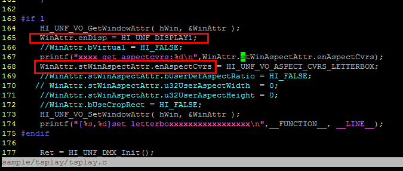
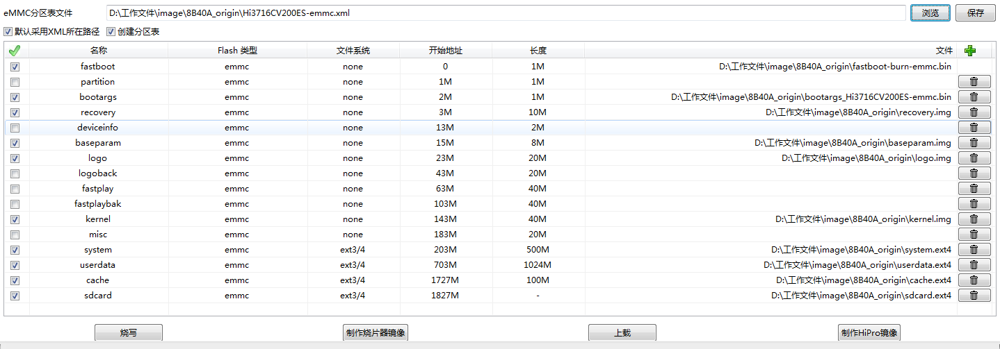

####8d40a/3719M_base/android4.2

27. 杜比透传问题  
----抓取日志：cat  /proc/msp/sound0;  cat  /proc/msp/adec00;   cat /proc/msp/hdmi0; cat /proc/msp/sys;  
----iptv 参数文件：busybox vi /data/data/net.sunniwell.app.ott.huawei/.iptv/para  
----3798 iptv参数文件：busybox vi /data/data/net.sunniwell.app.iptv/.iptv/para  
----配置属性：setprop sys.prop.audiorender 34  
----iptv播放：sw_media_start igmp://224.2.2.2:2244  
----mSndPortId = findValidSndPortId(); 解决本地播放无法控制解码输出、透传输出  

26. 上海社会化项目3719接口setVideoDisplayMode设置问题  
  

25. 设置视频透明度的接口HI_UNF_VO_SetAlpha  
     ----4.2 sdk中没有找到类似功能的接口，只有layer层的接口没有VO层的接口，提交海思处理  
     ----确认电信规格及测试用例，不需要vo设置为透明的功能  

24. 回环测试在拔掉一段时间后测试失败：  
     1）开机不插网线、回环水晶头：ok  
     2）开机插网线，然后换回环水晶头：  
     3）开机插回环水晶头：ok  

23. 无线开启不连接下，概率待机唤醒不了  

22. 设置NTSC制式后，进入IPTV播放视频，HDMI和CVBS输出视频只显示屏幕一半大  
     ----见问题20  
21. 使用组合键#**#概率调出来的一键收集信息页面在EPG后面  
     ----见问题20  

20. 【一键信息收集】概率调出一键收集页面不是悬浮在EPG上面（当时操作步骤是进入IPTV报10071错误码，发现网络未联通，然后连通网络后，再进入iptvepg首页调出一键收集页面）  
     ----提供创建三个图层的apk提交海思复现并处理  

19. 待机唤醒多次出现过一次hdmi输出到电视画面变的非常模糊  
     ----提交海思处理  
     ----再次复现时候抓取framebuff图像进行分析  

18. 连续安装大容量apk后，提示应用安装无响应，页面会闪烁，至launcher页面后进行U盘升级，提示无足够空间，删掉应用后，仍然提示无足够空间  
     ----连续安装大容量apk后，概率性cpu占用太高，导致页面会不停闪烁时，此时系统已完全挂掉，是完全无法响应任何操作，只能开机重启。  
     李龙武确认，不能升级的问题是没有删除掉之前的包导致空间不足。  
     安装大容量apk不会在/cache下生产任何文件，跟安装apk没有关系，安装卸载在设置页面--应用管理中可以看到flash空间是可以正常变化的。  
     发现媒体中心在播放的时候会在/cache下生产很多文件，越来越多很可能导致空间不足升级失败，TODO：需要华为自研进行修改，将文件放到/mnt/sdcard并自行进行大小的限制  

17. 概率不能待机下去  
     ----上层调用异常  

16. 概率待机唤醒后自动待机下去，周而复始再也不能唤醒  
     ----实际为待机唤醒后自动待机下去了。153出现概率很低，155出现概率很高，李龙武修改ShutDown.apk一个延迟时间从高概率出现到很小概率。可能只是一个触发，根因尚未找到  
     ----待机apk中有两处执行待机操作的代码，待机下去的时间长短不同会导致概率出现唤醒后执行到另外一处待机的代码。  

15. 概率待机下去后唤醒出现黑屏  
     ----hisi低功耗bug，检测cvbs是否插入不准确  

14. swdec 的接口实现问题：设置窗口位置异常、设置contentmode无变化  
     ----4.2sdk跟4.0sdk的接口有变动，重新封装  

13. 待机led灯异常  
     ----修改c51 待机下去前将gpio5 全部配置成gpio模式  
     ----libsuspend中添加gpio复用、gpio方向、及power灯和网络灯颜色的配置。  
     ----硬件相关，代码上传至小系统  

12. loader添加hdcpkey  
    ----重写libsw_devinfo_access，添加串口开关及hdcpkey到deviceinfo中  
     可用swdevinfo进行测试  

11. 低概率出现开机检测不到SD卡，重新插拔一下才能被检测到  
     ----60sdk sd直接挂载不上，提交海思解决  

10. 机顶盒设置分别为PCM和透传的时候播放杜比片源都无声音。  
     ----发现海思部分4个问题，目前无法实现设置页面中的pcm/passthrough/no-output的配置。与se沟通目前做成全面解码。  

9. 概率性外置硬盘要30S左右才能挂载成功。  
     ----4t日立硬盘能复现，hisi处理  

8. 【待机唤醒】待机下去指示灯概率为绿色，且无法唤醒  
     ----李龙武修改：待机前不开wifi，待机后不再出现无法唤醒的问题。  

7. 提供关闭视频输出的jni接口，  
mkdir net/sunniwell -p  
javac  disp_enable.java  
mv disp_enable.class  net/sunniwell/  
javah  net.sunniwell.disp_enable  

6. logcat中查看有chkntfs的严重报错  
    ----hisi处理  

5. 设置PAL/NTSC出现蓝屏显示不支持  
    ----60版本sdk已经修改  

4. 设置屏幕适配切换时把OFFSET_STRIDE设为1，满足0~100的任意值设定  
    ----不做修改，以4为步长进行设置  

3. c10 分支的小系统出的版本分辨率、图像缩放问题  
    ----小系统中on-project中上传过libSWDisplay.so  libsw_devinfo_access.so也就是说编出来的版本没有用到最新的修改，将on-project中的这俩库删掉就ok了。  

2. 设置分辨率、图像缩放不能保存  
     ----参数保存到baseparam中（实际采用的参数），同时保存到deviceinfo中（保留之前设置制式环境变量流程）  

1. 擦写deviceinfo导致循环重启  
用生产镜像raw.img恢复  
---- mmc write 0 2000000 0 a800（恢复20-21M）：fail  
---- mmc write 0 2000000 0 a900：ok  

用0xff 破坏性擦写  
---- mw.b 2000000 0xff 20000（擦写0x20000=0x100*512 0x200000=0x1000*512 大小内存为0xff）  
---- mmc write 0 2000000 a800 100：ok  
---- mw.b 2000000 0xff 200000  
---- mmc write 0 2000000 a000 900： fail  
---- mw.b 2000000 0xff 200000  
---- mmc write 0 2000000 a000 800：ok  
---- mw.b 2000000 0xff 200000  
---- mmc write 0 2000000 a800 100：fail  
---- mmc write 0 2000000 a800 80：ok  
---- mmc write 0 2000000 a800 c0：ok  

2. 添加fastplay分区  
1）swptable.c 默认分区表  
2）swboot.c 默认cmdline  
3）recovery.fstab  
4）升级loader、baseparam分区  

####3716CV200  

8. init.rc中挂载分区  
    ----添加swdb/backup分区  

7. 寻找 linux/version.h问题  
    ----/device/hisilicon/bigfish/sdk/source/boot/product/android/loader/swflash_api.h中注释掉hi_common.h hi_type.h，不再去包含version.h了  

6. system/cache挂载上了，data挂载不上  
    ----手动将空文件夹打了一个userdata.ex4烧上去挂载成功  

5. system挂载不上  
    ----BoardConfig.mk中修改system、cache、userdata 的分区大小，make ext4fs重新编译镜像  

4. emmc/nand 初始不同文件：  
       modified:   swboot.c  
       modified:   swdevinfo.c  
       modified:   swdevinfo.h  
       modified:   swflash_api.c  
       modified:   swflash_api.h  
       modified:   swptable.c  

3. 原生分区表：   
  

2. 代码编译问题二：  
    ----linux/version.h找不到，在sdk/source/boot/product/Makefile添加了   /usr/include的头文件路径。在系统代码中查找也有多份linux/version.h，不过路径不太合适。  

3.  .reg文件： 
sdk/source/boot/sysreg/hi3716cdmo2a_hi3716cv200es1_ddr3_1gbyte_16bitx2_2layers.xlsm 修改后生成 xx.reg文件  

1. 代码编译问题一：  
    ----在120服务器上编译sdk可以通过，编译loader不过；在180服务器上则会一次通过没有任何问题。  
make[4]: *** wait: No child processes.  Stop.  
服务器上升级/安装一系列软件问题解决：sudo apt-get install git-core gnupg flex bison gperf \  
build-essential zip curl zlib1g-dev libc6-dev lib32ncurses5-dev \  
ia32-libs x11proto-core-dev libx11-dev lib32readline5-dev \  
lib32z-dev libgl1-mesa-dev g++-multilib mingw32 tofrodos \  
python-markdown libxml2-utils xsltproc python uboot-mkimage lzma  
