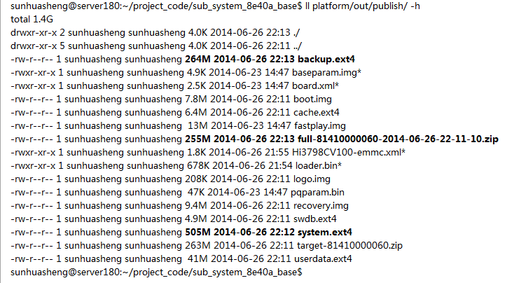
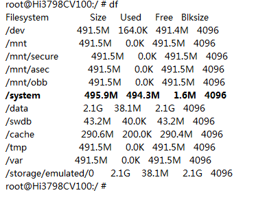

11. iptv  
    source build/envsetup.sh  
lunch 15  
/home/sunhuasheng/project_code/linux_base/swiptvmw_android/$ source shanghai_ctc_hi3798.env  
source build/swenv/swbasic.env  
external/swapi/src/base$ mm -B  
手动修改：  
    +       #LOCAL_MODULE := libswcommon_ssl_101f  
    +       LOCAL_MODULE := libswcommon  
    external/swapi/src/common$ mm -B  

10. 重新划定分区  
    划定system 512M, backup 440M，cache 300M  
以盒子上占满（剩余1.6M空间）system分区出发，platformt/release/system 最多555M  
backup.ext4 分配390M（分配380M打镜像失败）可以打出镜像，分配50M冗余空间，最终440M  
此时升级包为255M，分配45M冗余，最终300M  
  
盒子上df结果：  
  

9. 寄存器  
GPIO_STB4应该是GPIO_STB0_4，其基地址是GPIO_STB0，_4是bit4位置。同样，GPIO1_STB7应该是GPIO_STB1_7，其基地址是GPIO_STB1，_7是bit7位置。  

8. recovery手动编译出来的可以支持ntfs的u盘，小系统编译出来的不成  
----手动编译用的是recovery_uImage,小系统里边都是用的android_uImage，后者是单独驱动支持ntfs，ufsd_hisilicon.ko，前者内核支持了ntfs。采用android_uImage的recovery插入ufsd_hisilicon.ko 手动可以挂在ntfs u盘，代码挂在则失败。  
----重新编译内核中ntfs模块成单独驱动。参见文档device/hisilicon/bigfish/sdk/install_notes\(chs\).txt 单独编译内核部分，其中编译部分用make ARCH=arm CROSS_COMPILE=arm-hisiv200-linux-   modules  

7. 工具链  
按你说的提示，我在android官网下载了android-ndk-r9c-linux-x86.tar.bz2，解压后，用命令“ build/tools/make-standalone-toolchain.sh --platform=android-8 ”生成arm-linux-androideabi-4.6工具链。
然后在使用这个工具链，用3719SDK编译的ffmpeg静态库 成功编译了libswiptvmw（使用之前的工具链会编译失败）。  
我想问一下，之前编译libswiptvmw的arm-linux-androideabi-4.4.3 工具链是否也是这样生成的。  如果是的话，我就共享给其他同事编译3719的libswiptvmw。  

6. iptv  
//搜寻libcall_swservice.so 代码无果，对比3716、3719中此库MD5相同，故直接拷贝之  
cp ./swapi/pub/android_platform/libs/android_hi3716/libcall_swservice.so ./swapi/pub/android_platform/libs/android_hi3798/  
//情况如上  
cp ./swapi/pub/android_platform/libs/android_hi3719/android4.2_libs/libcpufeatures.so ./swapi/pub/android_platform/libs/android_hi3798/  
//参加其他平台对应的目录下有大量的库，编译中间件到这里边找，全部拷贝一下  
cp -P out/target/product/Hi3798CV100/system/lib/lib* /home/sunhuasheng/project_code/linux_base/swapi/pub/android_platform/libs/android_hi3798/  
parts/pub/ranger/libs/android_hi3798/lib$ cp tm shanghai -r  
swapi/pub/android_platform/libs$ cp android_hi3719 android_hi3798 -r  
arts/pub/libs$ cp android_hi3719/ android_hi3798 -r  
parts/pub/ranger/libs$ cp android_hi3719/ android_hi3798 -r  
swapi/pub/network/libs$ cp android_hi3719/ android_hi3798 -r  
swapi/pub/extdev/libs$ cp android_hi3716 android_hi3798 -r  
swapi/pub/media/libs$ cp android_hi3716/Irdeto_CCAClient/ android_hi3798/ -r  
parts/pub/ranger/libs$ cp android_hi3798/lib/shanghai_hi3719M/ android_hi3798/lib/shanghai -r  
swapi/pub/android_platform/libs$ mkdir  android_hi3798/android_libs/  
swapi/pub/android_platform/libs$ cp android_hi3716/android_libs/ android_hi3798/ -r/  

5. recovery 编译  
make -C device/hisilicon/bigfish/sdk/source/kernel/linux-3.10.y O=/home/sunhuasheng/project_code/android_kk_develop/out/target/product/Hi3798CV100/obj/RECOVERY_OBJ \   
                SDK_CFGFILE=configs/hi3798cv100_a/hi3798cdmo1a_hi3798cv100_a_android_recovery_cfg.mak \  
                ARCH=arm CROSS_COMPILE=arm-hisiv200-linux- \  
                CONFIG_MSP=y \  
                CONFIG_INITRAMFS_SOURCE=/home/sunhuasheng/project_code/android_kk_develop/out/target/product/Hi3798CV100/recovery/root \  
                -j 128 uImage  
cp out/target/product/Hi3798CV100/obj/RECOVERY_OBJ/arch/arm/boot/uImage  out/target/product/Hi3798CV100/Emmc/recovery.img  

4. 进入recovery  
//**读取emmc的偏移地址和大小都采用了block数，即需要大小除以块大小512**  
mmc read 0 0x1ffffc0 0x1000 0x5000; bootm 0x1FFFFC0  
//新分区  
mmc read 0 0x1ffffc0 0x2000 0x5000; bootm 0x1FFFFC0  
//擦除misc  
mmc write 0 0x1ffffc0 5F000 a000  

3. 创建仓库  
// 初始化仓库并指定远端仓库名称  
git init .  
git remote  add sunniwell ssh://git@svn.xxapk-release.git/hisi-base-4.4-apk  
// 目前还没有分支，需要提交一下文件会自动生成master分支  
touch .gitignore  
git add .gitignore  
git commit -m "init file"  .gitignore   
// 提交该分支  
git push sunniwell master  

2. 小系统仓库：  
manifests:   
ssh://git@svn.xx/hisi-3798C-spc010-emmc-kk-manifest.git  
apk：  
ssh://git@svn.xxapk-release.git/hisi-base-4.4-apk  
iptvmw：  
ssh://git@svn.xx/hisi-3798C-spc010-emmc-kk-iptvmw  
platform/build:  
ssh://git@svn.xx/hisi-3798C-spc010-emmc-kk-build  
platform/on-project:  
ssh://git@svn.xx/hisi-3798C-spc010-emmc-kk-project  
platform/release:  
ssh://git@svn.xx/hisi-3798C-spc010-emmc-kk-release  
下载地址：  
repo init -u ssh://git@svn.xx/hisi-3798C-spc010-emmc-kk-manifest.git  -b 8E40A-EMMC-BASE 

1. 有关CI  
项目名称：ANDROID-Hi3798C-SPC010-EMMC-kk-4.4 
版本文件：build_id.mk  
编译脚本：build-hi3798c-spc010-emmc-kk.sh  
代码地址：repo init -u ssh://gerrit.xx/hisi3798-kk-20140430/manifest.git -b develop  
版本存储：ssh://git@svn.xx/hisi-3798C-spc010-emmc-kk-release  
编译通知：  
fanjiwen@sunniwell.net;wangdongliang@sunniwell.net;sunhuasheng@sunniwell.net;jiangkun@sunniwell.net;liuwenyao@sunniwell.net;  
