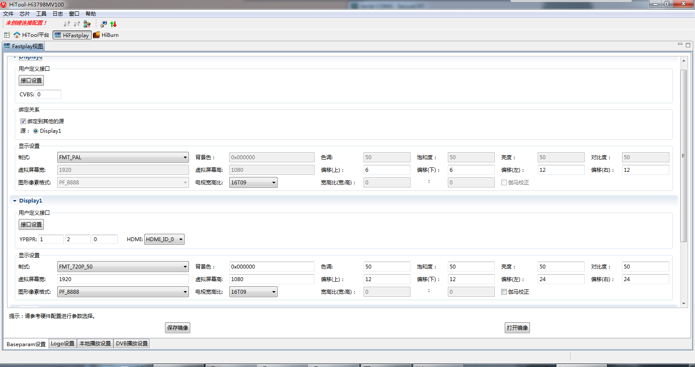

86. M321 在联想 9165-AC6上使用 ，屏幕有5厘米的黑边，只能设置往左和往上调节，有个对话框“输入信号超出范围”  
----这个应该是显示器适应问题，接电脑也有人碰到过这种现象。
    这种问题都是调节显示器来处理的，显示器的MENU--Auto Adjust，可以自动调整到合适范围。

85. 【Framework】不支持支持根据配置控制不启动Launcher而直接启动特定的APK（通过串口设置setprop epg.launcher.packagename为设置页面，但实际不能支持）  
----功能已添加，另外该属性是不能重启保存的，那在重启的时候没有检测到该属性就不能按照预期启动相应的apk了。该属性需要添加到/system/build.prop中。   
可用如下方法进行测试：  
1.mount -o remount system /system  
2.echo "epg.launcher.packagename=net.sunniwell.app.swsettings" >> /system/build.prop  
3.重启  

84. 55、56、57补丁  
     53基础上的usb补丁patch_for_huawei_Hi3798m_HiSTBAndroidV600R001C00SPC053__20141231_01.tar.bz2  
 bigfish/frameworks/hipq/libs/PQService.cpp 的修改  
sunhuasheng@server180:~/opt/hisi/3798m/patch_iptv/20141213_001/patch_for_SichuanTelecom_HiSTBAndroidV600R001C00SPC056_20141213_001$ md5sum.sh .  
dir:.  
291821bb1fe2cf0f7caeee803554292a  ./readme.txt  
2f4ba1cef97e8f2f9bc17385b6e01af2  ./device/hisilicon/Hi3798MV100/device.mk  
8cd29d8ef2076f64e1476fb84854919b  ./device/hisilicon/Hi3798MV100/prebuilts/baseparam_1080.img  
c316c34d6c1654cb325d40a42f2f0cc5  ./device/hisilicon/Hi3798MV100/prebuilts/baseparam.img  

83. 小米电视，自适应切换到720p失败  
----自适应的是选了1080p_60Hz，切换到720p_50Hz ，用disptest   setfmt的方式验证，从60Hz的几个制式切换到720p_50Hz都会需要30多秒的时间才能显示出来，设置页面中倒计时是15秒，那就会出现上述中切换到720p后黑屏然后倒计时结束后回到自适应。小米电视有问题！  

82. 出现包异常情况陷入升级失败，重启，再进recovery尝试升级的循环。  
开发手段：busybox echo 0000000000000000000 >/dev/block/platform/hi_mci.1/by-name/misc  

81. 接串口线待机，然后断电、上电后盒子起不来。  
----**串口线中有提供3.3v电压，倒灌到cpu中影响cpu工作逻辑，有需要复位的没有复位成。**    

80. 北京功放测试spdif需要用小功放，pcm及透传都ok。连接大功放时候透传可以有声音输出，解码时候面板会显示pcm，但不会有声音输出。  

79. 文件管理器在user版本响应慢，[persist.sys.ui.hw]: [false] 关掉硬件加速导致，设置为true即可。  

78. 3798m更新baseparam.img:  
  

77. Hisi问题：
77. 1. sdcard 挂载问题  
     a.（出现3次）概率出现SD卡挂载不上问题；备注：重新插拔恢复正常，有一次需要下电才能恢复正常；  
     b. 快速拔插SD后，检测不到升级  
     c. 【升级】SD卡升级下载升级包过程中拔掉SD卡，再插上可检测并下载  
     d. 反复拔插SD卡，提示信息展示SD已移除，实际SD卡未移除，检测不到SD。  
77. 2. HDMI转DVI问题  
     a. 盒子先接电视机的，再接HDMI转DVI(显示器)画面黑屏无输出  
     b. 通过HDMI转DVI线连接显示器，断电重启后必现黑屏  
----跟华为沟通，recovery中显示异常的问题不处理。  
77. 3. 死机问题    
     a. B012版本媒体遍历自动化跑了大概4个小时，板子死机。  

77. 4. 重启盒子，启动完后再插上HDMI线，电视只显示了四分之一  

76. 问题单梳理
76. 1、  system_server占有率过高问题需要定位解决。  
     ----【20141104】目前接触的几个版本都未超过30%，华为俞健也反应新版本上没有复现，跟踪观察。  
76. 2、  NTP 同步时间慢  
76. 3、  HDMI 分辨率方案落实修改  
     ----【华为宁伟佳】设置页面需要将所列制式修改为相应50Hz  
     ----【华为宁伟佳】恢复出厂设置后，在没有persist.sys.optimalfmt.enable情况下，一进入设置中的“显示”会将此属性设置为1。目前在build.prop中添加默认persist.sys.optimalfmt.enable=0后使用上已没有问题，不过最好查下代码修改掉。  
     ----【20141104】恢复出厂设置时候需要重置制式、显示区域、亮度等参数，由于恢复出厂时候reboot太慢，设置制式会有黑屏现象，故已将此动作放到recovery中。  
----【20141104】设置制式时候cvbs画面会有抖动，已提单海思处理。  
76. 4、  首次apk安装未知来源开关优化 （提供华为修改思路）  
     ----【20141104】华为处理，除ui设计外请留意是否能够实现在关掉允许未知源安装时候，从沙发管家之类商城、文件管理器、adb install方式确实不能安装；在打开未知源安装时候，几种方式都能安装成功。  
     ----验证沙发管家及文件管理器安装ok，都会有提示框。adb install方式不处理，非问题。  
76. 5、  视频浏览没有缩略图   
76. 6、  开机时间优化（目标20秒）、包括生产版本开机时间优化  
76. 7、  待机唤醒问题修改  
     ----【20141104】最新版本待机30多次没有见异常，跟踪观察  
76. 8、  sd外置安装apk  
     ----【20141104】张丙胜研究中  
76. 9、  快捷组合按键截屏  
     ----【20141104】待华为给出具体需求，如哪几个组合键、保存截屏文件到哪、文件命名方式等  
----【20141111】李龙武处理  
76. 10、hdmi转dvi  
     ----【20141104】B018T14及最新版本B018SP14自测没有问题，请李彬生及华为再确认。  
----【20141111】android中没有问题，recovery中无显示，提单海思。  
----【20141111】跟华为沟通，recovery中显示异常不做处理。  
76. 11、busybox裁减  
----【20141104】已裁减完成，待海思最终确认。  
76. 12、adb及串口开关控制  
----【20141104】adb控制已ok，默认user版本已关闭串口。  
----【华为宁伟佳】需要在设置页面中添加串口开关----串口不在设置页面中添加开关  
76. 13、另外那个在爱奇艺播放器播放变形的问题,可能需要朝歌那边对比下.   264/265之间的差异,目前看起来视频源和海思底层播放这块,应该都是识别的1280X560.  
76. 14、 SPDIF解码输出时，先播放杜比片源，再播放DTS片源会无声音输出，SPDIF源码输出时，播放DTS片源，无声音输出，功放显示为PCM     
     ----多音轨片源存在此问题，在mediaPlayerService中不再根据音频格式区分，统一按照设置页面中的设置来配置hdmi/spdif输出模式  
76. 15、【1】/sys/devices/system/cpu/cpu0/cpufreq/scaling_governor    默认是interactive模式/；在朝歌版本中变成了userspace模式. 同时scaling_setspeed被设置成了1200000  
【2】查看了下/sys/devices/system/cpu/cpu0/cpufreq/scaling_setspeed文件. 海思demo版本返回的是: <unsupported>  朝歌的版本返回的是: 1200000  
----补丁修改fastboot导致  

75. busybox裁减、缩略图、
----见上问题单梳理

74. hisi问题单  
--小块花屏问题  
--安兔兔视频播放问题==答复原生版本没有问题  
--53补丁编译不过问题  
--电视显示为四分之一问题  

73. ENHANCE_APPLICATION_COMPATIBILITY := false临时改动，需要改回去  
--已改回，将device/hisilicon/bigfish/prebuilts/Android.mk 中Pmqos的控制改为此宏为true，添加Pmqos  

72. HDMI OUT无法切换为外部HDMI信号的问题  
--R3600由10K改为4.7K，R3609由1K改为4.7K  

71. libsqlite.so来源
代理版本：c1f228de1ddd9686b4b442feeff6bd44  /home/sunhuasheng/libsqlite.so
1d49449afa9caa3d4b4bf2151f6cdad7  /home/sunhuasheng/project_code/sub_system_8m330_base/platform/release/system/lib/libsqlite.so
sunhuasheng@server180:~/project_code/sub_system_8m330_base/platform/release$ git checkout 67aec791795d0bce32f6d9cb32c88c43f553386f system/lib/libsqlite.so
31a84568504d8b2fc0c3bba091c7a2b8  /home/sunhuasheng/project_code/sub_system_8m330_base/platform/release/system/lib/libsqlite.so
1d49449afa9caa3d4b4bf2151f6cdad7 /home/sunhuasheng/project_code/sub_system_8m330_m321/platform/release_user/system/lib/libsqlite.so 
sunhuasheng@server180:~/project_code/sub_system_8m330_m321/platform/release_user$ git checkout 59bb1714f1bf74801ccd0f3c48783565405270b7
c1f228de1ddd9686b4b442feeff6bd44 /home/sunhuasheng/project_code/sub_system_8m330_m321/platform/release_user/system/lib/libsqlite.so 
219f116fc0e405c7da37031ead16986d  /home/sunhuasheng/opt/hisi/3798m/download_eng/out/target/product/Hi3798MV100/system/lib/libsqlite.so
1d49449afa9caa3d4b4bf2151f6cdad7  /home/sunhuasheng/opt/hisi/3798m/download_eng/device/hisilicon/bigfish/external/sqlite/prebuilt/libsqlite.so
1d49449afa9caa3d4b4bf2151f6cdad7  /home/sunhuasheng/opt/hisi/3798m/download_user/out/target/product/Hi3798MV100/system/lib/libsqlite.so
1d49449afa9caa3d4b4bf2151f6cdad7  /home/sunhuasheng/opt/hisi/3798m/download_user/device/hisilicon/bigfish/external/sqlite/prebuilt/libsqlite.so
1d49449afa9caa3d4b4bf2151f6cdad7  /home/sunhuasheng/project_code/android_3798M_kk_develop/device/hisilicon/bigfish/external/sqlite/prebuilt/libsqlite.so
1d49449afa9caa3d4b4bf2151f6cdad7  /home/sunhuasheng/project_code/android_3798M_kk_develop/out/target/product/Hi3798MV100/system/lib/libsqlite.so
--libsqlite.so 狂打印SettingProvider打印跟快速启动有关，关掉快速启动后用最新库亦没有问题。

70. 升级完后这次开机启动没有开机广播  
--张华刚验证没有问题  

69. 有关安全红线  
--有关/tmp_database，由mount tmpfs tmpfs /tmp_database nosuid nodev 改为mount tmpfs tmpfs /tmp_database mode=0775,gid=1000  
--有关file_context，build/core/Makefile中SELINUX_FC字段  
----- Making update package ------  
----- Made update package: out/target/product/Hi3798MV100/Nand/update.zip --------  
zipinfo -1 out/target/product/Hi3798MV100/Emmc/update/sor_update.zip | awk '/^system\// {print}' | out/host/linux-x86/bin/fs_config > out/target/product/Hi3798MV100/Emmc/update/file/META/filesystem_config.txt
java -jar out/host/linux-x86/framework/signapk.jar -w  build/target/product/security/testkey.x509.pem build/target/product/security/testkey.pk8 out/target/product/Hi3798MV100/Emmc/update/sor_update.zip out/target/product/Hi3798MV100/Emmc/update/update.zip  

68. fmask、umask改为007 导致/mnt/sda/sda1权限有777 变为770，然后又导致hisi本地播放失败。  
--hisi原生apk播放失败，m321项目apk播放没有问题，转海思处理。  
--安全红线改动，mask改为0002，则目录权限变为775  

67. user版本编译新加的代码  
----device_common.mk中添加到符号PRODUCT_PACKAGES中

66. 播放过程中不出现屏保  
----全聚合-HiMediaPlayer及MediaPlayerService都会走到  
----媒体中心只走HiMediaPlayer  
----qq音乐只走MediaPlayerService  
====在HiMediaPlayer及MediaPlayerService中都添加sw.media.isplaying的属性配置  
----有些apk可能带有软解码音频功能，暂不考虑    

65. CPU_HS_DET  引脚的40.9M时钟：所以EMC认证需要把入himm 0xF8B26400 0x00、himm 0xf8a21160 0x300何如当前软件，硬件把C8007电容上件  
----fastboot中配置为gpio模式

64. Antutu视频测试.   
--clean后新版本ok

63. 朝歌8G40c版本  
----宋雷涛

62. 裕斗那一个朝歌m321盒子hdmi无输出，拿华为m321与之互换使用，待排查

61. 检测补丁工具

60. 键值的keycode名称，待机广播

59. mmi客服版本  
--刘祎楠

58.  后续会跟家武讨论下，看看这些我们双方都有可能改动的代码该如何维护。

57. 3719flash性能测试  
--丙胜搞定

56. [安全红线]  vold里面挂载的时候的参数

55. sdcard快速拔插不能识别问题  
----转hisi处理

54. 9月22号生产版本，20提前给一个版本预验收

53. 键值问题

52. recovery升级过程中出现 Warning:No file_contexts

51. 提供一下播放设置模块中的Image Quality功能接口  
--hisi答复

50. 补丁051升级脚本改动：  
+delete("/data/property/persist.sys.firstboot.flag");  
+delete("/data/property/persist.sys.qb.flag");  
--此属性在data中，擦除data可以去掉，而且目前没有在用quickboot功能。  

49. 工厂升级，recovery中读取标记在升级完后不自动重启  
--挂载cache分区后检查/cache/update/manufactoryupdate.flag标记，有则不重启。

48. 如果设置了spdif，在启动的过程中，是否可以修改为一直都是spdif，反之亦然。

47. spdif控制添加一个寄存器的配置

46. 添加ethtool到版本中

45. 刘建峰imei -> sn  
==栗小强已解决

44. 拔掉u盘没有广播  
--没有问题

43. 320dpi问题

42. apk安装到sdcard

41. 朝歌3798板子需要添加usb3.0 驱动来支持usb3.0的口  

40. I2S时钟关闭的指令。  
请文耀确认GPIO6_6是否已经配置为普通GPIO了  
--已修改  

39. 杜比解码库删除，华为项目单独申请，华为项目小系统单独维护。  

38. 待机问题解决后通知下银邦飞  

37. 【升级】SD卡强制升级方式反复升级，几率卡在recovery界面不进行升级  
----待复现  

36. 調試MMI自動化測試時發現我們的AV左聲道聲音波形不對，請幫忙確認是否是軟件需要優化  
----硬件问题  

35. Android中自动升级recovery  
--**升级recovery的脚本在升级过程中才会放到system/etc下，生产版本没有此功能，升级过后即ok**  

34. 静音控制  

33. 你们现在板子上用的是usb2,3798M 只有usb0支持adb功能，所以板子上usb0 转usb口的插针座子要留着给测试用.  

32. M330a需要支持杜比解码，但是不支持DTS，请知。但是DTS后续需要可以被破解，破解后就支持DTS和杜比。  
--计划9月1号开始-9月5号提供  

30. sdcard的IO口驱动电流在现在配置能力上，降一个档次  
----提供各个模块电流的控制方法，待硬件测试后提供最终决定结果  

29. 由于华为产品的归一化要求，需要将USB&SD卡升级包默认放置路径由现在的upgrade目录，修改为dload目录  
----李龙武提供新升级apk  

28. 【M330a V1测试】影音同步测试,音频信号最大超前视频56ms,规格为 +20~-60 ,超出规格
----记得是华为标准视频超前音频+20ms~-60ms，麻烦帮忙再确认一下，如果是这样的话测试结果"音频超前视频42ms" 就在规格范围内了。s32VidPlusTime、s32VidNegativeTime只有sample中有去设置，是不是封装在了你们那个player库中了。  
----已提单hisi解决  

27. 问题描述:目前软件版本不支持全模式工作,USB/SD卡/EMMC/wifi/网口不支持后台工作  
--8.12号 朝歌给出新命令，验证可以读写，但是没有办法显示读写次数与状态，明天朝歌更新软件可以通过串口查询，后续集成测试软件需要在界面上显示读写次数。  
--新需求要apk，龙武提供  

26. 待机功耗  
----硬件缺mos管，不支持真待机。      

25. 网口吞吐量  
--hisi  

24. usb 后台读写  
--后台脚本  

23. wifi播放马赛克  
--CVBSTest+pc 共享  

22. 320dpi导致横屏，fastboot中时间异常---------找hisi解决  
----ui同步修改为1080p才行  

21. 寄存器设置  
     1.gpio0_1 cvbsmode  
     复用：himm 0xf8a21024  0x702  
     方向：himm 0xf8b20400  0x2  
     低电平（cvbs）：himm 0xf8b203fc  0x0  
     高电平（spdif）：himm 0xf8b203fc  0x2  
     2.gpio5_5 led  
     复用：himm 0xf8000044  0x00380000  
     方向：himm 0xf8004400  0x20  
     低电平（亮）：himm 0xf80043fc  0x0  
     高电平（灭）：himm 0xf80043fc  0x20  
     3.gpio4_3 mute  
     复用：himm 0xf8a210b0 0x700  
     方向：  
     4.spdif 复用  
     SPDIF_OUT: himm  0xf8a210ac 0x701  
     SPIO4_2: himm 0xf8a210ac 0x702  
     5.m330板子hdmi in/out切换  
    hdmi in：himm 0xf8b243fc 0xc  
    hdmi out：himm 0xf8b243fc 0xd  

20. 设置页面添加hdmi制式auto，需要开会讨论基线添加与否，设置负责人员。  

19. 生产测试 hdmi、cvbs、spdif  
----已添加cvbs、spdif开关  

18. 待机一次后待机失败  
----张华刚解决  

17. TestPlay 左右声道切换  
--李龙武apk实现，貌似有问题，ts的一个片源不能切换  

16. USB口信号质量测试(低速,高速,全速)需要软件提供测试命令  
----使用cvbstest.apk    

15. 目前软件版本不支持全模式工作,USB/SD卡/wifi/网口不支持后台工作  
----见提供的脚本  

14. 目前软件烧机播放画面经常卡顿,需要软件优化.  
--CVBSTest+pc 共享  

13. 3798M 样片，不支持4 K  HDMI 显示，等量产片  
---换量产片  

12. 两块板子ddr报错，启机失败  
----fastboot问题  

11. 生产测试sdcard、usb，左列多出空行；待机唤醒异常  

10. 播放卡顿  
--CVBSTest+pc 共享  

9. HDMI电气指标测试时，CLK不上拉，数据强制输出  
----hisi：无法强制输出  

8. HDMI展频、预加重以及DDR展频直接合入当前软件，可以通过串口或者网口写命令控制展频打开或者关闭，EMC优先摸底关闭展频情况。   

7. make_ext4fs -s -S root/file_contexts -l 503316480 -a system system.ext4.img system  

6. secure boot实现方案讨论  
 
5. 开机logo、开机动画提供时间点  
// [zhoujiawu]: 提供时间点为8月8日。  
5. 支持复位键检测和红外组合键检测，检测到按键进入recovery（需要确认是什么组合键）  
   //[zhoujiawu]: 组合键： 确认(OK) + 音量减  (可以是：确认、音量-，也可以是：音量-、确认, 交替识别到两个按键即可)  
5. 升级或失败时生成对应的log文件并保存在特定的内部SD卡路径下，以及升级失败错误码（需求确认存放路径和错误码规格）  
   // [zhoujiawu]: 使用Android默认的路径：/cache/recovery/， 升级错误码使用目前系统默认的。  
                   升级打印要能够重定向到串口。  
5. 支持升级包CRC校验和RSA华为私钥加密CRC校验码（需要提供实现的规格文档）  
   // [zhoujiawu]: 请提供朝歌目前升级的升级包校验方案，华为评估安全性，再确认是否要增加华为私钥。  
--完全用朝歌方案  
5. LED指示灯显示需求规格（上电后亮灯还是？）  
   // [zhoujiawu]: 具体参照规格，灯肯定是上电后才亮的，其余朝歌方案  
5. 预制TV应用市场是否提供（之前讨论结果是暂时不需要预制，是否可以明确）  
   // [zhoujiawu]: 暂时无此需求。  
5. 开机动画后显示一张启动画面，启动画面支持动态更换。（软件规格中有，但之前我们过项目需求时又说不需要实现，需要明确是否需要实现？）  
   // [zhoujiawu]: 需要实现。  

4. deviceinfo 添加stbid  

3. M330a的DPI值需要同时支持320DPI（Google CTS认证要求）和240DPI（第三方apk的兼容性比320好），蜜盒1也是同时支持的。  
默认出厂设置为320DPI，用户可以在设置界面的“显示”里面修改DPI值为240DPI或者320DPI。  
请UI/GUI设计的时候注意兼容，另外请开发兄弟注意两种DPI都要支持！    

2. 【0725】3798M预计8月4号会出2x512M=1G ddr，4层板的配置，麻烦提前提供对应的配置文件，以便编译新的fastboot适配新硬件  

1. 【0725】    一个是是否可以通过命令查询到cpu的运行频率、cpu温度、cpu核数这些信息？  
    是否可以通过命令强制hdmi输出以便硬件测试？  
--cpu温度需要读取寄存器然后换算，其余的可以在proc中读取到  

3. 小系统仓库：  
manifests:  
ssh://git@svn.xx3798M-spc030-emmc-kk-manifest.git  
apk：  
ssh://git@svn.xx/hisi-base-4.4-apk  
iptvmw：  
ssh://git@svn.xx3798M-spc030-emmc-kk-iptvmw  
platform/build:  
ssh://git@svn.xx3798M-spc030-emmc-kk-build  
ssh://git@svn.xx/build/platform-build  
platform/on-project:  
ssh://git@svn.xx3798M-spc030-emmc-kk-project  
platform/release:  
ssh://git@svn.xx3798M-spc030-emmc-kk-release  
下载地址：  
repo init -u ssh://git@svn.xx3798M-spc030-emmc-kk-manifest.git  -b 8M330-EMMC-BASE  

2. 有关user 版本的CI  
项目名称：ANDROID-Hi3798M-SPC033-EMMC-kk-4.4-USER  
版本文件：build_id.mk  
编译脚本：build-hi3798m-spc033-emmc-kk-user.sh  
代码地址：repo init -u ssh://gerrit.xx/hisi3798-kk-20140818/manifest.git -b develop  
user版本存储：ssh://git@svn.xx/hisi-3798M-spc033-emmc-kk-release-user  
fanjiwen@sunniwell.net;sunhuasheng@sunniwell.net;liuwenyao@sunniwell.net;  

1. 有关CI  
项目名称：ANDROID-Hi3798M-SPC030-EMMC-kk-4.4  
版本文件：build_id.mk  
编译脚本：build-hi3798m-spc030-emmc-kk.sh  
代码地址：repo init -u ssh://gerrit.xx/hisi3798-kk-20140718/manifest.git -b develop  
版本存储：ssh://git@svn.xx/hisi-3798M-spc030-emmc-kk-release  
编译通知：  
fanjiwen@sunniwell.net;wangdongliang@sunniwell.net;sunhuasheng@sunniwell.net;jiangkun@sunniwell.net;liuwenyao@sunniwell.net;  
