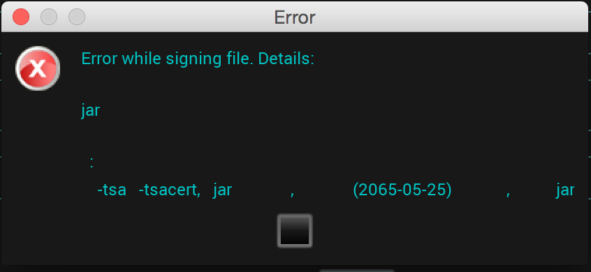

####内存泄露查找工具LeakCanary

####有关Android studio
1. 安装篇  
Windows下需要配置支持HAXM，具体参照 [安装Intel HAXM为Android 模拟器加速](http://www.tuicool.com/articles/meQbmmb)，还算比较顺利，只不过在配置BIOS中开启虚拟加速机制的时候找了半天。我这戴尔台式机，位置是Overclocking--CPU Features--Intel Virtualization Tech,选中为Enabled，F10保存退出即可。  
号称30秒启动的虚拟机，基本没有改善，而且还真真的占用了2G内存。还是上Genymotion，业界良心。  
2. AndroidStudio+Genymotion  
装下插件即ok，Settings--Plugins--搜索Genymotion--下方的按钮Browse repositories在线安装--弹出界面选择Install。  
然后工具栏新出现一个Genymotion Device Manager中配置Genymotion安装路径：D:\Program Files\Genymobile\Genymotion。
3. 导入之前的项目有可能会报'找不到API 19 sdk platform'的错  
AS默认只带了API22的platform文件，所有到sdk manager中将常见的api 21/19/17/15安装一下，有关SDK Manager设置代理见之前笔记'Eclipse之sdk manager篇’   
Mac上安装完后查看sdk Manager居然自动找到了Eclipse下载过的sdk路径，不用重新下载，爽歪歪。  
4. 导入之前的项目时候，出现如下报错  
   
将MyApplication中build.gradle中的android字段删掉即可，记得点击下'Sync Project with Gradle Files'即可生效：
    
5. Mac上安装AS，下载sdk阶段一直报错'The following SDK components were not installed: sys-img-x86-addon-google_apis-google-22 and addon-google_apis-google-22’ 
有全局翻墙环境，但是点击retry仍然一直失败，点击cancel然后就退出了，重新打开AS一路next下来又重复上述问题。  
直到重新打开AS，在Welcome界面直接点击cancel而不是点击next，则出现了创建Android App工程的界面，终于能用了。

####反编译
反编译：java -jar ~/tools/apktool_2.0.0.jar d myhw/ apks/myhw.apk  
重新打包：java -jar ~/tools/apktool_2.0.0.jar b myhw/ myhw_new.apk  

反编译：java -jar tools/apktool1.5.2.jar d apks/myhw.apk  apks/myhw  
出现报错：Could not decode arsc file  
原因：apktool工具版本太老，更新新版本的apktool  
sublime工具查看反编译出来的smali  
重新打包：java -jar tools/apktool1.5.2.jar b apks/myhw new_myhw.apk  
出现报错：Could not run progress “aapt"  
原因：需要将adt—sdk—build-tools—21.1.2(获取其他某个版本)—aapt的路径添加到环境变量PATH中  
对apk签名：java -jar tools/apk-signer-1.8.5.jar   
选择了待签名apk、key文件进行签名时出现如下乱码，待分析。还是用Linux中签名方式：java -jar $build_path/linux-x86/framework/signapk.jar $build_path/security/platform.x509.pem $build_path/security/platform.pk8  $input_file $output_file   
  

####不能打开包含在apk里边的数据库，如需使用得先写到data相应目录中或者sdcard中

####有关AsyncTask
1. 需要在UI线程中创建AsyncTask的实例以及调用AsyncTask的execute方法
2. 重写的四个方法是系统自动调用的，不能手动去调用
3. 每个AsyncTask只能被执行一次，多次调用会引发异常
4. 只有doInBackgroud方法是运行在其他线程做异步操作，其他三个方法都是运行在UI线程，也就都可以操作UI
5. AsyncTask的cancel只是将对应的AyncTask标记为cancel状态，并不是真正的取消线程的执行。需要在doInBackgroud和onProgressUpdate里边检测线程是否isCancelled状态，然后做相应操作。

####ndk
1. 环境搭建
    * 下载ndk，地址见[AndroidDevTools简介](http://www.androiddevtools.cn/)  
    *  chmod a+x android-ndk-r10d-darwin-x86_64.bin; ./android-ndk-r10d-darwin-x86_64.bin
    * 添加ndk-build所在目录到环境变量PATH

2. 生成头文件  
终端命令行方式，在工程根目录下：   
javah -classpath bin/classes -d jni -jni com.wilsonflying.testjni.AccessNative  
javah -classpath bin/classes -d jni  com.wilsonflying.testjni.AccessNative  
配置eclipse自动生成头文件：   
[在eclipse中快速开发JNI，一键生成C头文件.h，以及一键使用NDK交叉编译](http://www.oschina.net/question/1402563_133543)  
3. ndk-build  
终端命名行方式，在工程根目录下直接执行：  
ndk-build  
配置eclipse自动执行：  
[在eclipse中快速开发JNI，一键生成C头文件.h，以及一键使用NDK交叉编译](http://www.oschina.net/question/1402563_133543)   
4. 在preference中没有NDK的配置项的问题  
目前adt bundle版本是adt-bundle-mac-x86_64-20140702，在preference中没有NDK配置项。打开前不久的旧版本adt-bundle-mac-x86_64-20131030中的eclipse是有NDK配置项的。将~/Applications/adt-bundle-mac-x86_64-20131030/eclipse/plugins/com.android.ide.eclipse.ndk_22.3.0.v201310242005-887826.jar 拷贝到目前版本对应plugins目录，重启eclipse就ok了。
5. 配置NDK后在.C .CPP文件中仍然不能自动补齐的问题  
需要在项目开始写jni代码前通过Add Native Support的方式自动生成jni目录及默认的cpp文件和Android.mk。方法是右键工程名称—Android tools—Add Native Support。这个时候在去编辑代码就可以自动补齐，并且能够跟编辑java代码时一样实时检查代码语法错误。  
6. 在Acitivity中声明native方法来生成头文件的问题  
javah -classpath bin/classes:/Users/cindy/Applications/adt-bundle-mac-x86_64-20140702/sdk/platforms/android-21/android.jar -d jni com.wilsonflying.testjni2.MainActivity  
通过在Activity中声明native的方法，也是可以通过javah生成头文件的。只不过需要在制定classpath路径中添加android.jar所在目录，否则会报错提示找不到android.app.Activity的类文件。这样还是太繁琐，而且生成的头文件里边会有非常多没有用的东西，所以还是单独创建一个类，在其中声明native的方法，然后生成头文件。

####launchMode
standard 不管有没有已存在的实例，都生成新的实例  
singleTop 如果发现有对应的Activity实例正位于栈顶，则重复利用，不再生成新的实例  
singleTask 如果发现有对应的Activity实例，则使此Activity实例之上的其他Activity实例统统出栈，使此Activity实例成为栈顶对象，显示到幕前  
singleInstance 这种启动模式比较特殊，因为它会启用一个新的栈结构，将Acitvity放置于这个新的栈结构中，并保证不再有其他Activity实例进入  

####setImageDrawable与setImageResource
ImageView 使用：
imageview1.setImageDrawable(getResources().getDrawable(R.drawable.shoe_default));
ImageSwitcher使用：  
private int[] imageId = new int[] { R.drawable.img01, R.drawable.img02};
imageSwitcher.setImageResource(imageId[index]);

####scrollview与listview
ScrollView继承自FrameLayout，是一个Layout！可以滚动显示一个占据的空间大于物理显示的视图列表。scrollview只能包含一个子视图或试图组，在实际使用中通常包含的是一个垂直的LinearLayout。在页面展示后，scrollview中的所有内容都加载到了内存中，当数据量大时会比较耗资源。与之对应的还有个HorizontalScrollView，可以在水平方向滚动视图。  
ListView 继承自AbsListView，是一个可以在垂直方式滚动显示view视图的列表。只有在滑动到显示界面才会加载之前没有显示的内容，数据量大的时候性能方面优势比较明显。可以精确到其中每一个item的点击事件。使用ListView有两种方式，一种是通过一个继承了ListActivity的Activity，在其中设定ListAdapter，对于这种方式，比较适用于整个页面就是一个ListView；第二种方式就是直接使用ListView控件。

####空进程
运行这些进程的唯一原因是作为一个缓存，缩短下次程序需要重新使用的启动时间。系统经常中止这些进程，以调节程序缓存和系统缓存的平衡  
更多有关进程分类、进程生命周期、Android内存管理信息见：  
[Android 进程生命周期 Process Lifecycle](http://www.cnblogs.com/mengdd/p/3139934.html)   
[Android内存管理机制详解](http://blog.csdn.net/chaihuasong/article/details/8289367)  

####软引用
如果一个对象只具有软引用，则内存空间足够，垃圾回收器就不会回收它；如果内存空间不足了，就会回收这些对象的内存。只要垃圾回收器没有回收它，该对象就可以被程序使用。软引用可用来实现内存敏感的高速缓存。  
其特点是它的一个实例保存对一个对象的软引用，该软引用的存在不妨碍垃圾收集线程对该Java对象的回收。也就是说，一旦SoftReference保存了对一个Java对象的软引用后，在垃圾线程对这个Java对象回收前，SoftReference类所提供的get()方法返回Java对象的强引用。另外，一旦垃圾线程回收该Java对象之后，get()方法将返回null。   
更多有关软引用及强引用、弱引用、虚引用见：  
[android使用软引用构建缓存](http://blog.csdn.net/hbzh2008/article/details/9038029)   
[android 解决图片大量上载：软引用必须懂4点](http://www.educity.cn/wenda/176212.html)  

####有关listActivity的id
如果只是普通的文本内容的listview，完全可以不定义layout。如果需要定制布局，在布局文件中添加listview的时候需要将其id设置为android:id="@android:id/list"，或者android:id="@id/android:list”，否则会有这种报错：Your content mush have a listView whose id attribute is 'android.R.id.list'

####raw中命名文件不能有大写，asset中文件名可以有大写，什么破规矩！

####有关Java内部类引用外部变量需要定义为final
根据创建位置，内部类可以分为成员的、方法的、匿名的、接口的。
对于成员内部类来说，会持有一份外部类当前对象的引用：Out.this。这样就可以调用外部类可见的方法及成员变量，调用方法是通过持有的外部类当前对象的引用。  
对于方法内部类来说，通过外部类当前对象的引用访问不到所在方法中的局部变量。Java设计的解决办法是：将局部变量复制一份给内部类使用。方法则是在内部类初始化的时候通过构造方法传值的方式。这样引出一个问题就是，**方法中变量与内部类中变量副本的一致性问题**。解决此问题的方法就是需要将方法中的局部变量定义为final！  
更多详情见：[Java内部类与final关键字详解](http://blog.csdn.net/ygj281583295/article/details/9059737)  

####安全篇
1. 概述  
  
2. 对称加密  
置换加密、转置加密、乘积加密  
DES/AES  
高效、密钥交换的问题、不如RSA加密的安全程度高，但256bit的AES足够绝大多数安全领域  
3. 非对称加密  
RSA  
安全性足够高、没有密钥交换的问题、效率低，对大数据加密很慢  
4. 密钥交换  
非对称加密方式交换密钥   
Diffi e-Hellman密钥交换协议  
5. HASH(哈希、散列、数字摘要、数字指纹、MD),变长输入变换成哼定长输出    
常见hash算法：MD5、SHA1    
易变性：即使原数据发生1bit的变化，hash的输出将发现不可预知的巨大变化  
不可逆：通过hash结果构造出输入信息是不可能的或者说极其困难  
应用场景：防篡改、防损坏、认证  
HMAC(Hash-based Message Authentication Code)，使用key对原始信息进行变换后再进行HASH。解决：1.尾部直接附带消息摘要的问题(篡改内容的同时篡改消息摘要)2.直接对密码做HASH传输的认证问题(重放攻击，不用破解，截获或直接使用。(预防重放攻击，还可以从server端先发送随机码，client段将密码和随机码拼接然后做HASH))。
6. 数字签名  
  
7. 证书  
可完成公钥的存储和交换

####Effective UID/ Real UID
Linux中，父子进程间UID的世袭原则：身份世袭二权利不世袭，及子进程可以继承Real UID,不能继承Effective UID。表现为子进程的Real UID=子进程的Effective UID=父进程的Real UID。  
典型的实例:passwd, 运行时候Effective UID被提升为root，但RUID不会变。su，EUID和RUID均会改变。
有了setuid 还有setgid及对应的Effective GID、Real GID。  
android_filesystem_capability.h中定义了capability的描述。
  
  

####FLAG_ACTIVITY_CLEAR_TOP
A,B,C,D依次启动了四个Activity，由D到B而且不再需要回到C，则可以在D中启动B的时候加入intent.setFlags(Intent.FLAG_ACTIVITY_CLEAR_TOP);  
引申：由D退出程序，则可以用如上方法启动A，同时配置A为android:launchMode="singleTask"，这时启动A就不会调用oncreate(),而是响应onNewIntent()，在A中重写onNewIntent()添加finish动作，这时将会退出整个程序。  
更多详情见：[ActivityGroup相关--getLocalActivityManager() 以及intent.setFlags(Intent.FLAG_ACTIVITY_CLEAR_TOP)用法](http://blog.csdn.net/getchance/article/details/8444589)

####定制控件几种方式
1. 继承其他空间类(EidtText、Button)
2. 组合方式。当前空间类从容器里继承，并将若干控件添加到当前的容器中
3. 绘制控件，也就是空间类从View继承，并从onDraw方法中从零绘制控件。
编写控件类的时应将可能变化的值通过属性设置，而不是直接固化在控件类中。

####getApplicationContext与this
对于一般的Android应用，通常有两种Context，即Activity和Application。  
getApplicationContext() 返回应用的上下文，生命周期是整个应用，应用摧毁它才摧毁。  
Activity.this 返回当前activity的上下文，生命周期只是它所在的Activity，activity 摧毁它就摧毁。
如果是在匿名内部类中，this通常就是不能用的，因为内部类所new出来的对象的生命周期比较短。  

####layout_gravity/gravity/padding/margin
layout_gravity：描述该view与父view间位置关系，即view的布局描述   
gravity：描述该view与其内容的位置关系，比如EditText/Button中的文字位置  
需要注意的是，垂直布局中，描述左右方向的位置描述生效，垂直方向比如top、bottom不生效；水平布局类推。  
padding：描述该view与其内容的距离关系  
margin：描述该view与邻居view的距离关系  
spacing：gallery中图片间隔  
android:verticalSpacing/android:horizontalSpacing：gridview中图片上下、左右之间的间隔  

####layout_gravity/gravity/padding/margin
layout_gravity：描述该view与父view间位置关系，即view的布局描述  
gravity：描述该view与其内容的位置关系，比如EditText/Button中的文字位置  
需要注意的是，垂直布局中，描述左右方向的位置描述生效，垂直方向比如top、bottom不生效；水平布局类推。
padding：描述该view与其内容的距离关系  
margin：描述该view与邻居view的距离关系

####代码混淆
可以用sdk/tools下的混淆工具：proguard  
更方便的是在工程文件project.properties中打开这行的注释，使用默认的配置文件：proguard.config=${sdk.dir}/tools/proguard/proguard-android.txt:proguard-project.txt

####ZIP对齐对apk优化
签名之后进行此优化
	
	zipalign -v 4 src.apk dest.apk // -v像是详细输出，4字节对齐
	zipalgin -c -v 4 dest.apk   //-c检查对齐

####自动化测试工具：Monkey
monkey -p pkg_name  -v event_times

####性能分析工具：traceview
	Debug.startMethodTracing("activity_trace");
	test1();
	test2();
	Debug.stoipMethodTracing();
会在sd卡根目录生产一个activity_trace.trace文件，然后traceview  activity_trace.trace出现分析界面。

####内存消耗测试
long total = Runtime.getRuntime().totalMemory();//系统总内存
long free = Runtime.getRuntime().freeMemory(); //剩余内存

####ANR的处理思路
将耗资源的操作(比如下载文件，复杂计算)放到其他线程。

####Listview 的优化
1. 利用convertView，convertView相当于一个缓存，convertView会指向上下滑动list时候最近被遮挡的一个view。如果它不为空可直接拿这个view来使用，只需要重新更新相应的数据即可，而不需要重新new出一个view。
2. 定义一个ViewHolder类，存放需要findViewById查找的控件，然后使用setTag方法将ViewHolder对象与View绑定。在getView方法中convertView不为空的时候即可通过getTag方法重新得到view相应的控件，减少了消耗性能的findViewById操作的使用。
更多详情见：[Android ListView使用BaseAdapter与ListView的优化](http://www.open-open.com/lib/view/open1339485728006.html)

####组件所在进程
组件运行在哪个进程中可以在AndroidManifest中配置，其中Activity/Service/receiver/provider都有一个process属性来指定该组件运行所在进程。

####内存回收
针对像bitmap这样占用空间比较大的对象，如下方式提醒系统及时回收是个好习惯。

	if(bitmapObjec.isRecycled() == false){
		bitmapObject.recycle();
		system.gc();//提醒系统及时回收
	}

####屏幕适配
1. 涉及 屏幕尺寸、屏幕密度、屏幕方向、屏幕分辨率、独立于屏幕密度的像素(dp/sp)
2. 限制屏幕尺寸：在AndroidManifestxml中通过<compatible-screens>或者<supports-screens>标签来限制屏幕尺寸。在GooglePlay或者其他App市场上来过滤。
为不同的屏幕尺寸提供不同的布局：屏幕尺寸分为4个等级：small(标准120dpi-240*320)/normal(标准160dpi-320*480)/large(标准240dpi-480*800)/xlarge(320dpi-)，相应的布局资源目录layout-small/layout-normal/layout-large/layout-xlarge
3. 为不同的屏幕密度提供不同分辨率的图像资源（区分界限模糊）：低、中、高密度屏幕对应drawable-ldpi(版本不同可能是drawable)/drawable-mdpi/drawable-hdpi
4. 每一种屏幕尺寸都有要求的最小屏幕长宽尺寸，这些最小长宽尺寸使用与屏幕密度无关的单位dp，4种泛化的屏幕尺寸对应的最小屏幕长宽尺寸如下：  
xlarge: 960dp * 720 dp  
large: 640dp * 480dp  
normal: 470dp * 320dp  
small: 426dp * 320dp  
  

####有关数据库_id
Android对数据库表有一个约定，就是每张表都应该至少有_id这列。listview在适配cursor的时候，会默认的获取 _id 这列的值，如果建的表没有 _id这列的话，会报错。
如果不是用在listview中，创建表的时候可以不加 _id，但是查询的时候需要用as _id 。

####有关耗电
耗电状态切换时间：

1. 尽可能的将数据放在一起，减少建立链接的次数
2. 使用数据缓存机制，一般来说，每2到5分钟读取一次数据，每次1到5M是最佳选择；避免下载重复数据
3. 使用GCM(Google Cloud Messaging for Android)推送App的更新通知，这样不需要单独建立网络连接进行更新
4. 设置核实的轮询频率，最好允许用户修改轮询的频率
5. 使用HttpURLConnection 的Cache
6. 使用wifi，大多数情况下，wifi对电量的消耗要小于移动网络
7. 使用更高的带宽，使数据尽快下载或上传完，缩短耗电高枫的时间。ConnectivityManager.TYPE_WIFI/TYPE_MOBILE。

####硬件feature
android是默认设备带有触摸屏的，所以像在机顶盒、电视允许的系统中允许的话，就可以在AndroidManifest中配置不需要触摸屏：<uses-feature android:name="android.hardware.touchscreen" android:required="false">，运行时检测功能可用性可以用接口getPackageManager().hasSystemFeature("android.hardware.telephony")

####framelayout使用场景
framelayout 不需要调整的时候使用，效率比较高

####scrollview
scrollview 把原来layout中LinearLayout之类的字段替换成ScrollView，再将其中的内容用LinearLayout包裹一下即可

res中资源名字不能用数字打头，而且不能大写

####intent.setDataAndType
intent.setdata settype互斥，可以看下代码在设置一个的时候将另外一个置空了，所以需要两个都设置的时候调用intent.setDataAndType

####intent-filter
AndroidManifests.xml中给一个Activity指定的intent-filter可以有多个，intent-filter中的action、category、data也可以有多个。intent中设置的action只能有一个。

####eclipse创建android项目时，预览layout.xml文件时提示： This version of the rendering library is more recent than your version of ADT plug-in. Please update ADT plug-in，导致无法正常预览布局文件。
问题根源：SDK版本过高，ADT版本过低。可以调节预览页面右上角的android versiont to use when rendering layouts in eclipse，选择较低版本的api。如果不想每次手动调节这个东西，一则按照网上攻略选择help—>install new software升级tools(反正我是没有升级成功，翻墙状态下都根本刷不出来)，二则直接删掉较新的sdk，只留下document即可(删掉后出现了appcompat_v7报错的情况，删之，随便新建个工程即可附带重新生成)。

####用默认配置生成的工程会报错：R cannot be resolved to a variable
查看是没有R.java生成的，将appcompat_v7工程打开。将此工程关闭后采用默认配置生成的工程会立即出现报错。

####broadcast Reciever机制运行效率是比较低的，所以不能用于发送高频率或者发数据的场景。

使用bindService时候需要在service类中实现继承Binder的内部类，然后在onBind方法中返回该内部类的对象。否则在绑定service的时候没有onServiceConnected回调。

####startActivity方式打开音频、视频、图片、txt、word、网址、电话、短信、邮箱等等各种文件或组件

     实例：
     Uri uri = Uri.fromFile(new File("/mnt/sdcard/ice.avi")); 
     intent.setDataAndType (uri, "video/*"); 
     this.startActivity(intent);  

一个service只会有一个实例，多次绑定不会调用多次onCreate。service的整个生命周期有系统控制，所以不能通过new的方式来获取service的实例，需要通过bindService的形式获取。在一个activity中调用startService创建了服务，在该activity退出的时候服务不会被销毁；调用bindService创建的服务，在activity退出的时候服务会被销毁。

####Android推荐使用SparseArray代替HashMap，性能方面会有改善。

####LayoutInflater
LayoutInflater这个类的作用类似于findViewById(),  
不同点：   
LayoutInflater是用来找layout下xml布局文件的,而且它会实例化   
findViewById()是找具体xml布局文件下的具体widget控件，比如：Button按钮    

####Debug快捷键
F5 进入方法  
F6 逐行追踪  
F7 跳出方法  
F8 下一个断电或是结束Debug  

####Can't create handler inside thread that has not called Looper.prepare()   
子线程中handler需要跟looper一起使用

####android 中不允许图片资源的文件名中出现大写字母，且不能以数字开头。

####res\xml\oneXmlFile.xml: Invalid file name: must contain only [a-z0-9_.]

####mac下快捷键
comman+shift+f 格式化对齐  
command+Fn+F11 运行apk  
command+shift+o导包操作，推荐用这个，不仅可以导入需要的包，还能删掉多余的包  
command+alt+上/下  复制当前行到上面/下面  
alt+上/下   移动当前行到上面/下面  
command+alt+左/右 前一个/后一个编辑的页面  
command+Fn+F11 切换模拟器的横竖屏(genymotion也支持)  

####handler 负责发送消息，Looper负责接收handler发送的消息，并直接把消息回传给handler自己。

####(0202)am启动apk
am start -n [component] ,此处的component类似于代码里边的包名加类名，不过此处类名可以是完整的类名也可以是简写  
am start -n net.sunniwell.app.swsettings/.SWSettingsActivity  
am start -n net.sunniwell.app.swsettings/net.sunniwell.app.swsettings.SWSettingsActivity  

####有关@Override
@Override是伪代码,表示重写(当然不写也可以)，不过写上有如下好处:   
1、可以当注释用,方便阅读  
2、编译器可以给你验证@Override下面的方法名是否是你父类中所有的，如果没有则报错。例如，你如果没写@Override，而你下面的方法名又写错了，这时你的编译器是可以编译通过的，因为编译器以为这个方法是你的子类中自己增加的方法    

####Eclipse之sdk manager篇
如果没有全局的翻墙环境，可以配置sdk manager中代理。Android SDK Manager--tools--options，填写HTTP Proxy Server及Port信息。
mirrors.neusoft.edu.cn:80 或者 mirrors.opencas.cn:80。  
更多镜像地址及Android开发工具下载可见：[AndroidDevTools简介](http://www.androiddevtools.cn/)

####eclipse快捷键
[动画讲解Eclipse常用快捷键](http://www.techug.com/eclipse-shortcut-keys)  

####15. layout 文件不能有大写字母，只能是a-z, 0-9, or _.  

####14. 有关不同类中方法重名
抛异常信息：java.lang.ClassCastException: android.view.ViewGroup$LayoutParams cannot be cast to android.widget.Gallery$LayoutParams
像imgview.setLayoutParams(new Gallery.LayoutParams(200, 150));
与 iv.setLayoutParams(new ImageSwitcher.LayoutParams(ImageSwitcher.LayoutParams.WRAP_CONTENT,ImageSwitcher.LayoutParams.WRAP_CONTENT));
根据报错找到LayoutParams使用位置，加上限定类。默认是属于ViewGroup

像button4.setOnClickListener(new View.OnClickListener() {
与builder.setPositiveButton("确定", new DialogInterface.OnClickListener() {

####13. testGallery  
attrs.xml 内容不能补全，怎么写出来的？

####12. 有关widget，TabHost/TabWidget/FrameLayout需要引用android中id中相应名称tabhost/tabs/tabcontent，要不然找不到tb或者tb.setup 抛空指针异常。
例如tabhost：不能用android:id="@+id/tabhost"，需要android:id="@android:id/tabhost"   
相应的Tabhost tb = (TabHost) findViewById(android.R.id.tabhost);  

####11. imageButton 点击时候会有整个方块颜色闪动，可以将背景设置为透明来解决此问题。

####10. 有关adapter创建时候制定adapter的选择模式是android自带layout中的一系列值，需要在R前加android限定  
ArrayAdapter<String> adapter = new ArrayAdapter<String>(this, android.R.layout.simple_list_item_single_choice, theItem);

####9. 有关快捷键
alt+s+f  文件格式化对齐  
ctrl+1    弹出报错信息，其中比较好用的是强制类型转换Add cast  
ctrl+/    添加注释及取消注释  
ctrl+e   打开的文件列表，切换文件  
ctrl+F11 运行apk  
ctrl+o 列出当前类中的方法列表  
ctrl+m 放大缩小当前窗口  
ctrl+PageDown/PageUp 切换选项卡，即切换不同文件  
crtl+shift+t 查找当前工程中的方法  
crtl+shift+r 查找当前工程中的文件  
ctrl+shift+o 导入包  

####8. 像RadioGroup/checkbox这样有相同名字listener方法的组件，在import方法的时候会冲突，这个时候在new listenser接口的时候在前面加上包名限定，如：  
          sex.setOnCheckedChangeListener(new RadioGroup.OnCheckedChangeListener() {

####7. @+id 新建一个资源id到R.java中，@id 引用一个资源id。如果引用一个在当前代码之后定义的资源的id，可以先在此新建。后续再@+id也没有影响。

####6. 创建工程时候指定的包名体现在androidManifest.xml中，在src中新建包名需要一致，否则发现AndroidManifest及gen下包名均是建工程时候起的包名。  
可以在AndroidManifest中更改，保存后会在gen下更新，如果出现多个包共存可以project--clean一下。  

####5. 不能在内部注释

####4. 填充接口中参数，极有可能包含在某个类中，具体哪个类，可以将鼠标停留在接口上然后从如下提示信息中查看：

####3. res-drawable 中图片名字不能数字打头  

####2. Didn't find class "*****Activity" on path: /data/app/*******.apk  
--更改包名后可以看到 *.java中package 引用报名自动改变了，下面引用的R路径没有改变，另外AndroidManifest.xml 中package 包名没有改变。这都需要手动改正过来。

####1. 运行时候弹框Your project contains error(s)，please fix them before running your application.  
具体报错：A resource exists with a different case  
--如下，报名包含了跟目录名相同的字段：BitmapShader1，修改包名后ok   

####0. 运行eclipse报错Fail to create the java Virtual Machine
见[解决Fail to create the java Virtual Machine_百度经验](http://jingyan.baidu.com/article/afd8f4de466baf34e286e917.html)

####adt/sdk/sudio下载地址
详情见[Android开发环境的官网下载地址](http://www.cnblogs.com/tc310/p/3938353.html)  

####linux下安装sdk
详情见[RedHat Linux下安装jdk-6u45-linux-x64.bin](http://www.linuxidc.com/Linux/2014-01/95202.htm)   

####WIN7下jdk安装及环境配置
[JDK安装与环境变量配置](http://jingyan.baidu.com/article/6dad5075d1dc40a123e36ea3.html)  

####eclipse sdk Manager更新问题  
由于墙的原因，基本就是无法更新，可以设置一下http代理，在Android sdk manager-->settings中配置http proxy:http://mirrors.neusoft.edu.cn 端口：80,并且选中【Force https://... sources to be fetched using http://...】  
更多详情见：[AndroidDevTools简介](http://www.androiddevtools.cn/)

