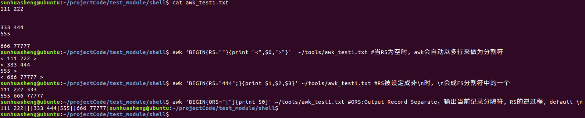
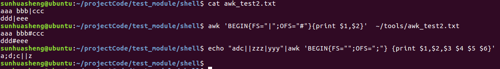
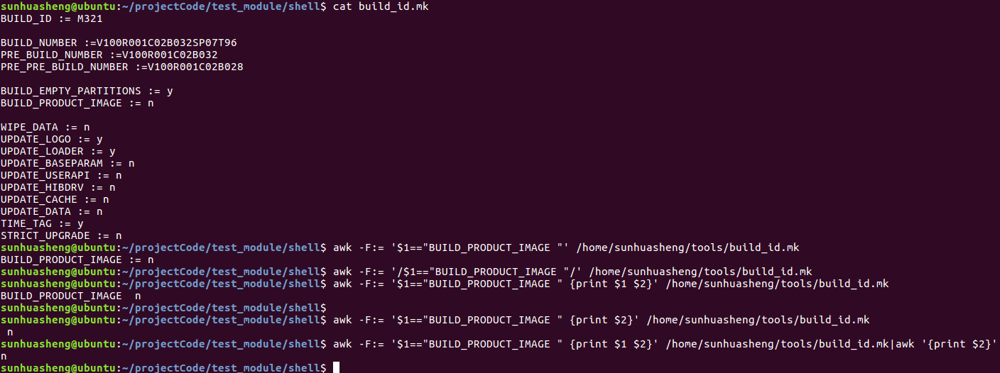
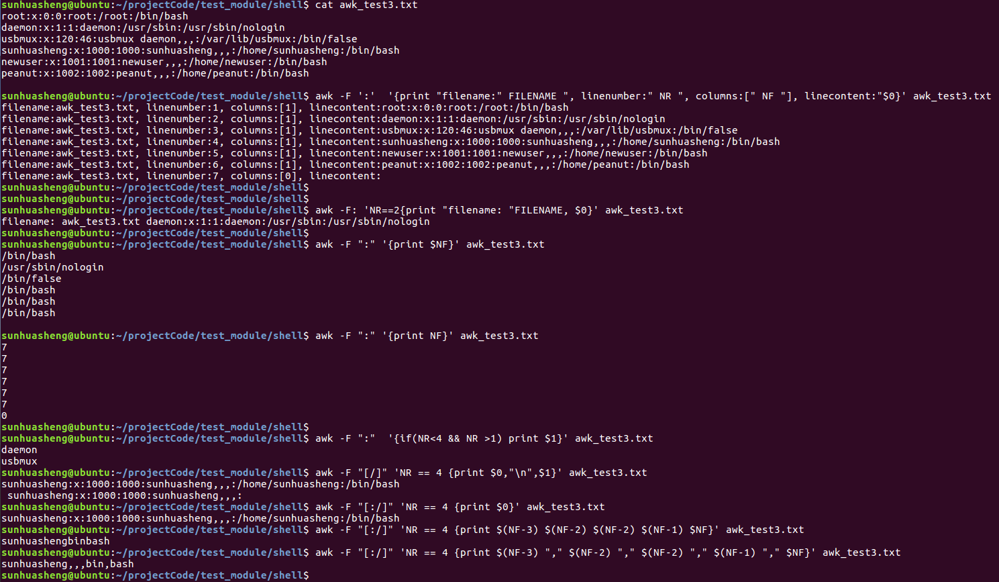
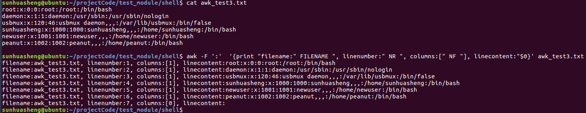
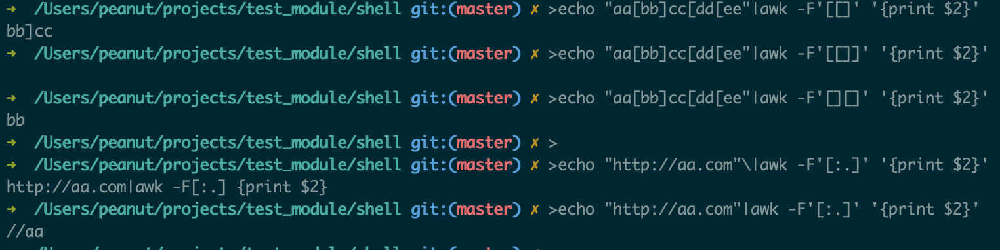
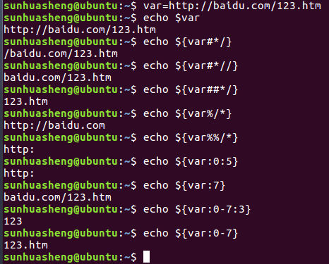
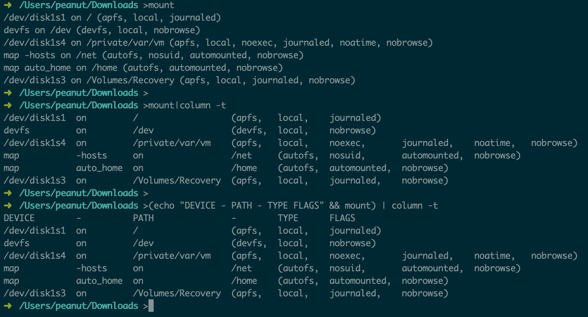

**目录**
[toc]


#### 收集内存信息
```
过滤ps的结果中RES、NAME字段，并按照RES值的大小逆向排序
ps -A|busybox awk -F' ' 'BEGIN {print "RES  NAME"} {print $5 "  "$9}'|sort -nr
top -s 6  ##用第6域即RES排序
free -m   ##用m为单位
```

#### 字符串替换
${value//pattern/string} 
进行变量内容的替换,把与pattern匹配的部分替换为string的内容

```
sunhuasheng@ubuntu:/usr/userData/sub_system$ dir="./platform/build/"
sunhuasheng@ubuntu:/usr/userData/sub_system$ pp="/usr/userData/sub_system"
sunhuasheng@ubuntu:/usr/userData/sub_system$ tmp=${dir/\./$pp}
sunhuasheng@ubuntu:/usr/userData/sub_system$ echo $tmp
/usr/userData/sub_system/platform/build/
sunhuasheng@ubuntu:/usr/userData/sub_system$ tmp=${dir/\./$(pwd)}
sunhuasheng@ubuntu:/usr/userData/sub_system$ echo $tmp
/usr/userData/sub_system/platform/build/
sunhuasheng@ubuntu:/usr/userData/sub_system$ tmp=${dir/\./`pwd`}
sunhuasheng@ubuntu:/usr/userData/sub_system$ echo $tmp
/usr/userData/sub_system/platform/build/
sunhuasheng@ubuntu:/usr/userData/sub_system$ 
```
* 一个替换的用法

#### 拆分字符串

```
         ExcludeList="boot,system,tvconfig"
         sp="
 "
         #list=(${ExcludeList//,/ })
         list=(${ExcludeList//,/$sp})       
         for var in ${list[@]}
         do
             #mainScript=`echo $mainScript|sed "s/mstar scripts\/\[\[$var//"`
             echo $var                                                                                                                                                                                 
            echo "mainScript:$mainScript"
         done   
```
* 拆分字符串，然后单独使用的一种方法。
* 同样都是用/bin/bash的情况下，demo脚本`list=(${ExcludeList//,/ })`好使，在android的脚本中就不好使，另寻他径定义了个换行符`sp`进行替换。

```
#!/bin/bash
 
string="hello,shell,split,test"  
array=(${string//,/ })  
 
for var in ${array[@]}
do
   echo $var
done 
```
* 拆分字符串方法一，`${parameter//pattern/string} ` 用string来替换parameter变量中所有匹配的pattern

```
    #!/bin/bash
     
    string="hello,shell,split,test"  
     
    #对IFS变量 进行替换处理
    OLD_IFS="$IFS"
    IFS=","
    array=($string)
    IFS="$OLD_IFS"
     
    for var in ${array[@]}
    do
       echo $var
    done
```
* 拆分字符串方法二，利用IFS(Internal Field Seprator) ，内部域分隔符。

```
#!/bin/bash
 
string="hello,shell,split,test"  
array=(`echo $string | tr ',' ' '` )  
 
for var in ${array[@]}
do
   echo $var
done 
```
* 拆分字符串方法三，利用`tr`,tr命令可以对来自标准输入的字符进行替换、压缩和删除。


#### 从utc到特定格式时间的转换
    date -d @1583810409 "+%Y%m%d-%H%M%S”
    20200310-112009

    date -d @`date +%s`  "+%Y%m%d-%H%M%S”
    20200310-112428


#### 拆分大文件为几个小文件
    split -b 500M  abc.zip
    split -b 500M  abc.zip abc.zip_  -d -a 2
    小文件拼接成大文件：
    cat abc.zip_* > abc.zip


#### 打压缩包保留软链接/用真实文件替换软链接
    zip -qry xx.zip xx/ 其中y用来保留原文件中软链接的形式，如果不加y，则使用 被引用的文件 替代软链接。


#### Shell_Linux tr 指令详解
[Shell_Linux tr 指令详解 - 迎难而上 - CSDN博客](https://app.yinxiang.com/shard/s6/nl/702043/61ff1d7c-939f-4921-91e6-97a917afcb81/)

```
1.tr命令可以对来自标准输入的字符进行替换、压缩和删除。tr只能接收来自标准的输入流。
2.tr [OPTION]... SET1 [SET2]
OPTION:
不带参数：
    将SET2中的每个字符替换SET1中的每个字符，字符是顺序替换，如果SET1的字符长度大于SET2，那么将SET1中多出来的字符用SET2中的最后一个字符替换。
-t, --truncate-set1:
    将SET2中的每个字符替换SET1中的每个字符，字符字符顺序1对1替换，无论SET1还是SET2哪个长，只替换对应的字符，多出的不替换。
-c,  --complement:
   取反操作，取数据流中SET1中指定字符的补集。
-d ，--delete :
   删除SET1中指定的字符，这里没有SET2
-s ，--squeeze-repeats :
   将SET1中指定的连续的重复的字符用单个字符替代，可以使用-s '\n'删除空行
3.字符集代码
[:alnum:]     字母和数字,可以用来替代'a-zA-Z0-9' 
[:alpha:]      字母，可以用来替代'a-zA-Z' 
[:cntrl:]       控制（非打印）字符 
[:digit:]       数字,可以用来替代'0-9' 
[:graph:]     图形字符 
[:lower:]     小写字母,可以用来替代'a-z' 
[:print:]      可打印字符 
[:punct:]    标点符号 
[:space:]    空白字符 
[:upper:]    大写字母,可以用来替代'A-Z' 
[:xdigit:]    十六进制字符
4.示例
➜  /Users/peanut >echo "HELLO WORLD" | tr 'A-Z' 'a-z’   ##大写转小写
hello world
➜  /Users/peanut >echo "hello 123 world 456" | tr -d '0-9’   ##删除数字
hello  world
➜  /Users/peanut >echo "aa.,a 1 b#$bb 2 c*/cc 3 ddd 4" | tr -d -c '[:digit:] \n’  ##删除 数字、空格、换行符 之外的字符
 1  2  3  4
➜  /Users/peanut >echo "aaAA1bbBB2ccCC3" | tr 'abc' ’12’  ##a换成1，b换成2，c换成2
11AA122BB222CC3
➜  /Users/peanut >echo "aaAA1bbBB2ccCC3" | tr -t 'abc' ’12’  ##a换成1，b换成2；mac不支持-t参数
11AA122BB2ccCC3
➜  /Users/peanut >echo "aaAA11bbBB22ccCC33" | tr -s '[:alpha:]’  ##重复的字母进行压缩
aA11bB22cC33
➜  /Users/peanut >echo "PATH=/sbin:/usr/sbin:/bin:/usr/bin" |tr ':' '\n’ ##一个字符替换成另外字符，不能一个替换成两个，比如tr ‘:’ ‘:\n’是不行的
PATH=/sbin
/usr/sbin
/bin
/usr/bin
➜  /Users/peanut >echo “WIPE_DATA := y" |tr -d '[:space:]'|awk -F":=" '{print $2}’  ##删除可能存在的多余空白字符，用分隔符切割后取第二个字段。cut的分隔符只能是单字符，awk可多字符。
```

#### awk

```
1.BEGIN可以用来定义分隔符；也可以在命令最后没有跟文件的时候不用进入等待状态而输出信息；也可以用来处理任意行之前进行的操作。 ；
awk 'BEGIN{FS=":";OFS="^"}/huasheng/{print $1,$2,$3}' /etc/passwd
awk 'BEGIN{print ENVIRON["PATH"];}’
awk -F: 'BEGIN{print "==firstname=="}/huasheng/{print $1}' /etc/passwd
2.if-else(比较对象类型要一致，第二个命令结果为false) 
awk 'BEGIN{a="11";if(a >= "10"){print "\"11\">=\"10\" ok";}else {print "\"11\">=\"10\" false"}}’ 
awk 'BEGIN{a="11";if(a >= 9){print "\"11\">=9 ok";}else {print "\"11\">=9 false"}}’ 
awk 'BEGIN{a=11;if(a >= 9){print "11>=9 ok";}else {print "11>=9 false"}}'
3.计算的时候非数字被忽略
awk 'BEGIN{a="b";print a++,++a;}’
0 2 
awk 'BEGIN{a=3;print a++,++a;}’ 
3 5
4.字符串转数字，用+连接；数字转字符串，用“”连接
 awk 'BEGIN{a="100";b="10test10";print (a+b+0);}’
110
awk 'BEGIN{a=100;b=100;c=(a""b);print c}’
100100
5.分隔符为空，则分隔每一个字符；输出print用逗号隔开，输出分隔符是OFS；输出用空格隔开，输出内容没有分隔
echo "adc||zzz|yyy"|awk 'BEGIN{FS="";OFS=";"} {print $1,$2,$3 $4 $5 $6}’
a;d;c||z
6.TODO??
echo "adc|zzz|yyy"|awk 'BEGIN{FS=""}{print $0}’
adc|zzz|yyy
echo "adc|zzz|yyy"|awk 'BEGIN{FS=""}{NF++;print $0}’
a d c | z z z | y y y
7.RS记录分隔符，默认是个换行符
echo "111 222a333 444bb555 666"|awk 'BEGIN{RS="[a-z]+"}{print $1,RS,$2,RT}’
111 [a-z]+ 222 a 
333 [a-z]+ 444 bb 
555 [a-z]+ 666 
当RS为空时，awk会自动以多行来做为分割符；RS被设定成非\n时，\n会成FS分割符中的一个；#ORS:Output Record Separate，输出当前记录分隔符, RS的逆过程, default \n
```


8.#OFS:Out of Field Separator，输出字段分隔符,$1,$2... 之间间隔被替换


9.文件中读取变量值


```
10.TODO:??
awk 'BEGIN{a="b";arr[0]="b";arr[1]="c";print (a in arr);}’
0 
awk 'BEGIN{a="b";arr[0]="b";arr["b"]="c";print (a in arr);}’ 
1 
11.匹配操作符~匹配后者正则表达式
$prop_name=ro.build.id
$awk -v identifier="${prop_name}=" '$0 ~ "^" identifier {print $1}' build.prop 
ro.build.id=Sbox8G40C
$awk '$0 ~ "^ro.build.id=" {print $1}' build.prop
ro.build.id=Sbox8G40C
```

#### Linux awk命令详解
[Linux awk命令详解 - 小a玖拾柒 - 博客园](https://app.yinxiang.com/shard/s6/nl/702043/512f53aa-db87-45fd-a1cf-5070458095d2/)

```
1.awk内置变量
ARGC               命令行参数个数
ARGV               命令行参数排列
ENVIRON            支持队列中系统环境变量的使用
FILENAME           awk浏览的文件名
FNR                浏览文件的记录数
FS                 设置输入域分隔符，等价于命令行 -F选项
NF                 浏览记录的域的个数
NR                 已读的记录数
OFS                输出域分隔符
ORS                输出记录分隔符
RS                 控制记录分隔符（默认是个换行符）
$0变量是指整条记录。$1表示当前行的第一个域,$2表示当前行的第二个域,......以此类推。
```



```
2.除了awk的内置变量，awk还可以自定义变量, awk中的循环语句同样借鉴于C语言，支持while、do/while、for、break、continue，这些关键字的语义和C语言中的语义完全相同。
统计目录下大于100k的文件数量
ls -l|awk '{if($5>100000){count++; sum+=$5}} END{print "Count:" count,"Sum: " sum}’
```

#### awk用法
[awk 用法（使用入门）](https://app.yinxiang.com/shard/s6/nl/702043/682d83f5-944c-4b3e-9f84-d3b39c704201/)

```
1.变量名    含义 
ARGC   命令行变元个数 
ARGV   命令行变元数组 
FILENAME   当前输入文件名 
FNR   当前文件中的记录号 
FS   输入域分隔符，默认为一个空格 
RS   输入记录分隔符 
NF   当前记录里域个数 
NR   到目前为止记录数 
OFS   输出域分隔符 
ORS   输出记录分隔符 
2.多分隔符
```


```
➜  /Users/peanut/projects/test_module/shell git:(master) ✗ >echo "aa[bb]cc[dd[ee"|awk -F'[[]]' '{print $2}’        ##这种写法不行
 收到
```

#### awk
[AWK - jayhenry7 - 博客园](https://app.yinxiang.com/shard/s6/nl/702043/a2d96c00-5887-4838-887d-a9f512f7759d/)


#### Shell脚本8种字符串截取方法总结
[Shell脚本8种字符串截取方法总结_linux shell_脚本之家【huasheng mark】](https://app.yinxiang.com/shard/s6/nl/702043/72745d98-1ed9-4520-b93d-76c08cc72669/)



#### shell脚本--sed的用法
[shell脚本--sed的用法 - 菜鸟博客 - CSDN博客](https://app.yinxiang.com/shard/s6/nl/702043/1a33eaaf-1d42-4a1d-93d9-a24dede2686f/)

```
1.sed的常用选项：
-e：它告诉sed将下一个参数解释为一个sed指令，只有当命令行上给出多个sed指令时才需要使用-e选项
-f：后跟保存了sed指令的文件
-i：直接对内容进行修改，不加-i时默认只是预览，不会对文件做实际修改
-n：取消默认输出，sed默认会输出所有文本内容，使用-n参数后只显示处理过的行

2.sed中的编辑命令：
a:追加  向匹配行后面插入内容
c:更改  更改匹配行的内容
i:插入  向匹配行前插入内容
d:删除  删除匹配的内容
s:替换  替换掉匹配的内容
p:打印  打印出匹配的内容，通常与-n选项和用
=:用来打印被匹配的行的行号
n:读取下一行，遇到n时会自动跳入下一行
r,w：读和写编辑命令，r用于将内容读入文件，w用于将匹配内容写入到文件

3.典型例子：
sed  -i  '/^$/d'    1.txt    #删除空行
sed 's/123/hello/2'   1.txt  #将每行中第二个匹配的123替换为hello
sed  -n 's/123/hello/gpw  2.txt'   1.txt    #将每行中所有匹配的123替换为hello，并将替换后的内容写入2.txt
sed 's/^#.*//;/^$/d'  1.txt  #先替换1.txt文件中所有注释的空行为空行，然后删除空行，替换和删除操作中间用分号隔开
sed 's/^[0-9]/(&)/'   1.txt   #将每一行中行首的数字加上一个小括号   (^[0-9])表示行首是数字，&符号代表匹配的内容
sed  's/$/&'haha'/'  1.txt   # 在1.txt文件的每一行后面加上"haha”字段
sed 's/$/<-added info->/' 1.txt  #在1.txt中内容的每一行末尾加<-added info->字段，&符号不添加也可以
sed 's/^/+header+/'   #在每一行头部添加字段
sed ‘2s/^/+header+/'   #在第2行头部添加字段
sed ‘2,$s/^/+header+/'   #在第2行至最后一行头部添加字段
sed  -n '/too/,$p'  1.txt  #打印从匹配too的行到最后一行的内容
sed  -n  '3,/you/p'  1.txt   #只打印第三行到匹配you的行
sed  -n '/bob/,/too/p'  1.txt   #打印从匹配内容bob到匹配内容too的行
sed  -n "$="   1.txt   #打印1.txt文件最后一行的行号（即文件有多少行，和wc -l 功能类似）
sed  -n '/error/{=;p}'   1.txt    #打印匹配error的行的行号和内容（可用于查看日志中有error的行及其内容）
sed  -n -e '1w  2.txt'  -e '$w  3.txt'  1.txt   #将1.txt的第1行和最后一行分别写入2.txt和3.txt
sed  -n  '/xyz/,+2w  2.txt'     1.txt     #将1.txt中从匹配xyz的行及其后2行的内容，写入到2.txt中

4.sed中使用变量
eval sed 's/$a/$b/‘ filename
sed "s/$a/$b/" filename
 关于单双引号的区别：  
单引号：shell处理命令时，对其中的内容不做任何处理。即此时是引号内的内容是sed命令所定义的格式。  
双引号：shell处理命令时，要对其中的内容进行算术扩展。如果想让shell扩展后得到sed命令所要的格式。

```


#### 有关传参
```
$0 表示程序名
$# 参数个数

$* 所有参数。当用引号包裹时，以一个单字符串显示所有向脚本传递的参数， 如"$*"用「"」括起来的情况、以"$1 $2 … $n"的形式输出所有参数。
$@ 所有参数。当用引号包裹时，在引号中返回每个参数。 如"$@"用「"」括起来的情况，以"$1" "$2" … "$n" 的形式输出所有参数。 
相同点：都是引用所有参数。
不同点：只有在双引号中体现出来。假设在脚本运行时写了三个参数 1、2、3，，则 " * " 等价于 "1 2 3"（传递了一个参数），而 "@" 等价于 "1" "2" "3"（传递了三个参数）。

$$ 脚本运行的当前进程ID号
$! 后台运行的最后一个进程的ID号
$? 显示最后命令的退出状态。0表示没有错误，其他任何值表明有错误。
$1~$9 位置参数不止9个，更多的参数也是一样支持的。只是要使用${10}这样的形式引用。 $1 和 ${1}的效果是一样的。不用花括号的话，$10 会被认为是 $1 和一个字符 0。

```


#### lzop压缩镜像
    lzop -o cache.img.lzo cache.img
    lzop -d cache.img.lzo


#### 文件计算crc，会在文件尾追加4字节
    sunhuasheng@ubuntu:~/projectCode/mstar658/msd6a658$ ll tmp.ini 
    -rw-r--r-- 1 sunhuasheng sunhuasheng 17967 9月  19 13:37 tmp.ini 
    sunhuasheng@ubuntu:~/projectCode/mstar658/msd6a658$ crc -a tmp.ini  
    u32ImageSize = 0x0000462F 
    CRC32 = 0xE46FA4C6 
    sunhuasheng@ubuntu:~/projectCode/mstar658/msd6a658$ ll tmp.ini  
    -rw-r--r-- 1 sunhuasheng sunhuasheng 17971 9月  19 13:37 tmp.ini


#### 将大文件分割成小文件
```
sunhuasheng@ubuntu:~/projectCode/mstar658/msd6a658$ ll ../images/marshmallow/almond/upgrade_script.txt
-rw-rw-r-- 1 sunhuasheng sunhuasheng 16388 9月  19 10:51 ../images/marshmallow/almond/upgrade_script.txt 
sunhuasheng@ubuntu:~/projectCode/mstar658/msd6a658$ split -d -a 2 -b 16384 ../images/marshmallow/almond/upgrade_script.txt ../images/marshmallow/almond/upgrade_script.txt. sunhuasheng@ubuntu:~/projectCode/mstar658/msd6a658$ ll ../images/marshmallow/almond/upgrade_script.txt.* 
-rw-rw-r-- 1 sunhuasheng sunhuasheng 16384 9月  19 13:27 ../images/marshmallow/almond/upgrade_script.txt.00 
-rw-rw-r-- 1 sunhuasheng sunhuasheng         4 9月  19 13:27 ../images/marshmallow/almond/upgrade_script.txt.01


sunhuasheng@ubuntu:~/projectCode/mstar658/msd6a658/out/target/product/almond/tmp$ ls -lh
total 1.8G 
-rw-r--r-- 1 sunhuasheng sunhuasheng 1.8G 9月  19 19:46 system.img 
sunhuasheng@ubuntu:~/projectCode/mstar658/msd6a658/out/target/product/almond/tmp$ split -b 150m system.img system.img  sunhuasheng@ubuntu:~/projectCode/mstar658/msd6a658/out/target/product/almond/tmp$ ls -lh 
total 3.6G 
-rw-r--r-- 1 sunhuasheng sunhuasheng 1.8G 9月  19 19:46 system.img 
-rw-rw-r-- 1 sunhuasheng sunhuasheng 150M 9月  19 19:47 system.imgaa 
-rw-rw-r-- 1 sunhuasheng sunhuasheng 150M 9月  19 19:47 system.imgab 
-rw-rw-r-- 1 sunhuasheng sunhuasheng 150M 9月  19 19:47 system.imgac 
-rw-rw-r-- 1 sunhuasheng sunhuasheng 150M 9月  19 19:47 system.imgad 
-rw-rw-r-- 1 sunhuasheng sunhuasheng 150M 9月  19 19:47 system.imgae 
-rw-rw-r-- 1 sunhuasheng sunhuasheng 150M 9月  19 19:47 system.imgaf 
-rw-rw-r-- 1 sunhuasheng sunhuasheng 150M 9月  19 19:47 system.imgag 
-rw-rw-r-- 1 sunhuasheng sunhuasheng 150M 9月  19 19:47 system.imgah 
-rw-rw-r-- 1 sunhuasheng sunhuasheng 150M 9月  19 19:47 system.imgai 
-rw-rw-r-- 1 sunhuasheng sunhuasheng 150M 9月  19 19:47 system.imgaj 
-rw-rw-r-- 1 sunhuasheng sunhuasheng 150M 9月  19 19:47 system.imgak 
-rw-rw-r-- 1 sunhuasheng sunhuasheng 150M 9月  19 19:47 system.imgal 
-rw-rw-r-- 1 sunhuasheng sunhuasheng  12M 9月  19 19:47 system.imgam

```


#### 替换语句中的变量
    sunhuasheng@ubuntu:~/projectCode/mstar658/msd6a658$ aa="mmc write.p 0x20200000 boot \$(filesize) 1”
    sunhuasheng@ubuntu:~/projectCode/mstar658/msd6a658$ echo $aa 
    mmc write.p 0x20200000 boot $(filesize) 1
    sunhuasheng@ubuntu:~/projectCode/mstar658/msd6a658$ bb=${aa/'$(filesize)'/99} 
    sunhuasheng@ubuntu:~/projectCode/mstar658/msd6a658$ echo $bb 
    mmc write.p 0x20200000 boot 99 1


#### 查看文件大小
    sunhuasheng@ubuntu:~/projectCode/mstar658/msd6a658$ stat ../images/marshmallow/almond/boot.img 
      File: '../images/marshmallow/almond/boot.img’ 
      Size: 14512604      Blocks: 28352      IO Block: 4096   regular file 
    Device: 805h/2053d    Inode: 26217317    Links: 1 
    Access: (0664/-rw-rw-r--)  Uid: ( 1000/sunhuasheng)   Gid: ( 1000/sunhuasheng) 
    Access: 2019-09-18 13:12:09.006259376 +0800 
    Modify: 2019-09-18 13:11:30.214259138 +0800 
    Change: 2019-09-18 13:11:30.214259138 +0800
     Birth: - 
    sunhuasheng@ubuntu:~/projectCode/mstar658/msd6a658$ 
    sunhuasheng@ubuntu:~/projectCode/mstar658/msd6a658$ stat -c%s ../images/marshmallow/almond/boot.img  
    14512604


#### 进制转换
    sunhuasheng@ubuntu:~/projectCode/mstar658/msd6a658$ echo "obase=10; 17”|bc
    17 
    sunhuasheng@ubuntu:~/projectCode/mstar658/msd6a658$ echo "obase=16; 17"|bc 
    11
    sunhuasheng@ubuntu:~/projectCode/mstar658/msd6a658$ echo "obase=2; 17"|bc 
    10001
    sunhuasheng@ubuntu:~/projectCode/mstar658/msd6a658$ echo "ibase=16;obase=8;11”|bc
    21 
    sunhuasheng@ubuntu:~/projectCode/mstar658/msd6a658$ echo "ibase=8;obase=16;11"|bc 
    9 
    sunhuasheng@ubuntu:~/projectCode/mstar658/msd6a658$ echo "ibase=16;obase=10;11"|bc 
    11 
    sunhuasheng@ubuntu:~/projectCode/mstar658/msd6a658$ echo "ibase=16;11"|bc 
    17 
    sunhuasheng@ubuntu:~/projectCode/mstar658/msd6a658$ echo "ibase=8;obase=10;11"|bc 
    11 
    sunhuasheng@ubuntu:~/projectCode/mstar658/msd6a658$ echo "ibase=8;11"|bc 
    9
    ====输出是10进制的时候，不要加上obase=10参数，默认就是转成10进制，实际操作来看加上obase=10反而结果会不对。


#### 查看已经安装的软件/包
    dpkg --get-selections


#### 查找文件
    locate javac
    locate types.h


#### 更换java
    sudo update-alternatives  --config java


#### 更换shell
    sudo dpkg-reconfigure dash
    sudo dpkg-reconfigure bash


#### 有关字符串截取
[SHELL中字符串的截取_husucc1984的空间_百度空间](https://app.yinxiang.com/shard/s6/nl/702043/9e9cbccb-6e66-4de0-b820-5a28ea4063dc/)

[Shell脚本8种字符串截取方法总结_linux shell_脚本之家【huasheng mark】](https://app.yinxiang.com/shard/s6/nl/702043/72745d98-1ed9-4520-b93d-76c08cc72669/)


#### 有关字符串长度
    $echo ${#variable}
    $expr length "$variable"
    $expr "$variable" : ".*"

    $ x="this is a test"
    $ echo ${#x}
    14

    $ x="this is a test"
    $ expr length "$x"
    14

    $ x="this is a test"
    $ expr "$x" : ".*"
    14


#### 有关查找字符串子串位置
    $expr index "$variable" "substring"

    $ x="this is a test"
    $ expr index "$x" "is"
    3

    $ expr index "$x" "t"
    1
    (ps:如果出现重复,好象只能查到第一个,第二个,第三个,...,怎么查到呢???)

#### 有关得到字符串子字符串
    $echo ${variable:position:length}
    $expr substr "$variable" startposition length

    $ x="this is a test"
    $ echo ${x:1:5}
    his i

    $ x="this is a test"
    $ expr substr "$x" 1 5
    this
    (ps:注意方法一和方法二中位置的区别!)

#### 有关匹配正则表达式之匹配长度
    $expr match "$x" "string"

    $ x="this is a test"
    $ expr match "$x" "his"
    0
    $ expr match "$x" "this"
    4
    $ expr match "$x" "."
    1


#### 有关字符串的截取
1.截取头部/尾部
    
    ${varible##*string} 从左向右截取最后一个string后的字符串  
    ${varible#*string}从左向右截取第一个string后的字符串  
    ${varible%%string*}从右向左截取最后一个string后的字符串  
    ${varible%string*}从右向左截取第一个string后的字符串  
    "*"只是一个通配符可以不要
    如：
    $ MYVAR=foodforthought.jpg  
    $ echo ${MYVAR##*fo}  
    rthought.jpg  
    $ echo ${MYVAR#*fo}  
    odforthought.jpg  

    $ MYFOO="chickensoup.tar.gz"  
    $ echo ${MYFOO%%.*}  
    chickensoup  
    $ echo ${MYFOO%.*}  
    chickensoup.tar  
    
    MYFOOD="chickensoup"
    $ echo ${MYFOOD%%soup}
    chicken

2.截取中间部分字段
    
    ${varible:n1:n2}:截取变量varible从n1到n2之间的字符串
    $ EXCLAIM=cowabunga
    $ echo ${EXCLAIM:0:3}
    cow
    $ echo ${EXCLAIM:3:7}
    abunga

3.使用cut截取

    cut：对标准输入的字符串进行处理
    cut -bn-m:以byte为单位，从第n个byte开始，取m个
    cut -bn,m:以byte为单位，截取第n,m个byte
    cut -b-n,m:以byte为单位，截取1-n,和第m个
    -c:以charactor为单位
    -d:指定分隔符，默认为tab
    -s:使标准输入中没有delimeter
    cut -f1:截取第1个域

    $ a=12345678
    $ echo $a|cut -b 2-5
    $ 2345 #这里是输出结果


#### 有关替换问题
    echo ${变量/旧的内容/新的内容} #替换一个
    echo ${变量//旧的内容/新的内容} #替换所有
    
    $ aa="No such file or directory"
    $ echo ${aa/o/a}
    Na such file or directory
    $ aa="No such file or directory"
    $ echo ${aa//o/a}
    Na such file ar directary


#### 文档TopLinuxShellCommand.pdf
[TopLinuxShellCommand.pdf](https://app.yinxiang.com/shard/s6/nl/702043/89951733-9e77-4072-8f31-58b4efae301a/)

#### 在以普通用户打开的VIM当中保存一个ROOT用户文件  
```
:w !sudo tee %  
查阅vim的文档（输入:help :w），会提到命令:w!{cmd}，让vim执行一个外部命令{cmd}，
然后把当前缓冲区的内容从stdin传入。  
tee是一个把stdin保存到文件的小工具。  
而%，是vim当中一个只读寄存器的名字，总保存着当前编辑文件的文件路径。 
```

#### 执行上条指令
```
$ !!  
以SUDO运行上条命令  
$ sudo !!  
```

#### 替换上一条命令中的一个短语
```
$ ^foo^bar^  
这道命令的原始样式应该是这样的:  
!!:s/foo/bar/  
如果要替换掉每一个foo则应该如下这样：  
!!:gs/foo/bar
```

#### 快速备份一个文件
```
$ cp filename{,.bak}  
其原理就在于bash对大括号的展开操作，filename{,.bak}
这一段会被展开成filename filename.bak再传给cp，于是就有了备份的命令了  
可以尝试下
$ echo {a,b,c}{a,b,c}{a,b,c}  
aaa aab aac aba abb abc aca acb acc baa bab bac bba bbb bbc bca bcb bcc caa cab cac cba cbb cbc cca ccb ccc
```


#### 免密码SSH登录主机
$ ssh-copy-id remote-machine  
这个命令把当前用户的公钥串写入到远程主机的~/.ssh/authorized_keys内，这样下
次使用ssh登录的时候，远程主机就直接根据这串密钥完成身份校验，不再询问密码
了。前提是你当前用户有生成了公钥，默认是没有的，先执行ssh-keygen试试吧！
这个命令如果用手工完成，是这样的：

    your-machine$ scp ~/.ssh/identity.pub remote-machine:
    your-machine$ ssh remote-machine
    remote-machine$ cat identity.pub >> ~/.ssh/authorized_keys
如果你想删掉远程主机上的密钥，直接打开authorized_keys，搜索你的用户名，删除那行，即可。


#### 抓取LINUX桌面的视频
```
ffmpeg -f x11grab -s wxga -r 25 -i :0.0 -sameq /tmp/out.mpg
ffmpeg的通常用法是，根据一堆参数，输出一个文件，输出文件通常放最后，下面解析 下几个参数:
-f x11grab 指定输入类型。因为x11的缓冲区不是普通的视频文件可以侦测格式， 必须指定后ffmpeg才知道如何获得输入。
-s wxga 设置抓取区域的大小。wxga是1366*768的标准说法，也可以换成-s 800×600的写法。
-r 25 设置帧率，即每秒抓取的画面数。
-i :0.0 设置输入源，本地X默认在0.0
-sameq 保持跟输入流一样的图像质量，以用来后期处理。
```


#### 清空或创建一个文件
```
‘> file.txt’
‘>’在shell里面是标准输出重定向符，即把（前部个命令的）命令行输出转往一个文件
内，但这里没有"前部命令"，输出为空，于是就覆盖（或创建）成一个空文件了。
有些脚本的写法是:>file.txt，因为:是bash默认存在的空函数。  
单纯创建文件也可以用$touch file.txt，touch本来是用作修改文件的时间戳，但如果文件
不存在，就自动创建了。
```

#### 重置终端
```
reset
如果你试过不小心cat了某个二进制文件，很可能整个终端就傻掉了，可能不会换行，没
法回显，大堆乱码之类的，这时候敲入reset回车，不管命令有没有显示，就能回复正常
了。
```

#### 查看系统中占用端口的进程
```
netstat -tulnp Netstat是很常用的用来查看Linux网络系统的工具之一，这个参数可以背下来:
-t: 显示TCP链接信息
-u: 显示UDP链接信息
-l: 显示监听状态的端口
-n: 直接显示ip，不做名称转换
-p: 显示相应的进程PID以及名称(要root权限)
如果要查看关于sockets更详细占用信息等，可以使用lsof工具。
```


#### 有关columncolumn 
用于把输出结果进行列表格式化操作，比如mount查看挂载信息:
mount | column -t


#### 实时某个目录下查看最新改动过的文件
```
watch -d -n 1 'df; ls -FlAt /path'
在使用这条命令时你需要替换其中的 /path 部分，watch 是实时监控工具，-d 参数会高亮显示变化的区域，-n 1 参数表示刷新间隔为 1 秒。
df; ls -FlAt /path 运行了两条命令，df 是输出磁盘使用情况，ls -FlAt 则列出 /path 下面的所有文件。
ls -FlAt 的参数详解:
-F 在文件后面加一个文件符号表示文件类型，共有 `*/=&gt;@| `这几种类型，* 表示可 执行文件，/ 表示目录，= 表示接口( sockets) ，&gt; 表示门， @ 表示符号链接， | 表示管道。
-l 以列表方式显示 -A 显示 . 和 ..
-t 根据时间排序文件
```

#### 通过ssh挂载远程主机上的文件夹
```
sshfs name@server:/path/to/folder /path/to/mount/point 
这条命令可以让你通过 SSH 加载远程主机上的文件系统为本地磁盘，前提是你需要安装FUSE 及 sshfs 这两个软件。
卸载的话使用 fusermount 命令：
fusermount -u /path/to/mount/point
关于 sshfs 实际上我之前写过一篇文章介绍过，详见"在 Ubuntu 上使用 sshfs 映 射远程 ssh 文件系统为本地磁盘”
```

#### 执行一条命令但不保存到 history 中
```
`<space>command`
通过在命令行前面添加一个空格，就可以阻止这条命令被保存到 bash history(~/.bash_history) 文件中，这个行为可以通过 $HISTIGNORE shell 变量来控制
```

#### 显示当前目录中所有子目录的大小
    du -h --max-depth=1

#### 查看ASCII码表
    man 7 ascii
    man ascii

#### 在一个子SHELL中运行一个命令
```
(cd /tmp && ls)  
当然这只是演示，要查看目录当然可以ls /tmp。  
好处就是不会改变当前shell的目录，以及如果命令中设计环境变量，也不会对当前
shell有任何修改。  
在Shell编程中还有很多使用上引号来括住一个命令：
    `ls /tmp`
这也是子shell过程。可是上引号的方法无法嵌套，而使用小括号的方法可以
```

#### 清空屏幕
```
<CTRL+l>; 这个跟之前介绍的reset命令重置终端的作用有些类似，其实都只是发送一段控制序列，让终端的显示复位。
还可以这样运行:tput clear tput是专门用来控制终端的一个小工具，也挺强大的
```

#### 我想知道一台服务器什么时候重启完
```
ping -a IP
系统管理员最常做的事情是重启系统。但是服务器的重启过程往往得花上好几分钟，什么 你的服务器4个scsi卡?16个硬盘?系统是Redhat?还完全安装所有组件?好吧，它重启 的时间都够你吃顿饭了，所以我很想知道它什么时候回来。
ping命令有个audible ping参数，-a，当它终于ping通你的服务器时会让小喇叭叫起来。
```

#### 用TELNET看《星球大战》
    telnet towel.blinkenlights.nl