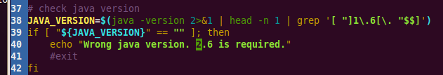

####将测试失败项重新测试一遍，不单独生成测试结果，将测试结果更新到原有结果中。
1. 将统计结果中failed项总数改为0，对应数据改动notExecuted中，
 -->

2. 具体测试项中result="fail" 改为result="notExecuted"

####需要有Gallery.apk

####补充测试，生成单独的测试结果
执行help可以看到使用说明  
创建测试计划：add derivedplan --plan plane_name --session/-s session_id -r [pass/fail/notExecuted/timeout]
1. 失败项：  
add derivedplan --plan FailedPlanS3 -s 3 -r fail  
run cts --plan FailedPlanS3 --disable-reboot  
2. 未执行项：   
add derivedplan --plan notExecutedPlanS3 --session 3 -r notExecuted  
run cts --plan notExecutedPlanS3 --disable-reboot  

####单独测试项
run cts -c 测试类名 -m 测试的方法名，如：要测试的类名为： libcore.java.net.URLConnectionTest，方法名为：testConnectViaHttpsWithSSLFallback  
则测试命令为：run cts -c  libcore.java.net.URLConnectionTest  -m  testConnectViaHttpsWithSSLFallback  

####有关java版本
可以不用1.6版本，修改cts-tradefed不退出  
  

####有关输入法
删掉system/app/VIME*，及自己的输入法apk。  
保留LatinIME.apk  

