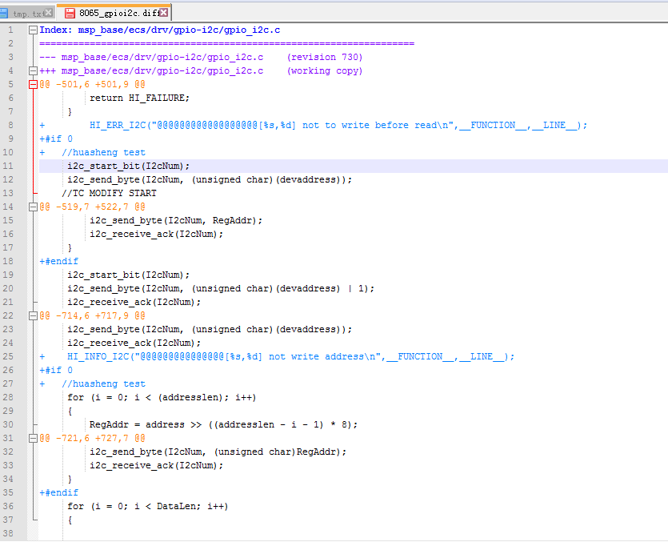

####DVBS控制流程

####术语
1. Open Cable 电缆短路
2. Back Bias（雷击浪涌时的）反馈偏压
3. RSSI （Received Signal Strength Indication） 接收信号强度
4. BER （bit error rate）误码率
5. PER （ packet error rate）误包率
6. FER （frame error rate）误帧率
7. RSSI （Received signal strength indication）接收信号强度
8. SQI （Speech quality index）话音质量指数。SQI 用于表达语音由于无线链路传输造成的失真度，该算法为爱立信的专利算法。该算法考虑诸多的无线参数包括BER 、FER 、切换频率、切换状态、DTX 是否激活以及所用的编码器等。从而给出最终的语音质量评估值SQI，SQI的取值从－20到＋30。这里需要指出的是对于不同的编码器类型，SQI是有上限的。对于半速率编码器而言，SQI的上限为19，而全速率为21，增强型全速率为30。这里因为不同的编码方法对数据的压缩是不同的，从而造成的语音失真也是不同的。通常我们认为当SQI小于0时语音质量为不可接受，当SQI大于0而小于18时，语音质量为可接收，当SQI大于18时语音质量为良好。
9. ku波段与c波段  

####9492LNB配置

####工厂dvbs码流发射器

  

####8065新板需要高安的loader，签过名的kernel和fs
kernel可用基线下的 kernel_linux-2.6.35_hi3716_Hi3716XV100R001C00SPC0A1_CA.img.sig  
fs可用签名工具对img镜像签名 ./swsign -f rootbox.img_4 -s sunniwell_rsa_priv.txt -t app -e 0

####新调过角度的锅
     rf: 12731  sym_rate:30000  vertical  
	##########################blind_result start#######################################################  
	###index= 0###freq=12372##symbol_rate=2400##polarization=0##dvbs2=0##k22hz=0########################  
	###index= 1###freq=12384##symbol_rate=6667##polarization=0##dvbs2=1##k22hz=0########################  
	###index= 2###freq=12411##symbol_rate=11111##polarization=0##dvbs2=0##k22hz=0#######################  
	###index= 3###freq=12420##symbol_rate=2963##polarization=0##dvbs2=0##k22hz=0#######################  
	###index= 4###freq=12425##symbol_rate=4440##polarization=0##dvbs2=0##k22hz=0#######################  
	###index= 5###freq=12308##symbol_rate=3800##polarization=1##dvbs2=0##k22hz=0#######################  
	###index= 6###freq=12431##symbol_rate=29999##polarization=1##dvbs2=0##k22hz=0######################  
	###index= 7###freq=12471##symbol_rate=30000##polarization=1##dvbs2=0##k22hz=0######################  
	##########################blind_result end#####################################################

####8845B使用的lnbh23叠加22k信号
采用的是demod给出22k信号通过EXTM到lnb，然后lnb叠加。因此按照下面方式设置。
  

####调试环境
1. B180_TM_3716M项目代码hi3716_tm_ranger.env环境变量
2. local_RDA5815S_8065.env 本地dvb相关环境变量设置

####dvb的几款板子情况简述如下：
dvb-s/s2:  
板子型号 平台 demod lnb tuner  
8845 3716C avl6211 st lnbh23 sharp7903  
8865(大小坂) 3716C avl6211 allegro8290 sharp7903  
8015 3716M avl6211 st lnbh23 rda 5815s  
8065(大小版) 3716M avl6211 allegro8290 rda 5815s  
8015(第二版) 3716M Si2166B allegro8290 rda 5815s  
dvb-c:  
平台      tuner  
3716C  tmx7070x  
3716M  r820c  

####dvb-s码流发射器即使在不发流的时候也有ts波形量到，也能锁频成功，清查问题时候注意

####8290 lnb
1. 8290上电以后，会自动产生一个中断响应，要先读一下内部的状态寄存器，把中断清除，然后再写入控制寄存器。
2. ENB即使reset也能有电压输出，应该是硬件设计不严谨
3. 一次读取两个字节数据可以将其两个状态寄存器数值读出，每次读一个字节则只能得到第一个寄存器的内容，跟文档描述不一致
4. 查询cable线插拔时候，需要设置ENB,CADT,VSEL0-VSEL3。关键是设置完后有个等待时间（差不多1000us以上）再去读取状态寄存器才会得到对应的结果。（由驱动中的一句打印产生延时的巧合发现该问题）

####8015调试
8015上计算信号强度时候，在avlink实验室发不同信号强度信号，读取寄存器值，然后对这两个值做了个对应关系，大概是一个分两段的线性关系，于是matlab做了个回归方程。原始数据如下：  
  

####8865调试
1. 采用gpio模拟i2c，A1 sdk中对gpioi2c做了一些改动，需求读写时序：设备地址、W、数据；设备地址、R、数据。diff：  
  
2. sdk中libhijpge.so copy一个libjpge.so
3. 一个奇怪的问题，在能锁频、也能量到ts波形情况下依旧不能播放，用示波器去量ts的clk引脚就能播放出来！！！------- clk总线太长
4. 另一个奇怪的问题，能播放但有马赛克，示波器量ts clk引脚马赛克消失  ------- clk总线太长
5. 调试几下小板废掉  ---------多了块电容

####I2C配置
1. gpio管脚则需配置gpio为i2c模式  
2. sw_i2c_open对应i2c的id  

####dvbs发流设备
  
  
  
