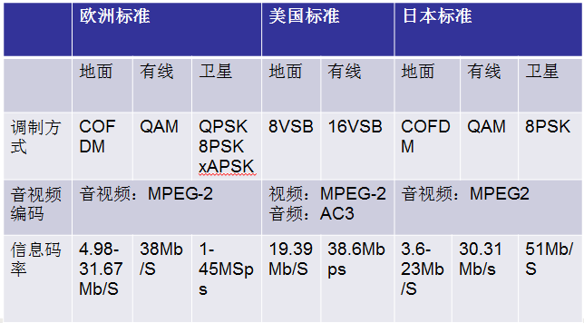
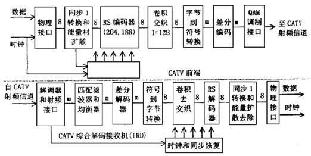

第1章 系统介绍

DVB（Digital Video Broadcasting）是数字视频广播的缩写，包括卫星、电缆（有线）电视、地面广播的数字电视、未来高清晰度电视在内多种格式数字电视的广播与传输。作为一套技术上比较完善、明确、易于遵循的标准，DVB在世界范围内已得到了广泛的支持。

国际三大数字电视标准：  
欧洲DVB（Digital Video Broadcasting）  
有线：DVB-C（cable）  
卫星：DVB-S，DVB-S2（satellite）  
地面：DVB-T（ terrestrial）  
手持/移动：DVB-H（handheld）  
美国ATSC（Advanced Television Systems Committee）  
地面/有线：ATSC   
手持/移动：ATSC-M/H：  
日本ISDB（Integrated Services Digital Broadcasting）  
有线：ISDB-C  
卫星：ISDB-S  
地面：ISDB-T  
手持/移动：LSEG  
三大DVB标准比较如下：

  
图1-1 三大DVB标准比较

DVB信源编码和系统复用都遵循Mpeg2标准，信道编码根据传播方式的不同，可分为DVB-S、DVB-C、DVB-T三类，欧洲电信标准组织ETSI于1994年、1995年分别通过了适合于DVB-S、DVB-C、DVB-T的3个DVB标准，特点如下：

DVB-S：卫星数字电视。用于11/12GHz频段的卫星系统，技术难度小，传输业务量最大，覆盖面广，接收不灵活。

DVB-C：有线数字电视。通常用于8MHz有线频道，能客纳38.5Mbit/s的有效载荷容量，传输8--10个电视频道，并没有邻频干扰，技术难度中等，传输业务量较小，可有交互功能。

DVB-T：地面数字广播电视。用于地面7-8MHz频段的数字式地面电视系统，技术难度高，传输业务量小，接收灵活。

比较上述3类，卫星是最直接的途径，实现的技术难度较小，地面传输的难度最大。因此，卫星广播最容易实现，而且可传输的业务量几乎是无限的。但是，卫星接收必需有一个合适的天线和接收机，要想作到随处的灵活接收是极困难的；地面传输情况正相反，有限的频谱只能提供有限的业务量，但在其覆盖的范围内，接收则灵活得多。有线电视的情况介于两者之间，它有较高的业务容量，但受限于电缆的铺设范围。

DVB信道编码：

目的是为保证正确接收。为了与信道的统计特性相匹配，并区分通路和提高通信的可靠性，而在信源编码的基础上，按一定规律加入一些新的监督码元，以实现纠错的编码。3种传输条件下的信道编码基本相似，分外码和内码两级，外码采用RS（Reed-Solomon）码，内码采用卷积码。为避免突发干扰所引起的连续误码，采用码流交织技术处理。

DVB信号调制：

调制方法在不同传输情况下是不同的。DVB-S卫星广播系统中采用四相相移键控（QPSK），QPSK调制抗干扰能力强，接收机能在非常低的信噪比下可靠地检测出信号，适合卫星信道的要求。并且，QPSK调制在一个周期内可以传送2比特数据，相同带宽条件下，码率比BPSK提高1倍。

DVB-C有线电视系统传输时采用正交调幅（QAM）方式调制，因为有线信道的主要困难是信道带宽受限，QAM调制可以使信道的利用率达到最大。

DVB-T地面广播系统传输时采用正交频分复用（OFDM）调制方式。因为在地面广播中信道环境恶劣，图像会遇到许多在卫星信道和有线信道中没有的破坏，而OFDM调制方式采用多载波代替单载波，对于多径、频率选择性衰落、时间选择性衰落及地面移动广播接收时的多普勒效应都有较强的抗干扰能力。

1.1 有条件接收系统

由于将来DVB业务趋向付费电视方式，要求广播运营者具有控制和管理网络系统的能力，按照用户要求对其授权并收发信号的能力，因此DVB系统需要有一个高度可靠的有条件接收系统。

有条件接收系统的任务是保证广播业务仅仅被授权接收的用户所接收，其主要功能是通过对广播电视信号加扰，连续改变信号形式的方法，使得只有用恰当的解码器和电子密钥才能接收到正确的信号。电子密钥一般通过智能卡或其他安全信道传送给用户，通过对用户电子密钥的加密实现信号的加扰。另一方面，有条件接收系统还必须确保被授权的用户能接收到加扰节目。

有条件接收系统由加扰器、解扰器、加密器、控制字发生器、用户授权控制系统、用户授权管理系统和条件接收子系统等部分组成。条件接收子系统是对电

  
图1-2 DVB条件接收系统示意图

子密钥进行解码，恢复出控制解扰序列所需的信息。有条件接收系统框图如下：

控制字（CW）是用于解码器中的密钥。

授权控制信息（ECM）是一种特殊形式的电子密钥信号和信道寻址信息。发送端ECM被加密后与信号一起传送，接收端ECM被用来控制解扰器。

授权管理信息（EMM）是一种授权用户对某个业务进行解扰的信息。发送端EMM被加密后与信号一起传送，接收端EMM被用来打开/关闭单个解码器或一组解扰器。

授权管理系统是根据用户订购节目和收看节目的情况来向授权控制系统发出指令，决定哪些用户可以被授权看哪些节目、接受哪些服务。同时，授权管理系统向用户发出账单。

授权控制系统是根据用户授权管理系统的指令，产生业务密钥，决定哪些用户收看哪种节目、享有哪种服务。

有条件接收系统工作原理：

在信号的发送端，首先由控制字发生器产生控制字CW，并将CW提供给加扰器和加密器A。CW典型字长为60bit，并且每隔2至10秒改变一次。加扰器根据CW对来自复用器的MPEG-2数据流进行加扰运算。加扰器输出经过扰乱以后的MPEG-2数据比特流，CW即为加扰器加扰使用的密钥。加密器A接到CW后，根据用户授权控制系统提供的业务密钥（Sercice Key）对CW进行加密运算，加密器A输出经过加密后的控制字，即为ECM。业务密钥同时提供给加密器B，加密器B与加密器A的区别在于加密器B能够自己产生密钥，并可以利用此密钥对授权控制系统送来的业务密钥进行加密。加密器B输出加密后的业务密钥，即为EMM。然后ECM和EMM信息均被送到MPEG-2复用器，与被送到同一复用器的图像、声音和数据信号比特流一起打包成MPEG-2传送比特流输出。

注意：ECM和EMM均可以打入MPEG-2数据包。

在信号的接收端，经过解调后得到加扰比特流，由于最开始的瞬间，CW在加扰比特流中没有被恢复，加扰比特流通过解扰器不被解扰就送到解复用器。 ECM和EMM信号被置于MPEG-2数据包包头的固定位置，因此，解复用器很容易就可解出ECM和EMM信号。解复用器出来的ECM和EMM信号被分别送到智能卡（Smart Card）中的解密器A和解密器B。解密器A、解密器B与智能卡中的安全处理器共同工作，恢复出控制字CW，并将CW送到解扰器。以上获得CW的过程只在初始化的瞬间进行，一旦正确获得了CW，解扰器就可恢复正常工作，将解调后的比特流去扰，恢复成正常的比特流。

DVB有条件接收系统安全性的三层保护：

第一层保护是用控制字对复用器输出的图像、声音和数据信号比特流进行加扰，通过扰乱正常的比特流使其在接收端如果不经过特定的解扰就不能获得正常的图像、声音和数据信息。

第二层保护是通过对控制字CW用业务密钥加密，从而使CW在传送过程中即使被盗， CW的非法获得者也无法对加密后的CW解密。

第三层保护是对业务密钥的加密，它使得整个系统的安全性更强，使非授权用户在即使得到加密业务密钥的情况下也不能轻易解密。因为如果不能对加密的业务密钥解密就不能得到正确的CW，没有正确的CW也就无法解出正常的信号比特流。

DVB有条件接收系统公共加解扰算法：

根据广播电视运营商的不同需要，在一个网络中可以支持不同的条件接收系统。但是DVB只定义了一个公共加扰系统，也就是要求不同的条件接收系统都要采用DVB规定的相同的加解扰算法，不过允许各个有条件接收系统的加解扰密钥、CW及其产生方法不同。所有符合DVB标准的有条件接收系统对图像、声音和数据信号加扰方式都相同，而各个密钥的保密处理方法则是由生产厂家自行设定。

通过公共的加扰系统和MPEG-2复用传送机制，DVB可以在同一个传输网络中通过不同有条件接收系统传送不同节目和不同业务。这样，通过一个接收机就可以接收多个有条件接收节目。

公共接口：

有条件接收系统通过一个公共接口与综合接收解码器相连。使用公共接口可以使有条件接收系统集成在一块模块上，装入DVB机的插槽。

公共接口的物理格式采用个人计算机的PCMCIA标准，这个标准中规定了一个68路的连接口。

1.2 DVB主要技术特点

DVB系统采用MPEG压缩的音频、视频及数据格式作为数据源。  
系统采用公共MPEG-2传输流（TS）复用方式；  
系统采用公共的用于描述广播节目的系统服务信息（SI）；  
系统的第一级信道编码采用R-S前向纠错编码保护；  
调制与其它附属的信道编码方式由不同的传输媒介来确定；  
使用通用的加扰方式及条件接收界面。  

音频特点：

DVB音频编码采用MPEG-2第二层音频编码MUSICAN，这一方案利用了声音在低频部分的掩蔽效应，对人耳不太敏感的频率进行低码率的编码，从而达到较大的压缩率，降低音频编码速率。MUSICAN支持对单声道、立体声、环绕声和多路多声道的编码，具有接近激光唱片的声音质量。

视频特点：

DVB视频编码采用MPEG-2视频编码标准，定义了4个等级和5个档次的编码，各个等级和档次可以任意组合，形成灵活多用途的编码机制。编码等级是根据图像清晰度来划分，分别代表从低清晰度的录像带到高清晰度电视。档次是根据算法的复杂程度来划分，每个档次提供构成编码系统的一套压缩工具和压缩算法。

传输复用器：

传输复用器将送入复用器的4-10路节目流（PES）复用为MPEG-2传输流（TS），在复用器中数据量极大，PES至TS的码转换工作十分繁重，传输复用器的技术关键是如何负担码流的均衡和统计复用工作，最大限度提高信道利用率。

DVB额外服务信息（SI）：

SI信息主要提供接收解码的设置信息，如节目的种类、节目的时间、节目的来源等。SI信息有 4个基本表：网络信息表NIT，它把一些节目集中在一起，提供调谐接收必须的转发器、频率、符号率、调制方式等参数，供接收解码器的自动调谐接收；业务描述表SDT，它给出传输流中与每个节目或业务有关的其它节目的名称和参数；节目信息表EIT，它给出了各类节目的时间安排及预定时间播放；时间及日期表TDT提供节目开始的具体时间、结束时间等。此外还有运行状态表RST、电子节目指导EPG等。

DVB信道编码器：

TS流作为DVB信道编码器的输入，为了克服在传输过程中产生误码或在接收方能有效的纠正误码，DVB信道编码器采用前向纠错编码等手段，编码方式运用了RS码、深度交织、网格编码等最新编码方式，调制方法根据信道的不同进行调整，卫星信道采用QPSK、电缆信道采用64QAM、地面信道采用OFDM。

用户端机顶盒：

机顶盒是用户端用来还原信号的设备，其对信号的处理过程包括：接收来自电缆或卫星的信号，进行解调、信道解码，并且恢复MPEG-2的传输流，然后经过解复用选出需要的节目流，并对节目流进行必要的解密处理，送MPEG-2视频、音频解码器进行信源解码，恢复出的视频、音频信号送用户TV接收机及放音设备。此外，机顶盒还能够在码流出现错误的时候进行掩盖处理，并实现IC收费卡的管理。

 

第2章 DVB-S

2.1 工作流程介绍

不论dvb-s还是dvb-c、dvb-t的dvb系统工作流程都大致可归纳为下图描述的流程：

  
图2-1 数字电视系统框图

2.2 lnb介绍

LNB： Low  Noise  Block  Downconverter（低噪声下变频模块）又称高频头

  
图2-2 LNB实物图一

  
图2-3 LNB实物图二

图中标识的振子才是传说中的卫星天线，分为水平和垂直两种，分别用于接收水平极化和垂直极化的卫星信号。通常说的卫星天线（即接收的锅）只是反射面而已。

高频头实际上是天线的心脏，它主要是个共鸣腔，用来接收经天线面反射举脚的信号，然后再进行进一步的处理。他就像一段喉管，通过振荡，经由极性探针把无线电波的能量转换为电信号。附加的电路把这些电信号在送入电缆之前进行放大，而且为了减少电缆传输中的信号损失，又将它们转换成较低的频率。绝大多数类型的LNB都是用相同的技术，其主要区别是噪声指标。

每只LNB只能用于某一波段，因此S、C及Ku等波段各需不同的波导管。LNB将卫星传送下来的C与Ku波段超高频微弱信号经放大后再与其本振作用后输出卫星接收机所需要的950MHz-2150MHz第一中频信号。卫星广播电视接收系统的室外单元是由接收天线、馈源、高频头和传输馈线组成。高频头是在整个卫星广播电视接收系统中的最前端设备。它由低噪声微波放大器、本振电路和混频器及中放电路组成。高频头是室外单元唯一的一个有源器件，它和天馈系统一起安装在户外（或阳台内）并通过同轴电缆与卫星接收机相连。系统的灵敏度或信噪比很大程度上取决于高频头的性能指标。

按照卫星极化方式可分为圆极化与线极化两种：左旋L与右旋R，垂直V与水平H。

按照卫星接收信号频率分为C波段（大锅接收：1.2M以上）和Ku波段（小锅接收：0.35-1M的锅即可接收）。

C波段下行频率：3.7-4.2GHz，Ku波段下行频率：10.7-12.75GHz

高频头的产品品种主要有：C/Ku波段单本振单极化高频头、单本振双极化高频头、双本振双极化高频头等几种类型。

本振：本振就是高频头本身产生的振荡频率，它的作用就是和天线接受到的下行频率经电子元件相加或相减从而得到较低的频率供接受机解调。

双本振：指高频头内有两个本振频率。

C波段单本振高频头：

普通的C波段双极化高频头一般只有一个本振频率5150MHZ。当节目设置水平极化时， 接收机向高频头馈送18V电压；垂直极化时，馈送13V电压。高频头识别工作电压，使相应的极化探针工作。所以高频头只能工作在一种极化方式，不是水平就是垂直。而双本振高频头是两个单本振高频头组合而成，各自工作混合输出。水平探针5150MHZ本振；垂直为5750MHZ本振。两个本振频率相差600MHZ，足以使两种极化信号的中频频率拉开距离，此时接收机识别到的只是不同频率的信号，极化设置无效。所以使用双本振高频头时接收机的设置很重要：一般水平节目的本振设5150MHZ；垂直节目设5750MHZ。水平节目设置一般与平常的设置没什么区别，而垂直5750MHZ本振极化信号。接收机中如本振仍为5150，则下行频率要减去600；若设5750，则下行频率应加上600。

C波段双本振高频头：

C波段双本振高频头的双本振是同时工作的，不需要切换。高频头内水平极化探针和垂直极化探针分别连接着一个本振。接收到的双极化信号分别进入两个本振，比如，水平信号对应的本振为 5150M Hz，则输出的中频在950～1450M Hz范围内；垂直信号对应的本振频率为5750M Hz，输出的中频为1550～2150M Hz，如果把高频头转动90度，高频头两个本振输出的中频频率则刚好相反。这样就可以把3.7～4.2GHz范围内的双极化C波段信号转变为 950～2150M Hz的中频信号同时输出，无需0/22kHz或 13/18V 开关切换。这样做的目的主要是为了工程上使用的方便，因为不需使双极化馈源和两个高频头，只需一根电缆（也有双缆）就可同时输出水平、垂直双极化信号。使用这种高频头的前提条件是：接收机的中频带宽一定要保证950～2150M Hz范围内，才能保证节目不遗漏。使用这种高频头，对于模拟卫星电视接收机，只要接收机带宽足够，不管有无双极化切换功能，都能收到双极化信号，这对于早期不具备13V/18V换功能的机器来说非常适用。但对于现在的卫星数字电视接收机来说较麻烦，因为双本振同时工作，所以首先要搞清楚两个极化方向各自对应的本振频率，如让水平极化信号连接低本振5150M Hz，垂直极化信号连接高本振5750M Hz（当然也可以相反，只要转动高频头90度），然后在设置接收机参数时就要注意把水平的信号本振设在5150M Hz，垂直信号的本振频率设在5750M Hz。至于参数中的极化方式可任意设置，对接收都没有影响，这样就可把双极化信号收齐。

Ku波段双本振高频头：

Ku波段频率范围在 10.7～12.75GHz，带宽超过2000M Hz，超出了接收机的频率范围。这比C波段带宽宽4倍，制造如此高的频率和高的带宽的高频头确实复杂，特别是本振频率即要频率高又要频率稳 ，还有一些其它指标都使 Ku波段高频头的生产不能和C波段高频头一样对待。为了制造容易又能保证指标的Ku高频头选用了低本振，这样就降低了制造难度，又由于Ku频带宽，选用一个本振频率很难做到Ku波段全都适用，而采用缩小频带范围在不同的频带范围设置不同的本振频率。

为了达到全频段接收，Ku双本振高频头把Ku波段频率分为高低二段，即 10.7～11.8GHz和 11.7～12.75GHz。对应的双本振频率分别为 9.75GHz和10.6GHz，两个本振的工作由0/22kHz开关来切换，两个本振始终只有一个在工作，这样可以把整个Ku波段频率转变到接收机所能接收的 950～ 2150M Hz中频范围内。目前市场上常见到的本振频率有9.75GHz、10.6GHz、10.75GHz、11.25GHz，11.3GHz等。

LNB开关：

一般来说，一个天线对应一个LNB，但并非绝对这样，一个天线上可以挂多个LNB，只要LNB能够收到信号就行了，所以天线与LNB并没有绑定的关系。因此就有了选择LNB开关的问题，LNB开关一般用于多星的切换，每个LNB对应于一颗卫星，通过LNB开关来选择收LNB对应的卫星节目，一般有3种开关，22KHz、Mini-DiSEqC和DiSEqC 1.0/2.0，22KHz和Mini-DiSEqc都是二选一的开关，DiSEqC 1.0/2.0是四选一的开关。

（1）22K脉冲中频切换开关

22K脉冲中频开关最初并不是用于双星切换的，而是用于Ku波段双本振LNB的两个高、低本振切换的。由于Ku波段的频率范围在10.7GHz～12.75GHz之间，其带宽已远远超出了接收机中频输入950～2150MHz的频率范围。为了能够使接收机能够覆盖整个Ku波段，故将Ku波段为分成两个频段区间，分别对应使用LNB的9.75GHZ和10.6GHz高低两个本振，来达到整个Ku波段的接收覆盖。所以这种9.750/10.600GHz双本振LNB也称为通用高频头或全频段高频头。9.750/10.600GHz双本振LNB由22KHz脉冲信号来完成这两个本振间的切换。

因为双本振高频头人们并不经常用到，后来就把它从高频头中分离出来，制成了独立的22K开关。22K中频切换开关有两个输入接口和一个输出接口。在22K开关中，有一个22KHz选频网络电路，它能检测出与接收机的连接同轴缆中有无22K脉冲，从而控制两输入接口的通断。两输入接口接两面天线的LNB或者一锅双星的两只LNB，接口ON(或是22K)对应22K脉冲开，接口OFF(或是0)对应22K关，输出接口连接收机。

  
图2-4 22k一切二开关实物图

（2）DisEcq中频切换开关

DiSEqC：Digital Satellite Equipment Control，数字卫星设备控制，有1.0、1.1、1.2、2.0等不同版本的标准，是用数字卫星电视接收机控制，发出指令集（控制指令）给相应设备，如切换开关、切换器、天线驱动设备、LNB等。工作过程是数字卫星电视接收机内部在同步时钟脉冲配合下，通过与LNB高频头相连的同轴电缆线，经调制于22KHz频率上交替变化的数字信号串行转送相关控制指令。

DisEcq中频切换开关，它最初由飞利浦公司研制成功，它有四个输入接口和一个输出接口。开关的核心是一块CPU，它接收并译码由接收机传送过来的DiSEqC1.0指令码，控制四个输入接口所连接的四面天线切换

  
图2-5 天线参数示意图

提到的天线的转动只是天线的方位角，极化角和仰角一般是固定不变的，极化角和仰角只能通过手来调，而方位角只能通过向极轴发送命令转动。

并不是所有的DVB-S设备都支持天线的转动，必须支持DiSEqC 1.2或以上版本的设备才能转动天线，天线的极轴也要支持DiSEqC 1.2或以上版本，天线的转动是向极轴发送相应的控制命令，具体命令见相关的DiSEqC文档。

  
图2-6 22k一切四开关

中频的计算：

C波段：第一中频频率=本振频率-下行频率

Ku波段：第一中频频率=下行频率-本振频率

下行频率：指卫星向地面发射信号所使用的频率，不同的转发器所使用的下行频率不同，一颗卫星上有多个转发器，所以会有多个下行频率。

第一中频信号：高频信号经过变频而获得的一种信号。为了使放大器的稳定的工作和减小干扰，一般的接收机都要将高频信号变为中频信号。

本振频率：由本振电路产生，由天线接收下来的高频卫星广播电视信号经低噪声微波放大器放大送入混频器，同时本振电路产生的高频本振信号也送入混频器。两个不同频率的信号送入混频器后，由于混频器是个非线性器件，使天线送来的信号与本振送来的信号在混频器内进行混频，从而产生出一系列不同频率的中频信号。

调试注意事项：

(1) 接收信号的锅及LNB正常安装好、调好方位角度及仰角角度度后一般就不需要动了。需要比较多调试的是机顶盒上的LNB供电芯片。

(2) CPU引出的i2c与底层open的i2c匹配，硬件部门会给出每个新板的软件开发指导书，说明用的哪组i2c；如果是gpio管脚复用成i2c模式的，需要配置相应gpio寄存器。

(3) i2c读写波形是否与芯片手册描述相同，这个需要特别注意。海思提供的i2c读写波形如下：

Cpu i2c写的时序：Start  deviceaddr[7]  W[1]  ACK  registeraddr[8]  ACK  data[8]  ACK  Stop

Cpu i2c读的时序：Start  deviceaddr[7]  W[1]   ACK  registeraddr[8]  ACK  Stop Start  deviceaddr[7]  R[1]  ACK  registeraddr[8]  ACK  data[8]  ACK  Stop

如果确实需要的波形与此波形不符，海思提供了gpio模拟i2c的接口source/msp_base/ecs/drv/gpio-i2c/gpio_i2c.c中HI_UNF_I2C_CreateGpioI2c，需要根据实际情况调整代码，然后更换hi_gpioi2c.ko。

(4) 剩下的就是根据芯片手册通过i2c读写来操控lnb供电芯片，达到提供水平或垂直极化所需要的电压、叠加内部产生或demod提供22k信号到最终的输出电压波形上、读取寄存器检测cable插拔状态。

2.3 tuner介绍

Tuner即调谐器，其主要功能是从950-2150MHz的输入信号中选出所要接收的某一电视频道的频率，并将它变换成36MHz左右的第二中频频率，送给中频放大与解调器。电子调谐器的原理比较简单，即用可调的本机振荡频率(fL)与欲接收的电视信号的高频信号(fG)混频，相减后得到一个新的电视中频信号(IF)，这一信号中包含有电视图像中频信号和伴音中频信号等。当然,仅仅变频还不够，由于电子调谐器处于电视机接收机的最前端，其处理信号的质量关系整体图像、伴音还原的逼真与稳定，为此必须设置相关的高频增益自动控制电路(RFAGC)和频率自动调整电路(AFC)。

  
图2-7 Tuner实物图

无论是卫星、有线或者是地面数字电视接收机中，tuner的主要功能都可以用下图表示：

  
图2-8 Tuner功能示意图

经tuner调谐输出的IF中频在不同地区的标准中有所区别，美国标准45.75MHz，日本标准58.75MHz，欧洲标准38.9MHz。

传统调谐器（Can Tuner）：一般常见的tuner外观像是一个铁壳装置，里面是由一些复杂的元件组成，传统用铁壳离散元件以及调整线圈来做的成为Can Tuner。Can Tuner 的历史相当久远，从早期的CRT电视开始就有了Can Tuner 的身影。

硅晶调谐器（Silicon Tuner）：采用单晶片架构，微型化的半导体制程可让尺寸缩小，满足便携式装置轻薄的设计需求。硅晶调谐器更可在单一尺寸内整合诸多主被动功能，包括振荡源、Mixer、Filter、PLL、SAW、大部分电感电阻电容元件整合在内，体积可减少90%左右。另一方面硅晶调谐器已经进入CMOS制程，相较于传统调谐器，功耗可大幅减少2/3到4/5.且Silicon Tuner可耐高低温差和高电压差、震动撞击和极端气候环境，可靠度高。整体来看，硅晶调谐器可有效降低成本。

调试注意事项：

(1) 海思接口HI_UNF_I2C_Read、HI_UNF_I2C_Write对传入的地址数目有限制，一次最大允许写两个内部寄存器，而目前接触到的sharp7903、rda5815s两款tuner启动之初都会有批量数据的写入动作，因此对这两个接口中地址个数的判断去掉，从结果来看海思接口还是能够实现超过两个寄存器的写入动作。Hi3716CV100R001C00SPC090及 Hi3716XV100R001C00SPC0A1中的source/msp/ecs/api/hi_unf_i2c.c都已经修改并上传，对应libhi_ecs.so。

(2) 现在接触到的中天联科avl6211及益登科技的Si2166B两款demod芯片来看，常见的tuner类型已经支持，tuner的操控在demod中做了集成。Demod和tuner之间有一组i2c，在进行tuner锁频等操作时候实际通过demod的接口，通过i2c发送指令及数据到tuner完成真正的动作。

2.4 demod介绍

Demod即解调器：从调试产生的振荡或波形中恢复原调制信号的器件。

工作原理如下图：

  
图2-9 demod工作原理图

卫星信道可利用频带宽、功率受限，干扰大，信噪比低，对带宽要求不高，对纠错能力调制可靠性要求较高，采用前向纠错编码。 与DVB-S采用单一的QPSK调制方式相比，DVB-S.2有更多的选择，即QPSK、8PSK、16APSK、32APSK。对于广播业务来说，QPSK和8PSK均为标准配置，而16APSK、32APSK是可选配置。当从射频（RF）进来的外部信号经过TUNER调谐、DEMOD解调之后最终得到ts流数据。

盲扫（Blind Scan）：无需输入卫星节目的下行频率、符码率等参数，直接扫描所选定卫星下全部节目，也就是无预置参数扫描，俗称盲扫。盲扫的过程是通过执行一定的搜索步距（即下行频率、符码率的步进量），即将下行频率、符码率以设定的频宽作为一个步距，在设置的参数搜索范围内，由低向高一步一步地寻找信号。

盲扫的主要任务是监控搜索进程并保存结果，监控搜索进程是通过读取盲扫芯片内部寄存器实现的。如果在设定的时间内，在第n次读取到符合设定的值（假设为C0H），那么说明信道接收芯片已经找到并可以锁定正确的频道，软件即可读取内部寄存器换算成所需要的下行频率和符码率；如果在设定的时间内不能读到C0H，则在当前调谐频率上增加一个步距，再在第n+1次进行下一轮搜索，直到找到正确的频道。然后在当前调谐频率下，增加一个与当前搜索到的符码率相关的、更大的步距再进行下一轮搜索。

盲扫步距的选择非常重要，不能过大也不能过小。盲扫步距和盲扫信号的关系如下图所示：

  
图2-10 盲扫步距效果图

步距过大，虽然可加快盲扫速度，但会遗漏在两次捕捉之间的有用信号，不但盲扫信号部分丢失，也会影响扫出参数的准确性，使得和实际参数相比较，误差过大。步距过小，虽然信号搜索较全面，但扫速过慢，相对的盲扫所占用的时间就会延长；而且还会出现重复捕捉的现象，遇到一些盲扫软件没有识别重复参数加以删除的功能，会导致很多重复频道的产生。

一般在保证不丢失信号的情况下，尽量选择大的步距，以便能够尽最大能力缩短盲扫所占用的搜索时间。通常的盲扫机对下行频率的搜索采用3MHz为一步距，每隔3MHz搜索一次，排除其他因素，盲扫的频率最大误差也只有2MHz，正好落在接收机的下行频率容错范围内，不会对节目有多大影响。

波特率、码率、带宽与符号率：

在数字通信中的数据传输速率与调制速率是两个容易混淆的概念。

数据传输速率（又称码率、比特率或数据带宽）：描述通信中每秒传送数据代码的比特数，单位是 bps。

数据调制速率（又称波特率、符号率）：描述数据信号对模拟载波调制过程中，载波每秒中变化的数值。在数据调制中，数据是由符号组成的，随着采用的调制技术的不同，调制符号所映射的比特数也不同。符号又称单位码元，它是一个单元传送周期内的数据信息。

比特率与符号率的关系是：比特率=符号率*〖log〗_2^m，比如QPSK调制是四相位码，它的一个单位码元对应四个比特数据信息，即m=4，则比特率=2*符号率，这里〖log〗_2^m又称为频带利用率，单位是：bps/hz。

符号率（SR）和传输带宽（BW）的关系是：BW=SR（1+α），α是低通滤波器的滚降系数，当它的取值为0时，它的矩型系数最好，占用的带宽最小，但很难实现；当它的取值为1时，带外特性呈平坦特性，占用的带宽最大是为0时的两倍，为此它的取值一般不小于0.15。例如，在数字电视系统，当α=0.16时，一个模拟频道的带宽为8M，那么其符号率=8/（1+0.16）=6.896Mbps。如果采用64QAM调制方式，那么其比特率=6.896*〖log〗_2^64=6.896*6=41.376Mbps。

DVB-S与DVB-S2的区别：

DVB- S.2是服务于宽带卫星应用的新一代DVB系统，服务范围包括广播业务（BS）、数字新闻采集（DSNG）、数据分配/中继，以及Internet接入等交互式业务。与DVB-S相比，在相同的传输条件下，DVB-S.2提高传输容量约30%以上，同样的频谱效率下可得到更强的接收效果。

DVB-S.2最引人注目的革新在于信道编码方式，包括纠错编码和调制。DVB-S.2纠错编码使用LDPC（Low Density Parity Check code低密度奇偶校验码）与BCH码级联，调制则以多种高阶调制方式取代QPSK。DVB-S.2在设计中充分考虑了业务多样性需求，具有很好的适应性。如DVB-S.2支持1/4, 1/3, 2/5, 1/2, 3/5, 2/3, 3/4, 4/5, 5/6, 8/9, 9/10等多种内码码型；频谱成形中的升余弦滚降系数α可在0.35、0.25、0.2三种中选择，而不是DVB-S固定的0.35，自然α越小，频谱利用率越高。新的编码调制方案8PSK&LDPC已经十分接近香农极限。

VCM（Variable Coding and Modulation，可变编码调制）与ACM（Adaptive Coding and Modulation，适应编码调制）的使用是DVB-S.2的另一个显著的改进。在交互式的点对点应用如IP unicasting、Internet接入等中，可变编码调制（VCM）功能允许使用不同的调制和纠错方法，并且可以逐帧改变。采用VCM技术，不同的业务类型（如SDTV、HDTV、音频、多媒体等）可以选择不同的错误保护级别分级传输，因而传输效率得以大大提高。

DVB-S2的所有改进是通过与DVB-S不兼容的技术方式实现的，但考虑到业内有大量的DVB-S接收机尚在使用，它也通过可选配置的模式提供后向兼容，采用后向兼容模式，原DVB-S接收机可以接收部分DVB-S2的信号。

DVB-S和DVB-DSNG对信源的格式有严格的规定，即MPEG TS流，而DVB-S.2则灵活得多，实现了对多种数据输入格式的支持，扩展性大为增强。DVB-S.2支持包括MPEG-2、MPEG-4、MPEG-4AVC（H.264）、WM9在内的多格式信源编码格式及IP、ATM在内的多种输入流格式。

调试注意事项：

i2c与硬件匹配、寄存器配置、i2c地址等方面见LNB部分说明

(2) 配套的tuner不同，demod的参考时钟可能会不同，与硬件部沟通进行pll属性的设置。

(3) demod解调出来的ts数据有串行、并行之分，这个与硬件也有关系，我们一般都是用串行模式。demux有个数据线选择u32SerialBitSelector的属性需要设置。

(4) demod解调出来的ts数据进入demux有个port问题，只有跟demux绑定正确的port解码器才能拿到数据。

2.5 I2C介绍

IIC，Inter-Integrated Circuit(集成电路总线)，又名I^2 C，也写作I2C。这种总线类型是由菲利浦半导体公司在八十年代初设计出来的，主要是用来连接整体电路 ，I2C是一种多向控制总线，也就是说多个芯片可以连接到同一总线结构下，同时每个芯片都可以作为实施数据传输的控制源。只有串行数据 SDA 和串行时钟SCL 线在连接到总线的器件间传递信息，每个器件都有一个唯一的地址识别而且都可以作为一个发送器或接收器。

如下图所示一组I2C总线上挂载多个器件甚至多个主机（微控制器）：

  
图2-11 I2C总线配置举例

发送器：发送数据到总线的器件

接收器：从总线接收数据的器件

主机：初始化发送、产生时钟信号和终止发送的器件

从机：被主机寻址的器件

多主机：同事有多于一个主机尝试控制总线，但不能破坏报文

仲裁：是一个在有多个主机同时尝试控制总线，但只允许其中一个控制总线并使报文不被破坏的过程

同步：两个或多个器件同步时钟信号的过程

发送器和接收器的关系不是持久的，具体应该由数据传输的方向决定。

SDA 和 SCL 都是双向线路都通过一个电流源或上拉电阻连接到正的电源电压，当总线空闲时这两条线路都是高电平。I2C总线上数据的传输速率在标准模式下可达 100kbit/s，在快速模式下可达 400kbit/s，在高速模式下可达 3.4Mbit/s。连接到总线的接口数量只由总线电容是 400pF 的限制决定。

基本传输规则：

位传输，即每传输一个数据位就产生一个时钟脉冲

SDA线上的数据必须在时钟的高电平周期保持稳定。SDA线的高低电平状态只有在SCL线的时钟信号为低电平时才能改变

起始条件：在SCL线为高电平时，SDA线从高电平向低电平切换，这个情况用来表示起始条件

停止条件：在SCL线为高电平时，SDA线从低电平向高电平切换，这个情况用来表示停止条件

发送到SDA线上的每个字节必须为8位。每次传输可以发送的字节数量不受限制。首先传输的是数据的最高位(MSB)

数据传输必须带一个响应位，相关的响应时钟脉冲由主机产生。在响应的时钟脉冲期间，发送器释放SDA线(高)，接收器将SDA线拉低使它在这个时钟脉冲的高电平期间保持稳定的低电平。当从机不能响应从机地址时（例如它正在执行一些实时函数不能接收或发送）从机必须使数据线保持高电平。

  
图2-12 I2C传输示意图

7位寻址：

第一个字节的头7位组成了从机地址，第8位是数据方向位（R/W ̅），‘0’表示写、‘1’表示读。当发送了一个地址后，系统中的每个器件都在起始条件后将头7位与它自己的地址比较。如果一样，器件会认为它被寻址，至于是从机-接收器还是从机-发送器就由（R/W ̅）决定。

从机地址由一个固定和一个可编程的部分构成。由于很可能在一个系统中有几个同样的器件，从机地址的可编程部分就可是使最大数量的这些器件连接到I2C总线上。I2C总线委员会协调I2C地址的分配，保留两组8位地址（0000XXX和1111XXX），从机地址的11110XX组合保留给10位寻址。

标准模式I2C总线规范的扩展：

标准模式I2C总线规范在80年代初期就已经出现，它规定数据传输速率可达100kbit/s而且7位寻址。经过不断升级，到尽头它提供过来以下扩展：

快速模式，位速率可达400kbit/s

高速模式（Hs模式），位速率可达3.4Mbit/s

10位寻址，允许使用达1024个从机地址

调试注意事项：

(1) 我们用的挂载在I2C总线上的器件地址都是可配的，即芯片的可编程引脚给的电压不同会有不同的地址，这个硬件部给的软件编程书上会有说明。

(2) 目前一直用的模式时cpu引出一组I2C总线，lnb和demod挂在上边，demod与tuner之间一组私有的I2C。这样cpu只操作一组I2C即可控制lnb与demod，实现所有控制。

 

第3章 DVB-C

DVB-C系统组成如下图所示

  
图3-1 DVB-C系统组成方框图

由于有线电视传输信道的途径较短，信号衰减较小，系统的信道干扰小，无多径，无多普勒效应，无同频干扰，发射功率小，采用相对简单的单载波技术。可以提供较高质量的信道，即满足较高信噪比的信息传输。根据香农公式，可以用信噪比换取频带。因此有线信道适合采用多电平的调制技术，例如64QAM，256QAM。

带物理接口：使数据结构适合于信号源的格式，帧结构与包含了同步字节的MPEG-2传送格式相同。

同步极性翻转和随机化：该单元将翻转同步字节极性，并为了谱线成形将数据流随机化。在MPEG-2传送复用输出端的数据应按下图所示的结构进行随机化，伪随机二进制序列的生成多项式为g(x)=x15+x14+1。每8个传送包为一组，每组第一个包的MPEG-2同步字节应逐比特倒相，为解码器提供一个启动信号。并且在每组开始，解/扰码器复位一次，复位初始化序列为：100101010000000。

RS编码：对每个已随机化的传送包，该单元使用截短的RS编码，以产生一个具有防错功能的数据包。同步字节本身也参加RS编码。

卷积交织过程：该单元应完成一个深度为I=12的卷积交织变换。同步字节周期将保持不变。将字节变换到m比特符号，该单元是将交织后产生的字节变换为QAM符号。

差分编码：为了得到一个旋转不变的星座图，该单元将对每个符号的两位最高有效位（MSB）进行差分编码。

基带成形：该单元完成经差分编码的m比特符号到I和Q信号的映射。在QAM调制前，对I和Q信号进行余弦滚降平方根滤波。

QAM调制和物理接口：该单元完成QAM调制，随后将QAM已调信号连接到电缆RF信道。

基于DVB-C标准的数字机顶盒系统：

数字机顶盒是模拟电视机向数字电视机过渡的最佳的解决方案，是数字电视的过渡产品。通过数字机顶盒，可用模拟电视机收看数字节目。典型的有线电视DVB机顶盒系统框图如图所示：

  
图3-2 标准DVB-C机顶盒系统框图

这种机顶盒可以实现基于DVB-C下的数字电视广播的接收，提供电子节目导航（EPG）。从Cable下来的信号通过调谐、QAM解调后形成MPEG-2的TS复合流送到解复用器中，解复用模块从中提取特定的流（视频、音频和数据）进行解码。用户通过遥控、鼠标或键盘控制机顶盒，同时这种机顶盒还可以通过回传信道进行交互。

调试注意事项：

(1) 海思平台上dvb-c的已经集成了demod并支持了多款tuner，需要配置 hi_adp_boardcfg.h中相应的HI_UNF_TUNER_DEV_TYPE

(2) 获取PAT、PMT、MPE之类的section ：需要设置channel属性stChnAttr.enChannelType = HI_UNF_DMX_CHAN_TYPE_SEC; 设置channel pid；设置filter属性stFilterAttr.au8Match为section_id；然后绑定filter和channel即可拿到section数据。

(3) 获取ts数据时候，设置channel属性stChanAttr.enChannelType = HI_UNF_DMX_CHAN_TYPE_POST; 然后设置channel pid就可以获取ts数据了。

 

第4章 DVB-T

待补充
