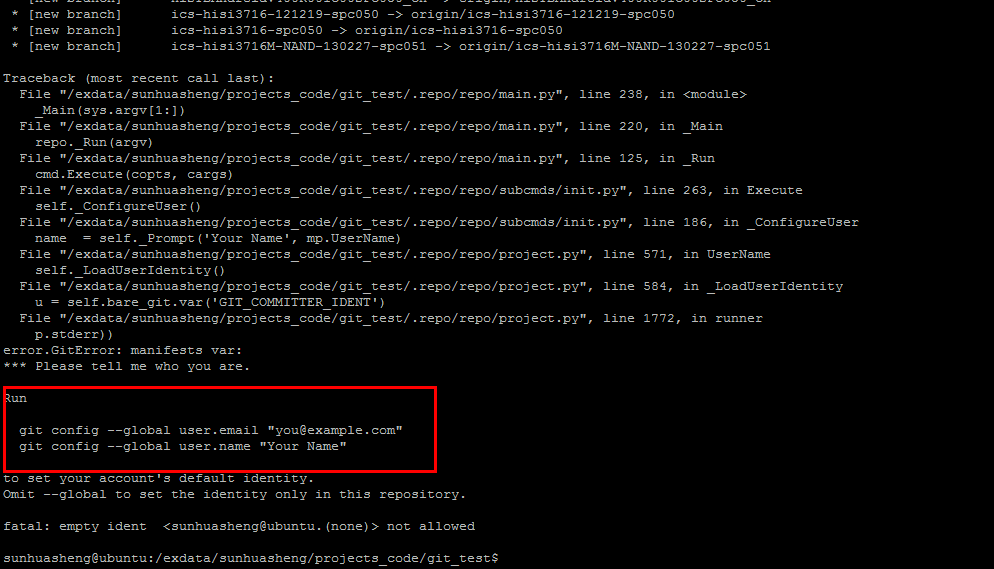
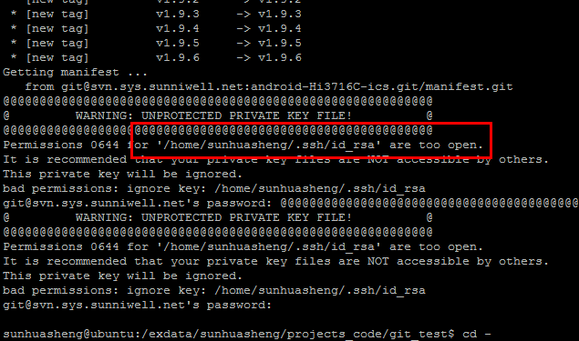

####新技巧
//清除未受仓库管理的文件及目录  
git clean -df  
//查看当前分支对应远端哪个分支   
git br -vv  
// git commit 之后git push之前追加log信息  
git commit --amend  

####分支日志异常，看到的是其他分支内容
git log --graph可以查看历史记录   
配置  merge no-fastforward (如下命令），这样在合并的时候，会产生一个merge commit的日志记录。但这个方法也只是在增加了日志，不能从根本上避免，还是需要操作的时候小心谨慎，pull 之前一定要看看当前分支是不是要pull的分支。  
`git config  --global merge.ff false`   

####git提交日志格式定制：  
git config commit.template .gitmessage.txt  //配置commit格式模板  
git config --global core.editor vim  //配置commit编辑器  

####批量操作，拯救base分支：  
repo forall -c "pwd;git push sunniwell master:base"  
repo forall -c "pwd;git add -A ."  
repo forall -c "pwd;git commit -m 'modify:patch Hixx056'"  
repo forall -c "pwd;git push sunniwell HEAD:refs/for/base"  

####(android_4.4 3798m)创建gerrit仓库：
* 1. repo仓库  
git clone ssh://git@svn.sys.sunniwell.net/xx/git-repo -b master .repo/repo  
git clone ssh://gerrit.sys.sunniwell.net/android-xx/hisi3798-xx/manifest.git .repo/manifests  
* 2. 解压原始包到此目录下，根下面的文件放到build、build/core下，在default.xml中添加Makefile的copy动作。  
* 3. 从4.2中copy .repo/manifests/default.xml，根据4.4实际情况添减仓库，并修改仓库主地址，然后创建base分支并上传default.xml。   
* 4. 上传代码：repo build -r android-xx/hisi3798-xx/manifest  -x .repo/manifests/default.xml -d .  
  * 1)在bootable/bootloader中提前touch .gitignore, 另外还有frameworks/mff  
  * 2)创建device/sunniwell 仓库并touch文件  
  * 3)git init && git add . && git commit -m 'project platform/frameworks/mff initialized' && git checkout -b base && ssh gerrit.sys.sunniwell.net gerrit create-project android-xx/hisi3798-xx/platform/frameworks/mff --parent android-xx/hisi3798-xx/manifest -b 'base' -d "'create project platform/frameworks/mff'" && git remote add sunniwell ssh://gerrit.sys.sunniwell.net/android-xx/hisi3798-xx/platform/frameworks/mff.git && git push --all sunniwell   
* 5. gerrit下载方法：  
repo init -u ssh://gerrit.sys.sunniwell.net/android-xx/hisi3798-xx/manifest.git -b base  
==================================分割线=======================================  
* 6. 新建develop分支，方式跟普通git一样，git  branch develop;git push sunniwell develop;   在.repo/manifests仓库中同样新建develop分支，并修改xml中默认分支。  
repo init -u ssh://gerrit.sys.sunniwell.net/android-xxx/hisi3798-xx/manifest.git -b develop  

####新添加仓库：
git init && touch .gitignore && git add . && git commit -m 'project platform/device/sunniwell initialized' && git checkout -b base && ssh gerrit.sys.sunniwell.net gerrit create-project android-xx/hisi3798-xx/platform/device/sunniwell --parent android-xx/hisi3798-xx/manifest -b 'base' -d "'create project platform/device/sunniwell'" && git remote add sunniwell ssh://gerrit.sys.sunniwell.net/android-xx/hisi3798-xx/platform/device/sunniwell.git && git push --all sunniwell

####(android_4.4/3798c)创建gerrit仓库：
* 1. 创建repo仓库  
git clone ssh://git@svn.sys.sunniwell.net/xx/git-repo -b master .repo/repo  
git clone ssh://gerrit.sys.sunniwell.net/android-xx/hisi3798-xx/manifest.git .repo/manifests  
* 2. 新下一套代码，删除.git 删除根目录下config.mk Makefile  mk-ics.sh，然后copy至新仓库下  
* 3. 从4.2中copy .repo/manifests/default.xml，根据4.4实际情况添减仓库，并修改仓库主地址。  
* 4. 上传代码：repo build -r android-xx/hisi3798-xx/manifest  -x .repo/manifests/default.xml -d .  
上传时候空仓库会报错，添加任意文件；上传仓库只有空目录没有报错，但仓库没有创建成功，repo sync下载时候会报仓库未找到，须在空目录下创建任意人家重新repo  build ...  
遗憾的是此时仍然没有ok  
查看repo build 实际执行下列一串操作：  
git init && git add . && git commit -m 'project platform/external initialized' && git checkout -b base && ssh gerrit.sys.sunniwell.net gerrit create-project android-xx/hisi3798-xx/platform/external --parent android-xx/hisi3798-xx/manifest -b 'base' -d "'create project platform/external'" && git remote add sunniwell ssh://gerrit.sys.sunniwell.net/android-xx/hisi3798-xx/platform/external.git && git push --all sunniwell  
此时手动执行报错：fatal: git checkout: branch base already exists  
可以试一下是这句的结果：  
 git checkout -b base && ssh gerrit.sys.sunniwell.net gerrit create-project android-xx/hisi3798-xx/platform/external --parent android-xx/hisi3798-xx/manifest -b 'base' -d "'create project platform/external'"   
跳过此句，执行下句上传完成：  
git remote add sunniwell ssh://gerrit.sys.sunniwell.net/android-xx/hisi3798-xx/platform/external.git && git push --all sunniwell  
* 5. gerrit下载方法：  
repo init -u ssh://gerrit.sys.sunniwell.net/android-xx/hisi3798-xx/manifest.git -b base  
==================================分割线=======================================  
* 6. 新建develop分支，方式跟普通git一样，git  branch develop;git push sunniwell develop;   在.repo/manifests仓库中同样新建develop分支，并修改xml中默认分支。  
repo init -u ssh://gerrit.sys.sunniwell.net/android-xx/hisi3798-xx/manifest.git -b develop  
* 7. merge base 到develop，push的时候用git push sunniwell HEAD:refs/for/develop会上传不上去，《git pull 之后！》直接上传即可：git checkout develop; git pull; git merge base; git push sunniwell develop;  
* 8. 打补丁：repo forall -c 'pwd; git add .; git commit -m "modify:patch_xxxxxxxxxxxxxxxxxxxxxxxxxxx"; git push sunniwell HEAD:refs/for/base'  
* 9. 批量删除文件：git rm `git st |awk '{FS="deleted:"}/deleted:/{print $2}' `  

####(60/90 sdk)创建gerrit仓库：
* 1. 创建repo仓库  
git clone ssh://git@svn.sys.sunniwell.net/linux-sunniwell.git/git-repo -b master .repo/repo  
git clone ssh://gerrit.sys.sunniwell.net/linux-xx/Hi3xx090/manifest.git .repo/manifests  
编辑.repo/manifests/default.xml  
.repo/manifests$ git branch develop  
.repo/manifests$ git push origin develop  
.repo/manifests$ git checkout develop  
.repo/manifests$ git add default.xml  
.repo/manifests$ git commit -m "add: init default.xml,reviewid:no" default.xml  
.repo/manifests$ git push  
上传代码（default.xml中分支不要用master，要不然会报fatal: git checkout: branch master already exists）：  
* 2. 创建git仓库，并上传测试文件  
mkdir  Hi37xx090; touch  Hi37xx090/.gitignore  
repo build -r linux-xx/Hi37xx090/manifest -x .repo/manifests/default.xml -d .  
* 3. 至此仓库搭建ok，将代码清理干净（revert掉本地修改，删掉非仓库文件，删除.svn/.git）在git仓库中上传即可。  
* 4. git仓库地址：  
ssh://gerrit.sys.sunniwell.net/linux-xx/Hixx90/Hi37xx090.git  
* 5. gerrit下载方法：  
repo init -u ssh://gerrit.sys.sunniwell.net/linux-xx/Hixx90/manifest.git -b develop  
repo init -u ssh://gerrit.sys.sunniwell.net/linux-xx/Hixx60/manifest.git -b develop  

####gerrit上传代码操作：
更新命令 : git pull 改为git pull 仓库别名 分支名  
上传命令 : 1、git add  上传文件  
   2、 git commit -am "提交信息"  
   3、 git push 仓库别名 HEAD:refs/for/分支名  
   之后就进入gerrit评审阶段， 待评审通过, 代码就会真正上传. 
实例：  
git add component/pm/c51/src/base.h  component/pm/c51/src/main.c  msp/drv/pm/drv_pmoc_intf.c  
git commit -am "modify:set gpio5 gpio mode before suspend"  
git push sunniwell HEAD:refs/for/develop  

sunhuasheng@ubuntu:~/projects_code/android_3719M_60/device/hisilicon/bigfish/sdk/source$ git br -a  
\* develop  
  remotes/m/develop -> sunniwell/develop  

####创建远端分支：
#####一：以当前分支为基础
git branch  new-branch-name  
git checkout  new-branch-name
//说明：如果当前在某一个分支上，则新建的分支继承此分支上的文件。如果想新建一个空的分支，可以从不在任一分支上的情况下删掉当前目录下所有文件，然后切到新分支上。  
git push  remote-branch-name   new-branch-name
//说明：一般会给远端分支起了个简短的别名，可以从 .repo/manifest.xml中remote name 看到，举例如下：   
例一：  
sunhuasheng@ubuntu:~/projects_code/sub_system_8040C/iptvmw$ git br -a  
\* 8040C-emmc-zj-cu  
  remotes/**iptvmw**/2530-base  
  remotes/**iptvmw**/2540B_ChinaMobile  
  remotes/**iptvmw**/8000A-emmc-base  
例二：  
sunhuasheng@ubuntu:~/projects_code/sub_system_8040C/platform/release$ git br -a  
\* master  
  remotes/m/8040C-emmc-zj-cu  
  remotes/**platform**/8000A-emmc-zj-ctc  
  remotes/**platform**/master  
#####二：新建空仓库  
mkdir on-project       
git init .  
git remote  add platform ssh://git@svn.sys.sunniwell.net/android-xxx.git/xxx/hi3716-xx-project.git
//cat platform/on-project/.git/config 而来  
git remote -v     // 可以查看对应的远端信息了  
touch .gitignore  
git add .gitignore  
git commit -m "test file"     // 需要有文件才能上传，才能建分支  
git push platform master  
//仓库创建完成，创建新分支  
git branch test_branch  
git checkout test_branch  
git push platform test_branch   // 完成空分支的创建  

####删除远端分支：  
git push  platform   :test_branch  
以某分支为基础提交新分支：  
git push  suniwell   develop:new_branch  

####配置颜色
git config --global color.status auto  
git config --global color.diff auto  
git config --global color.branch auto  
git config --global color.interactive auto 

####常用命令
git log  -2 swvdec/swvdec.c  
git log --stat -2  
git log -p  
git log --committer=sunhuasheng  
git log --author=sunhuasheng  
repo forall -c  git pull  
repo forall -c  "pwd;git branch"  
git diff HEAD^ HEAD swavstage/avporting.c  
git diff f75a756fba44a5354ad2:hi3716M/swavstage/avporting.c  e43e1d4915bcc760f437:hi3716M/swavstage/avporting.c  
git diff f75a756fba44a5354ad2:hi3716M   e43e1d4915bcc760f437  hi3716M/swavstage/avporting.c  
git remote show origin  
// 新建本地分支，未与远端分支挂钩   
git checkout -b tmp  
// 新建与远端分支挂钩的本地分支， 建议用第二条  
git checkout   -b my8845B   origin/8845B  
git checkout              --track    origin/8845B  
// 将本地分支tmp，合并到当前分支  
git merge tmp  
// commit 后发现冲突，reset一下  
git reset --hard HEAD^  
//git add -A 可以将删除动作一并纳入管理，在commit时候一并提交  
git add -A: [path]表示把中所有tracked文件中被修改过或已删除文件和所有untracted的文件信息添加到索引库。  

###svn部分:

svn log -v   //查看修改的文件  
svn log -r311 -v //查看311提交版本的修改文件  
svn diff  -r310:311  //查看310到311版本的修改差异  
svn diff  Makefile   -r310:311   //查看具体文件在310到311版本的修改差异  

####常见问题：
* 1.repo init 过程中报错如下  
====id_rsa 权限太大，解决： chmod 600 id_rsa  
  

* 2.repo init 过程中报错如下：  
解决：执行红框中两个config即可  

