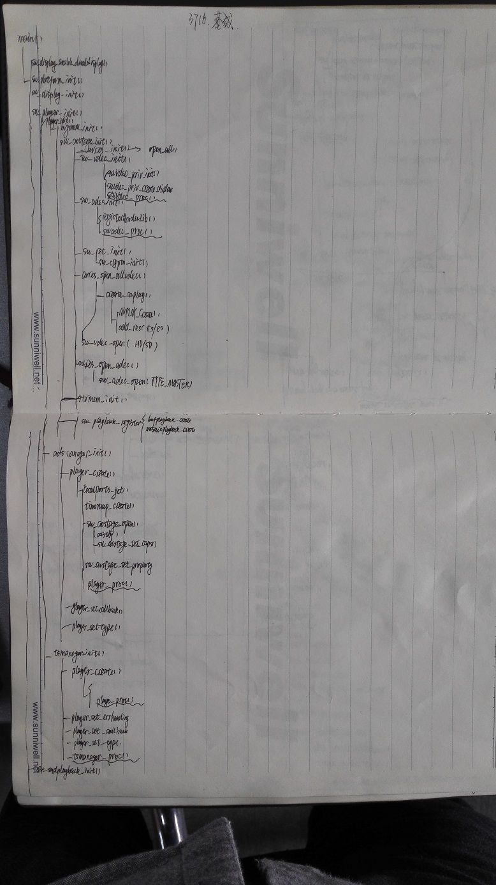

####有关隔行扫描/逐行扫描
隔行与逐行分别对应1080i/1080p中i系列和p系列，也分别对应PAL制和NTSC制。  

####有关D1
D1是数字电视系统显示格式的标准，共分为以下5种规格：D1：480i格式（525i），D2：480P格式（525p），D3：1080i格式（1125i），D4：720p 格式（750p），D5：1080p格式（1125p）。  
[D1标准](http://baike.baidu.com/subview/1369754/15302505.htm)  

####有关CBR
CBR（Constants Bit Rate）即固定码率，就是静态（恒定）比特率的意思，CBR是一种固定采样率的压缩方式。优点是压缩快，能被大多数软件和设备支持，缺点是占用空间相对大，效果不十分理想，现已逐步被VBR的方式取代。  
[CBR](http://baike.baidu.com/view/56356.htm?fr=aladdin)  

####mosaic播放流程
  
  

####组播播放流程
  
  
  

