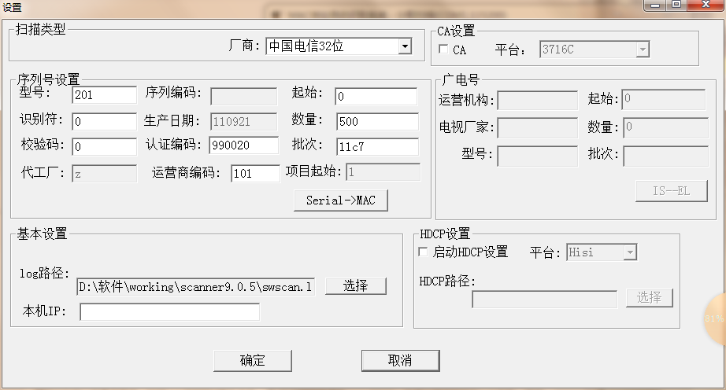
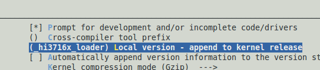

####Android

4. 8040c更换新flash，软件修改  
----实测结果目前代码兼容  

3. Android4.2 安装应用到/mnt/asec研究  
     ----文档完成,见res/linux_android杂项问题单/docs/  

2. 8040c湖北移动生产测试  
     ----scanner9.0.5 sw_tool9.0.5  
  

1. 在android 4.0及4.2都发现一个问题，在切换hdmi的制式时候cvbs也会有黑屏但没有相应切换到与hdmi相同扫描频率的制式上（一直是PAL）。  
    ----hisi提供补丁解决  

4. 8840C上3d应用  
    ----将libEGL.so、egl.cfg等3d相关的东西替换进去，3d游戏还是不能启动  
    ----/system/etc/3dapp.whitelist 中添加游戏对应的apk名称，能使得游戏启动。此时cpu占用90%，应该是GPU尚未正常工作。  
    ----原生android上3d游戏运行正常。瑶瑶在原生android基础上将iptv加入，3d正常使用  
    ----本地播放、DLNA播放报hisi底层错，将512M内存分配方案改为1G内存分配方式，播放问题ok。修改pmem编译新uImage打成新的boot.img，修改init.godbox.sh将加载mmz、galcore驱动的参数改为1G内存分配对应的地址。  

3. 8000A_EMMC版的盒子需要出生产镜像  
    ----直接从小系统中编译的镜像有问题，没有将fastboot打进去。  
    ----原有misc.img是进去factory_burn的，在生产版本的升级完成后会进入生产测试，将这个阶段的misc分区数据拿出来  

2. 【广东杜比】自适配、HDMI接入时候功放HDMI及spdif均无输出  
    ----在判断设备是否支持音频解码时候都是基于dd，没有去检测ddp。盒子检测到功放支持dd，认为设备支持，将设置为HDMI ddp透传输出、SPDIF无输出，而此时功放本身又不支持ddp的解码，使得HDMI也无声音。  
    ----海思给出的分析是“有些设备对是否支持ddp的信息不准确，从经验开，EDID中音频能力的信息不可靠，视频能力信息相对会好一些，一些大的厂商的设备也会好一些。”   
    ----忽略设备给出的信息的准确性，根据拿到的信息来做我们的逻辑处理。自适应模式下，HDMI接入，设备支持dd但不支持ddp，采用转dd透传输出的方式来处理。  
    ----新规格中添加了dts的要求，按dd方式来处理，TODO!  
    ----【新问题】手工模式下，设置HDMi-无输出和SPDIF-PCM配置，切功放信源后预期HDMI无音频输出的变为解码输出。  
    ----分析：在切换信源时候，HDMI有拔插事件，在hotplug处理中将HDMI属性重置了，使得本来关闭HDMI音频输出的设置失效。处理：在hotplug处理中判断当前是否有音频输出的要求，有的话关闭音频输出。  

1. 【待机、HDMI】v300的盒子待机起来后HDMI异常  
    1）HDMI待机起来后出现4 5次没有视频输出；  
    2）HDMI待机起来后，无视频输出，右下角提示“不支持的信号，检查你的设备输出”；  
    3）HDMI待机起来后显示第一张认证屏幕变为粉红色，接入EPG，操作焦点移动响应大于2s，页面展示严重闪屏，3-5s黑屏一次，再展示EPG首页；  
    ----1、如果发现没有输出并且proc信息中HPD Status: Out时，让硬件量一下hotplug管脚的电平。  
          2、“不支持的信号，检查你的设备输出”是电视输出的吗，换一台电视试一下。  
    ----8000C小盒子、8000E大盒子发现此问题  
    ----8000C上出现此问题时候发现盒子挂了，没有任何反应，这个需要查找盒子挂掉的原因。  

4. 8040D  ORT 實驗，共燒機10台，有4台出現了碼流播放卡頓現象，碼流是那個H264動畫片的那個，換了別的碼流都播不出來！   
     ----我这试过，播放稍微有一点点卡，感觉是跟wifi信号强度有关系。不能播放是是ts流吗，winsend只能发送ts流到组播的。  

3. 生产测试软件版本：9.0.5  
  
  

2. 工厂拿到生产版本wifi项测试不通过  
     ----这边进入过Android系统，在设置页面中打开过无线网络，然后这边测试没有发现问题，恢复出厂设置一下就能复现wifi测试不过的现象。  
    新出了一个apk，替换放到u盘 /product/SWProductTest.apk即可。  

1. wifi测试项  
     ----iwlist wlan0 scanning |grep sunniwell 
setprop net.dhcpc.standard  TMIPTVOTTDHCP  

####Linux

20. vga 配置  
一个是dac配置，一个是vesa的高清制式

19. 四会地区报v200板子cvbs声音异常
静音电路`gpio12_5`的复用寄存器设置有问题，一直以来恰巧静音管脚出来的电压是关静音需要的，也就是说一直以来没有真正静音过。  
另外两个批次的cpu在静音管脚的电压控制能力上不同，恰巧不能提供所需的电压，结果电压半高不低出现声音异常问题。也正因为不同批次cpu导致完全相同版本软件在不同盒子上出现正常异常两种现象。       
B180中的swsys解决过这个问题，b500上用的swsys库从swapi20编译而来，丢失了这部分改动  
引申一个问题：`sfc_cs0_gpio`: 偏移地址0x13C，寄存器设置1配置成`gpio12_5`模式。`tsi0_vi0_gpio`，偏移地址0x158，寄存器设置成3配置成`gpio12_5`模式。用的是al32 pin脚对应`tsi0_vi0_gpio`，所以需要将0x158设置3为`gpio12_5`，与此同时0x13C不能是1为`gpio12_5`模式，否则会有冲突。

18. 用tftp pull盒子文件出来，tftp  Pull  Local/Remote_file  filename   host_ip 
`# tftp -p -l swnetwork 172.16.6.115 `  
`swnetwork            100% |*******************************| 83456  --:--:-- ETA`  
`#`  
`# tftp -p -r swnetwork 172.16.6.115`  
`swnetwork            100% |*******************************| 83456  --:--:-- ETA`  
`# `  

17. 基线上抛事件到中间件
设置回调
sw_app_init(swapp.c)  
     --sw_media_init(modules/src/common/swmedia/swmedia.c) >>>(sw_evtdispatcher_on_event)  
          --sw_player_set_callback(media/swplayer/wraper/swplayer.c)  
               --player_set_callback(media/swplayer/player/player.c)  
回调回溯  
vdec->callback ==>on_avsevent(media/swplayer/player/player.c)  
     --on_mediaevent(media/swplayer/wraper/swplayer.c)  
          --sw_evtdispatcher_on_event(modules/src/common/swevtdispacther/swevtdispatcher.c)  

16. chipid获取时候有个小端转大端的操作，hisi sdk中没有说明

15. 8845B之A1_C  
kernel   
`[*] Initial RAM filesystem and RAM disk (initramfs/initrd) support`  
需要选择ram大小, 下面是选择了40M  
`<*>   RAM block device support                                    `                                                                   
`│ │                  (16)    Default number of RAM disks (NEW)    `                                                                                        
`│ │                  (40960)  Default RAM disk size (kbytes) (NEW)`
选择 squashfs文件系统支持  
`Fs->misecellaneous fs->squashfs support……`

14. cgms/a 设置cgms的同时还有wss的设置

13. 基线中middleware，modules也需要/pub/media/include中的头文件，更新头文件时格外注意需要统一更新

12. set_contentmode, set_aspect 接口都是对宽高比，及实现宽高比的方式进行设置的动作，所以两者冲突，几个不同窗口间切换需要的效果又不同，需要根据不同需求对应设置

11. ptcl项目设置宽高比没有反应问题，设置WinAttr.enAspectRatio的同时也需要设置WinAttr.enAspectCvrs

10. 对比度、饱和度、色调没有真正设置，据说会影响cvbs硬件指标

9. 四川项目epg打开小分辨率图片锯齿严重问题  
浏览器对图片进行了处理，采用了一种快速模式，改用正常模式即可。浏览器有自己的jpeg库对图片进行解码，海思解码器有hijpeg库进行所谓应解码。

8. hi_gpioi2c.ko 因与华为kernel不匹配插入失败问题：
   
`cp .config ./arch/arm/configs/hi3716m_defconfig`   
`make linux ;make ecs`  
重新编译新版hi_gpioi2c.ko  
最终解决方法：make hiloader_build编译小系统及对应的驱动，不用手动去做修改  
8841c采用了大小两套文件系统，一个普通的，一个精简的。两者内核不同，驱动文件不能通用.

7. HDCP字段经讨论为了tr135模块不和中间件耦合，还是在swdisplay模块增加接口获取。
定义接口bool sw_display_get_hdcp_state()，使能了HDCP返回true，未使能HDCP返回false。  
     ----display中添加接口  

6. ttnet 项目更换sdk B0  
     ----文件系统挂载不上的问题：kernel 修改了include/linux/cramfs_fs.h 将字宽从24改为28；另外修改了drivers/mtd/nand/nand_spl_ids.c 添加了对两款nand flash的支持  

5. 广东项目，机顶盒分辨率设置为PAL和NTSC时，在电视机上显示的分辨率不正确。显示为PAL（1440&times;576i@50Hz），NTSC（1440&times;480i@60Hz）  
     ----海思答复：720&times和1440&times是内部HDMI时序，在电视上一般无法显示，只能用分析仪才能获取。只要576i@50Hz等这些显示正常即可。  
     属于非问题。内部时序配置为720&times反而不正常，如这样，HDMI显示可能就有问题。  
     hisi提供补丁解决：播放码流data(RTSP).mpg在hdmi输出时变小的问题，海思补丁：朝歌_入网指标码流高清显示偏小.rar  
 

4. 广西2108B版本在播放杜比片源的时候会有严重的卡顿，那边的要求是杜比片源若没有license ，应不能解码，可以没有声音，但不能影响正常的播放， 广西2108B版本使用的是A1的SDK库  
     ----特定片源相关，只能在华为测试部复现，黄庚华分析先  
     ----同一个盒子在金荣达能复现、在岗头复现不了，做环境原因处理  

3. 下面邮件中提到一些属性值查了下基本都没有可获取的途径，sdk为linux Hi3716XV100R001C00SPC0A1 ，麻烦看看能否提供补丁来获取到这些参数（音/视频解码错误统计、音/视频解码丢包统计、音/视频解码下溢统计、音/视频解码pts错误统计）  
     ----hisi答复：需要跟研发沟通，目前来看短时间内提供不了  
     ----李志宾、江树华修改dec代码解决，应该有部分参数为假的  

2. c30标清问题：在3560E的盒子上，设置页面图像缩放，加减宽度，页面左右移动，加减高度，页面上下移动，正常效果：加减宽度，页面宽度缩小或者放大，加减高度，页面高度缩小或者放大！  
    ----曾志亮处理  

1. 上海百事通项目有用户反应hdmi自适应版本有盒子不能启机  
    ----查看loader三处问题  
    ----出问题的电视edid部分数据是无效的，解析代码容错处理。  

2. dts 播放无声音  
     ----组播时候strmfilter拿到audio_num为0，直接没有去播放音频，施大侠已帮忙修改。TODO：再看下本地播放跟组播播放流程
     杜比最后一个判断HDMI是否需要关音频输出的操作需要放在dd、ddp两种音频格式时候采取判断。  

1. 解码模式下无license时候cvbs有声音输出  
     ----将dec_mode设置放到判断license分支内，无license则设置THRU。（设置BUTT的话多播放几次会报错）  
