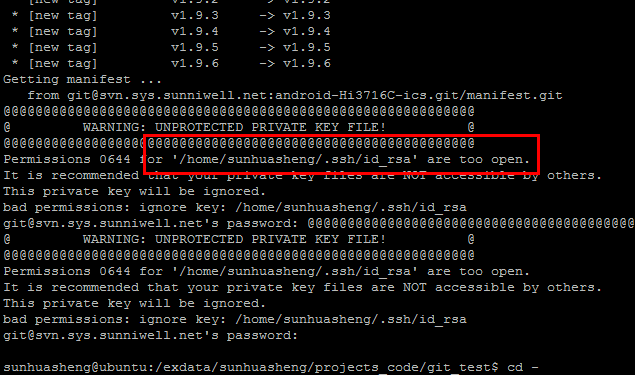

###svn部分:

svn log -v   //查看修改的文件  
svn log -r311 -v //查看311提交版本的修改文件  
svn diff  -r310:311  //查看310到311版本的修改差异  
svn diff  Makefile   -r310:311   //查看具体文件在310到311版本的修改差异  

####常见问题：
*1. repo init 过程中报错如下  
====id_rsa 权限太大，解决： chmod 600 id_rsa  
  

*2. repo init 过程中报错如下：  
解决：执行红框中两个config即可  

